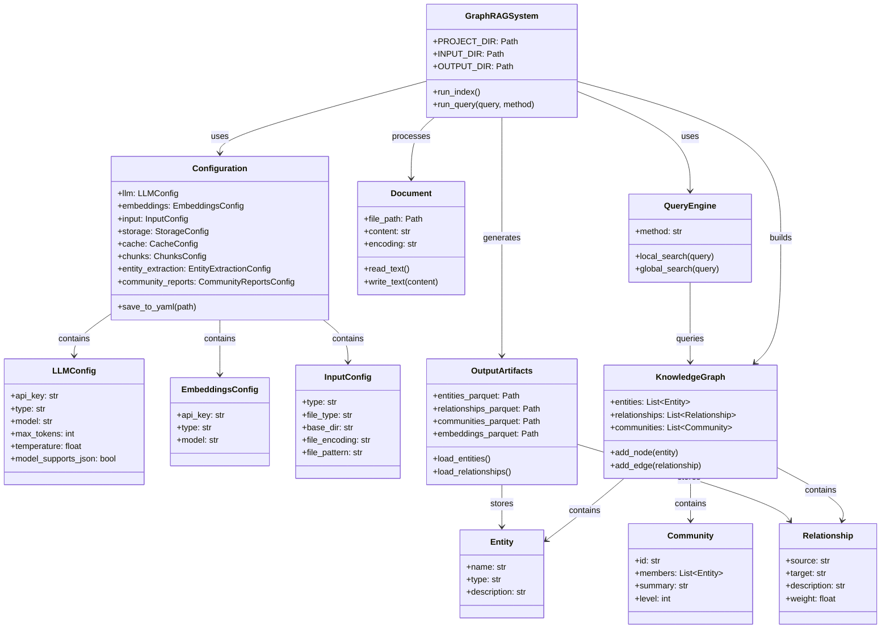
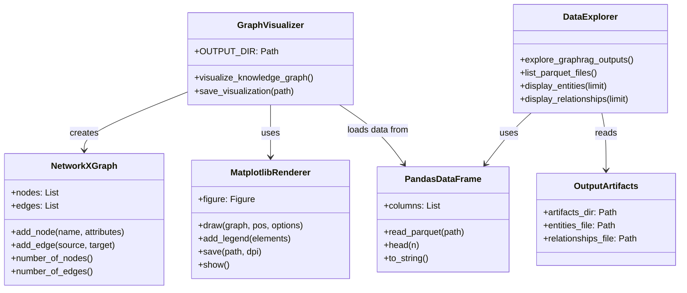
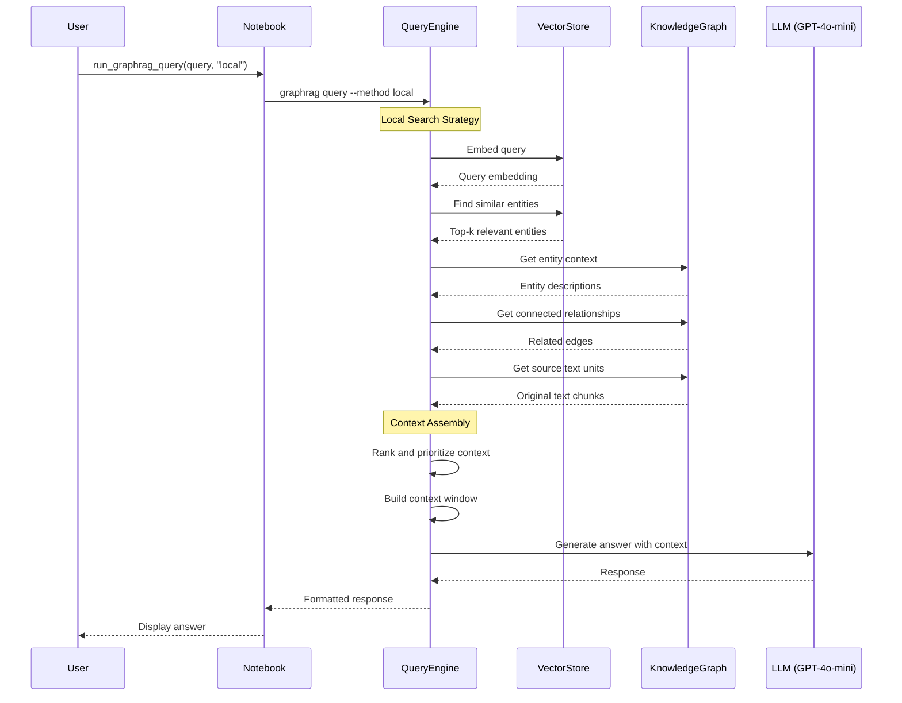
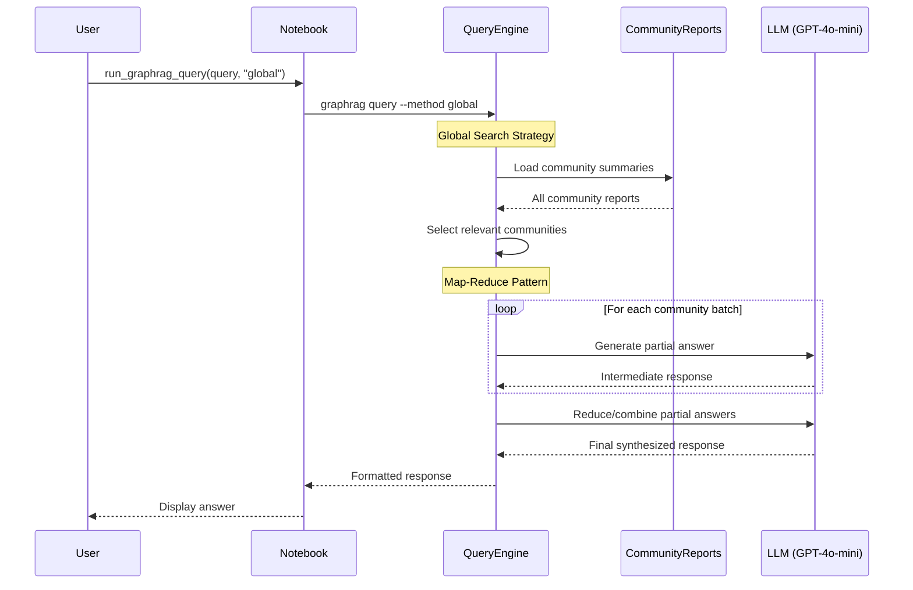
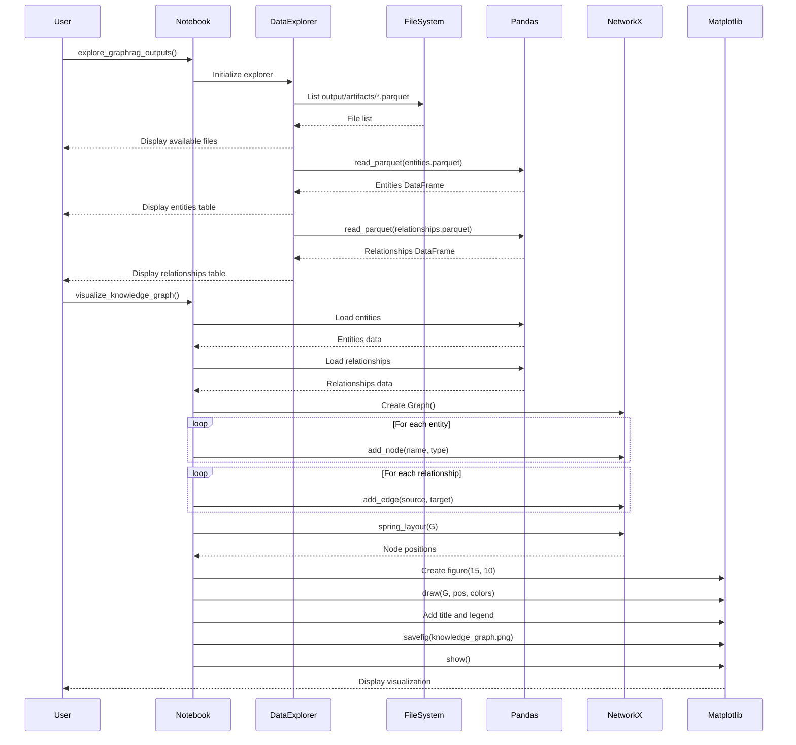
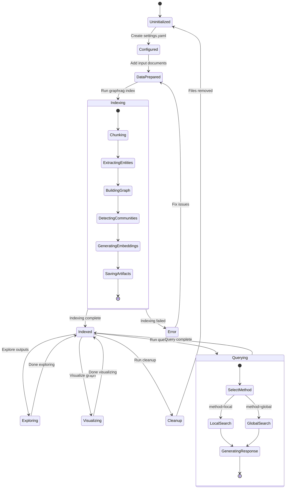
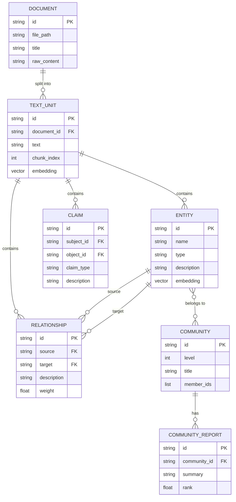

# GraphRAG Demo - UML Diagrams

This document contains UML diagrams describing the architecture and interactions of the GraphRAG toolkit demo.

---

## 1. Static Class Diagram - Core Components

---

## 2. Static Class Diagram - Visualization Components

---

## 3. Sequence Diagram - Setup and Configuration Flow

```mermaid
sequenceDiagram
    participant User
    participant Notebook
    participant Environment
    participant FileSystem
    participant Configuration

    User->>Notebook: Run installation cell
    Notebook->>Environment: pip install graphrag
    Environment-->>Notebook: Installation complete

    User->>Notebook: Run environment setup
    Notebook->>Environment: load_dotenv()
    Environment-->>Notebook: Load .env variables
    Notebook->>Environment: Check GRAPHRAG_API_KEY
    alt API key exists
        Environment-->>Notebook: ✅ API key configured
    else API key missing
        Environment-->>Notebook: ⚠️ Warning: No API key
    end

    User->>Notebook: Run project setup
    Notebook->>FileSystem: Create INPUT_DIR
    Notebook->>FileSystem: Create OUTPUT_DIR
    FileSystem-->>Notebook: Directories created

    User->>Notebook: Run sample data preparation
    Notebook->>FileSystem: Write techcorp_report.txt
    FileSystem-->>Notebook: File saved

    User->>Notebook: Run configuration cell
    Notebook->>Configuration: Create settings dict
    Configuration->>FileSystem: Save settings.yaml
    FileSystem-->>Notebook: Configuration saved
```

---

## 4. Sequence Diagram - Indexing Process

```mermaid
sequenceDiagram
    participant User
    participant Notebook
    participant GraphRAG
    participant LLM as LLM (GPT-4o-mini)
    participant EmbeddingModel as Embedding Model
    participant FileSystem

    User->>Notebook: run_graphrag_index()
    Notebook->>GraphRAG: graphrag index --root .

    Note over GraphRAG: Phase 1: Document Chunking
    GraphRAG->>FileSystem: Read input documents
    FileSystem-->>GraphRAG: Document content
    GraphRAG->>GraphRAG: Split into chunks (1200 chars, 100 overlap)

    Note over GraphRAG: Phase 2: Entity Extraction
    loop For each chunk
        GraphRAG->>LLM: Extract entities and relationships
        LLM-->>GraphRAG: Entities, relationships, claims
    end

    Note over GraphRAG: Phase 3: Graph Construction
    GraphRAG->>GraphRAG: Build knowledge graph
    GraphRAG->>GraphRAG: Merge duplicate entities
    GraphRAG->>GraphRAG: Calculate relationship weights

    Note over GraphRAG: Phase 4: Community Detection
    GraphRAG->>GraphRAG: Run Leiden algorithm
    GraphRAG->>GraphRAG: Create hierarchical communities
    
    loop For each community
        GraphRAG->>LLM: Generate community summary
        LLM-->>GraphRAG: Community report
    end

    Note over GraphRAG: Phase 5: Embedding Generation
    GraphRAG->>EmbeddingModel: Generate entity embeddings
    EmbeddingModel-->>GraphRAG: Vector embeddings
    GraphRAG->>EmbeddingModel: Generate text unit embeddings
    EmbeddingModel-->>GraphRAG: Vector embeddings

    Note over GraphRAG: Phase 6: Save Artifacts
    GraphRAG->>FileSystem: Save entities.parquet
    GraphRAG->>FileSystem: Save relationships.parquet
    GraphRAG->>FileSystem: Save communities.parquet
    GraphRAG->>FileSystem: Save embeddings.parquet

    GraphRAG-->>Notebook: ✅ Indexing complete
    Notebook-->>User: Display results
```

---

## 5. Sequence Diagram - Query Flow (Local Search)

---

## 6. Sequence Diagram - Query Flow (Global Search)

---

## 7. Sequence Diagram - Exploration and Visualization

---

## 8. Component Diagram - Overall Architecture

```mermaid
flowchart TB
    subgraph Input["📥 Input Layer"]
        DOC[("📄 Documents\n(input/*.txt)")]
        ENV["🔑 Environment\n(.env)"]
        CONFIG["⚙️ Configuration\n(settings.yaml)"]
    end

    subgraph Processing["⚡ Processing Layer"]
        CHUNKER["📦 Chunker"]
        EXTRACTOR["🔍 Entity Extractor"]
        GRAPH_BUILDER["🕸️ Graph Builder"]
        COMMUNITY["👥 Community Detector"]
        EMBEDDER["📊 Embedder"]
    end

    subgraph External["☁️ External Services"]
        LLM["🤖 LLM API\n(GPT-4o-mini)"]
        EMBED_API["📈 Embedding API\n(text-embedding-3-small)"]
    end

    subgraph Storage["💾 Storage Layer"]
        ENTITIES[("entities.parquet")]
        RELS[("relationships.parquet")]
        COMMUNITIES[("communities.parquet")]
        EMBEDDINGS[("embeddings.parquet")]
    end

    subgraph Query["🔎 Query Layer"]
        LOCAL["🎯 Local Search"]
        GLOBAL["🌐 Global Search"]
    end

    subgraph Output["📤 Output Layer"]
        RESPONSE["💬 Query Response"]
        VIZ["📊 Visualization"]
    end

    DOC --> CHUNKER
    ENV --> CONFIG
    CONFIG --> CHUNKER
    CONFIG --> EXTRACTOR
    
    CHUNKER --> EXTRACTOR
    EXTRACTOR <--> LLM
    EXTRACTOR --> GRAPH_BUILDER
    GRAPH_BUILDER --> COMMUNITY
    COMMUNITY <--> LLM
    COMMUNITY --> EMBEDDER
    EMBEDDER <--> EMBED_API

    GRAPH_BUILDER --> ENTITIES
    GRAPH_BUILDER --> RELS
    COMMUNITY --> COMMUNITIES
    EMBEDDER --> EMBEDDINGS

    ENTITIES --> LOCAL
    RELS --> LOCAL
    EMBEDDINGS --> LOCAL
    COMMUNITIES --> GLOBAL
    
    LOCAL <--> LLM
    GLOBAL <--> LLM
    
    LOCAL --> RESPONSE
    GLOBAL --> RESPONSE
    
    ENTITIES --> VIZ
    RELS --> VIZ
```

---

## 9. State Diagram - GraphRAG Pipeline States

---

## 10. Entity Relationship Diagram - Data Model

---

## Summary

These diagrams illustrate:

1. **Class Diagrams**: The main components and their relationships in the GraphRAG system
2. **Sequence Diagrams**: The flow of operations for setup, indexing, and querying
3. **Component Diagram**: The overall system architecture
4. **State Diagram**: The lifecycle states of a GraphRAG project
5. **ER Diagram**: The data model and relationships between entities

The GraphRAG toolkit transforms unstructured documents into a queryable knowledge graph through:
- **Entity extraction** using LLMs
- **Graph construction** with relationships
- **Community detection** for hierarchical understanding
- **Dual query modes** (local for specific facts, global for synthesis)

