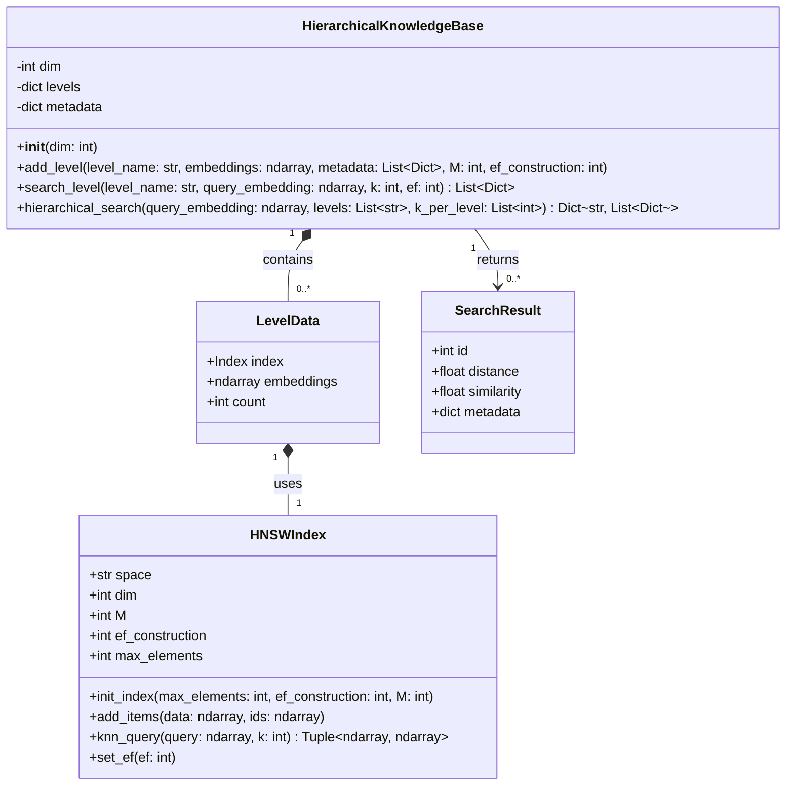
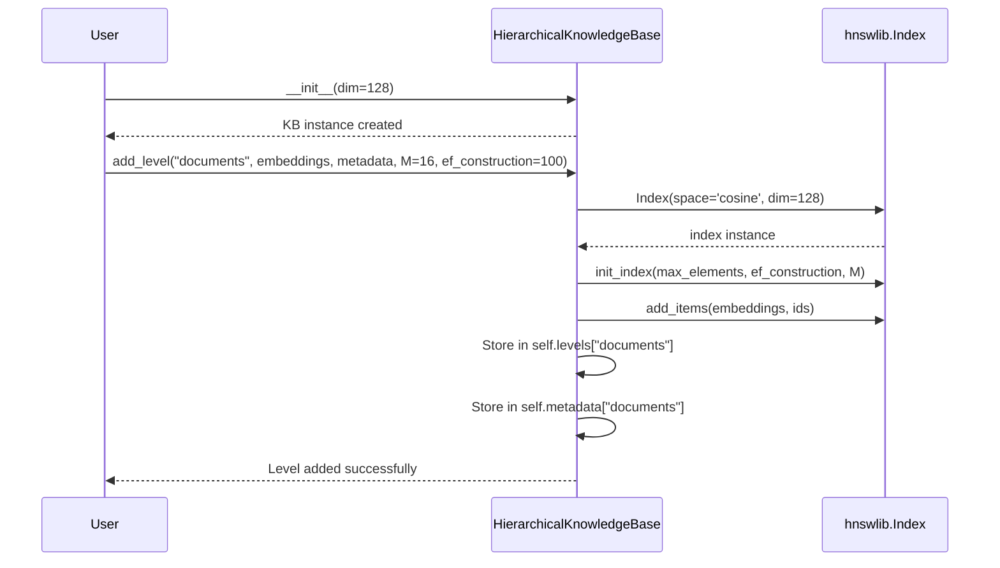
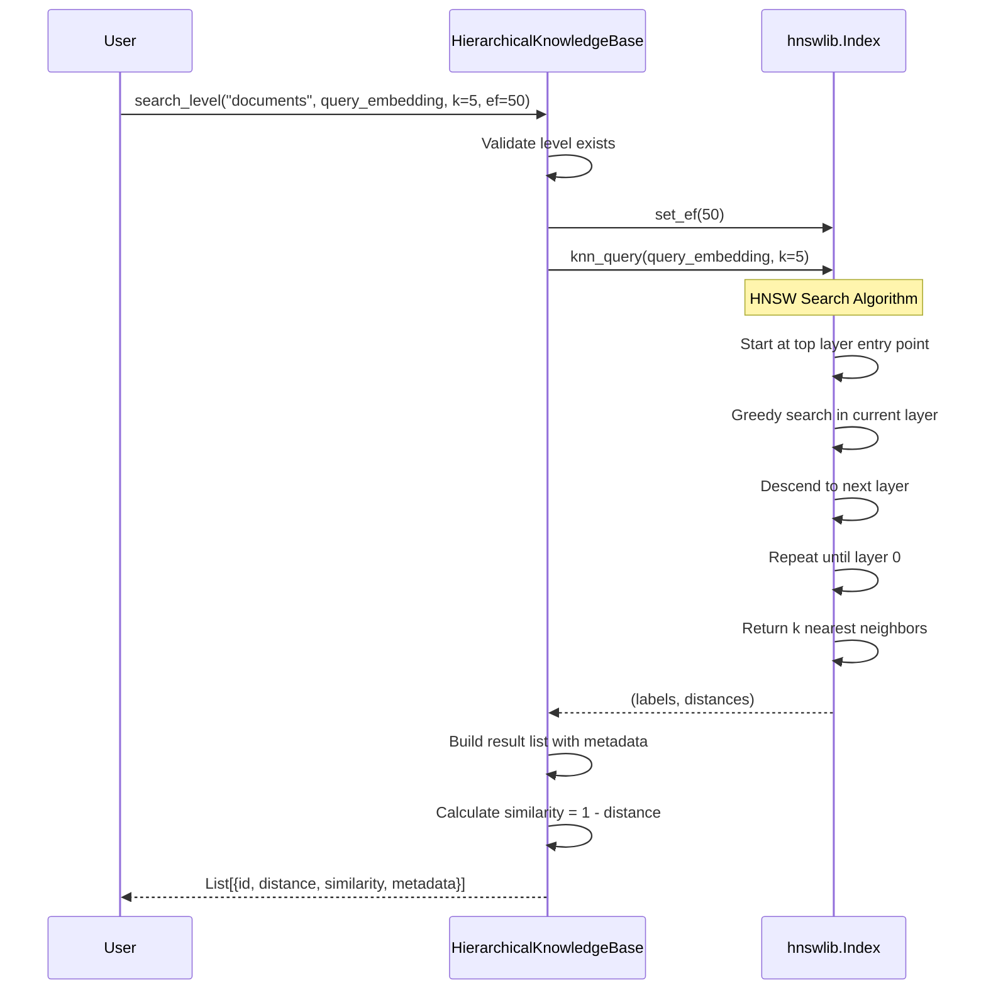
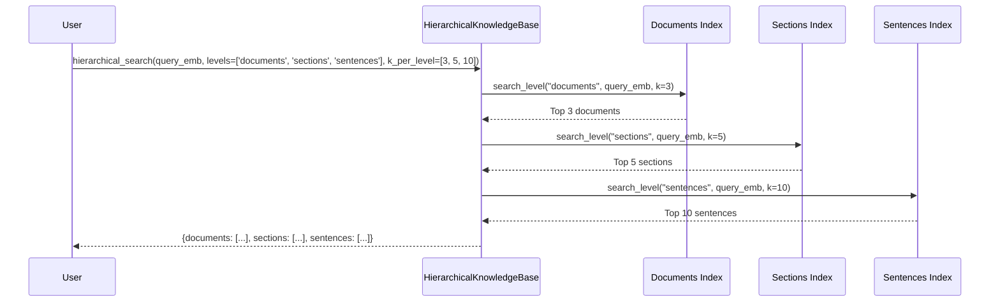

# 🔍 HNSW Hierarchical Reasoning - Architecture Documentation

This document provides comprehensive documentation for the `hnsw_hierarchical_reasoning.ipynb` notebook, including class diagrams, sequence diagrams, workflows, and detailed descriptions.

---

## 📑 Table of Contents

1. [Overview](#overview)
2. [Architecture Overview](#architecture-overview)
3. [Class Diagrams](#class-diagrams)
4. [Sequence Diagrams](#sequence-diagrams)
5. [Workflows](#workflows)
6. [Component Details](#component-details)
7. [Configuration Guide](#configuration-guide)

---

## Overview

**Hierarchical Navigable Small World (HNSW)** is a graph-based algorithm for Approximate Nearest Neighbor (ANN) search that achieves logarithmic search complexity. This notebook demonstrates how HNSW enables efficient hierarchical reasoning for similarity search and retrieval-augmented generation (RAG) applications.

### Key Features

| Feature | Description |
|---------|-------------|
| **Logarithmic Complexity** | O(log N) search vs O(N) for brute force |
| **High Recall** | Typically 95%+ accuracy compared to exact search |
| **Hierarchical Structure** | Multiple layers for efficient navigation |
| **Multi-level Reasoning** | Supports document → section → sentence hierarchy |

---

## Architecture Overview

```
┌─────────────────────────────────────────────────────────────────────┐
│                    HNSW Hierarchical Reasoning System               │
├─────────────────────────────────────────────────────────────────────┤
│                                                                     │
│  ┌─────────────────────────────────────────────────────────────┐   │
│  │                  HierarchicalKnowledgeBase                   │   │
│  │  ┌─────────────┐  ┌─────────────┐  ┌─────────────┐          │   │
│  │  │  Level 0    │  │  Level 1    │  │  Level 2    │          │   │
│  │  │ (Documents) │  │ (Sections)  │  │ (Sentences) │          │   │
│  │  │             │  │             │  │             │          │   │
│  │  │ HNSW Index  │  │ HNSW Index  │  │ HNSW Index  │          │   │
│  │  │ + Metadata  │  │ + Metadata  │  │ + Metadata  │          │   │
│  │  └──────┬──────┘  └──────┬──────┘  └──────┬──────┘          │   │
│  │         │                │                │                  │   │
│  │         └────────────────┼────────────────┘                  │   │
│  │                          │                                   │   │
│  │                   Parent-Child Links                         │   │
│  └─────────────────────────────────────────────────────────────┘   │
│                                                                     │
│  ┌─────────────────────────────────────────────────────────────┐   │
│  │                      Search Operations                       │   │
│  │  • search_level() - Single level search                     │   │
│  │  • hierarchical_search() - Multi-level search               │   │
│  └─────────────────────────────────────────────────────────────┘   │
│                                                                     │
└─────────────────────────────────────────────────────────────────────┘
```

---

## Class Diagrams

### Main Class: HierarchicalKnowledgeBase



### Class Structure (ASCII Version)

```
┌──────────────────────────────────────────────────────────────────┐
│                    HierarchicalKnowledgeBase                     │
├──────────────────────────────────────────────────────────────────┤
│ Attributes:                                                      │
│   - dim: int                    # Embedding dimension            │
│   - levels: Dict[str, LevelData]   # Named levels               │
│   - metadata: Dict[str, List[Dict]] # Metadata per level        │
├──────────────────────────────────────────────────────────────────┤
│ Methods:                                                         │
│   + __init__(dim: int = 384)                                    │
│   + add_level(level_name, embeddings, metadata, M, ef_constr)   │
│   + search_level(level_name, query_emb, k, ef) → List[Dict]     │
│   + hierarchical_search(query_emb, levels, k_per_level) → Dict  │
└──────────────────────────────────────────────────────────────────┘
                              │
                              │ contains
                              ▼
┌──────────────────────────────────────────────────────────────────┐
│                          LevelData                               │
├──────────────────────────────────────────────────────────────────┤
│   - index: hnswlib.Index    # HNSW index for this level         │
│   - embeddings: np.ndarray  # Raw embedding vectors             │
│   - count: int              # Number of items                   │
└──────────────────────────────────────────────────────────────────┘
                              │
                              │ uses
                              ▼
┌──────────────────────────────────────────────────────────────────┐
│                      hnswlib.Index                               │
├──────────────────────────────────────────────────────────────────┤
│ Attributes:                                                      │
│   - space: str              # 'cosine', 'l2', or 'ip'           │
│   - dim: int                # Vector dimension                  │
│   - M: int                  # Connections per element           │
│   - ef_construction: int    # Construction quality param        │
│   - max_elements: int       # Maximum capacity                  │
├──────────────────────────────────────────────────────────────────┤
│ Methods:                                                         │
│   + init_index(max_elements, ef_construction, M)                │
│   + add_items(data, ids)                                        │
│   + set_ef(ef)                                                  │
│   + knn_query(query, k) → (labels, distances)                   │
└──────────────────────────────────────────────────────────────────┘
```

### Metadata Structures

```
┌─────────────────────────────────────────────────────────────────┐
│                    Document Metadata                            │
├─────────────────────────────────────────────────────────────────┤
│  {                                                              │
│    "doc_id": int,                                               │
│    "title": str,                                                │
│    "topic": str                                                 │
│  }                                                              │
└─────────────────────────────────────────────────────────────────┘

┌─────────────────────────────────────────────────────────────────┐
│                    Section Metadata                             │
├─────────────────────────────────────────────────────────────────┤
│  {                                                              │
│    "section_id": int,                                           │
│    "parent_doc_id": int,                                        │
│    "title": str,                                                │
│    "topic": str                                                 │
│  }                                                              │
└─────────────────────────────────────────────────────────────────┘

┌─────────────────────────────────────────────────────────────────┐
│                    Sentence Metadata                            │
├─────────────────────────────────────────────────────────────────┤
│  {                                                              │
│    "sentence_id": int,                                          │
│    "parent_section_id": int,                                    │
│    "parent_doc_id": int,                                        │
│    "text": str,                                                 │
│    "topic": str                                                 │
│  }                                                              │
└─────────────────────────────────────────────────────────────────┘
```

---

## Sequence Diagrams

### 1. HNSW Index Initialization and Data Insertion



### 2. Single Level Search Flow



### 3. Hierarchical Search Flow



### 4. HNSW Internal Search Algorithm

```
┌──────────────────────────────────────────────────────────────────────────┐
│                    HNSW Search Algorithm Sequence                        │
└──────────────────────────────────────────────────────────────────────────┘

  Query Vector                    HNSW Graph Structure
       │
       │     Layer 2 (sparse):     [A] ─────────── [B]
       │                            │               │
       ▼                            │               │
  ┌─────────┐                       │               │
  │ Entry   │──────────────────────►●               │
  │ Point   │    Layer 1 (medium): [A] ── [C] ── [B] ── [D]
  └─────────┘                       │      │      │      │
       │                            │      │      │      │
       │  Greedy search             │      │      │      │
       ▼                            │      │      │      │
  ┌─────────┐                       │      │      │      │
  │ Found   │    Layer 0 (dense):  [A]─[E]─[C]─[F]─[B]─[G]─[D]─[H]
  │ Best    │◄───────────────────────────────●
  │ Match   │                               Query lands here
  └─────────┘
       │
       │  Return k nearest
       ▼
  ┌─────────────────────────┐
  │  Top-k Neighbors        │
  │  with distances         │
  └─────────────────────────┘
```

---

## Workflows

### Workflow 1: Complete HNSW Setup and Usage

```
┌─────────────────────────────────────────────────────────────────────────┐
│                     HNSW Setup and Usage Workflow                       │
└─────────────────────────────────────────────────────────────────────────┘

Step 1: Data Preparation
┌─────────────────────────────────────────────────────────────────────────┐
│  • Generate/Load embedding vectors (np.ndarray, float32)                │
│  • Normalize vectors for cosine similarity                              │
│  • Prepare metadata for each embedding                                  │
└─────────────────────────────────────────────────────────────────────────┘
                                    │
                                    ▼
Step 2: Index Initialization
┌─────────────────────────────────────────────────────────────────────────┐
│  index = hnswlib.Index(space='cosine', dim=128)                        │
│  index.init_index(                                                      │
│      max_elements=1000,                                                 │
│      ef_construction=200,  # Build quality                             │
│      M=16                   # Connections per node                      │
│  )                                                                      │
└─────────────────────────────────────────────────────────────────────────┘
                                    │
                                    ▼
Step 3: Add Data to Index
┌─────────────────────────────────────────────────────────────────────────┐
│  index.add_items(data, ids)                                            │
│  # data: (N, dim) float32 array                                        │
│  # ids: (N,) array of unique identifiers                               │
└─────────────────────────────────────────────────────────────────────────┘
                                    │
                                    ▼
Step 4: Configure Search Parameters
┌─────────────────────────────────────────────────────────────────────────┐
│  index.set_ef(50)  # ef >= k for best results                          │
│  # Higher ef = better recall, slower search                            │
└─────────────────────────────────────────────────────────────────────────┘
                                    │
                                    ▼
Step 5: Perform Search
┌─────────────────────────────────────────────────────────────────────────┐
│  labels, distances = index.knn_query(query, k=10)                      │
│  # labels: indices of k nearest neighbors                              │
│  # distances: distances to each neighbor                               │
│  # For cosine: similarity = 1 - distance                               │
└─────────────────────────────────────────────────────────────────────────┘
```

### Workflow 2: Hierarchical Knowledge Base Construction

```
┌─────────────────────────────────────────────────────────────────────────┐
│              Hierarchical Knowledge Base Construction                   │
└─────────────────────────────────────────────────────────────────────────┘

                    ┌──────────────────────┐
                    │    Raw Documents     │
                    │   (Text Content)     │
                    └──────────┬───────────┘
                               │
          ┌────────────────────┼────────────────────┐
          │                    │                    │
          ▼                    ▼                    ▼
┌─────────────────┐  ┌─────────────────┐  ┌─────────────────┐
│  Document       │  │  Section        │  │  Sentence       │
│  Embeddings     │  │  Embeddings     │  │  Embeddings     │
│  (Coarse)       │  │  (Medium)       │  │  (Fine)         │
└────────┬────────┘  └────────┬────────┘  └────────┬────────┘
         │                    │                    │
         ▼                    ▼                    ▼
┌─────────────────┐  ┌─────────────────┐  ┌─────────────────┐
│  HNSW Index     │  │  HNSW Index     │  │  HNSW Index     │
│  Level 0        │  │  Level 1        │  │  Level 2        │
│  (50 items)     │  │  (250 items)    │  │  (2500 items)   │
└────────┬────────┘  └────────┬────────┘  └────────┬────────┘
         │                    │                    │
         └────────────────────┼────────────────────┘
                              │
                              ▼
                ┌─────────────────────────┐
                │ HierarchicalKnowledge   │
                │      Base Instance      │
                │                         │
                │ levels = {              │
                │   'documents': {...},   │
                │   'sections': {...},    │
                │   'sentences': {...}    │
                │ }                       │
                └─────────────────────────┘
```

### Workflow 3: Hierarchical Search Strategies

```
┌─────────────────────────────────────────────────────────────────────────┐
│                    Hierarchical Search Strategies                       │
└─────────────────────────────────────────────────────────────────────────┘

Strategy A: Top-Down (Coarse to Fine)
━━━━━━━━━━━━━━━━━━━━━━━━━━━━━━━━━━━━━
Use Case: Exploratory queries, need context

    Query
      │
      ▼
┌───────────────┐
│  Documents    │ ──► Find relevant documents
│  (Broad)      │
└───────┬───────┘
        │ Filter by parent_doc_id
        ▼
┌───────────────┐
│  Sections     │ ──► Find sections within matched documents
│  (Medium)     │
└───────┬───────┘
        │ Filter by parent_section_id
        ▼
┌───────────────┐
│  Sentences    │ ──► Find specific sentences
│  (Fine)       │
└───────────────┘


Strategy B: Bottom-Up (Fine to Coarse)
━━━━━━━━━━━━━━━━━━━━━━━━━━━━━━━━━━━━━
Use Case: Precise fact retrieval

    Query
      │
      ▼
┌───────────────┐
│  Sentences    │ ──► Find most relevant sentences
│  (Fine)       │
└───────┬───────┘
        │ Get parent_section_id
        ▼
┌───────────────┐
│  Sections     │ ──► Get containing sections for context
│  (Medium)     │
└───────┬───────┘
        │ Get parent_doc_id
        ▼
┌───────────────┐
│  Documents    │ ──► Get source documents
│  (Broad)      │
└───────────────┘


Strategy C: Parallel Multi-Level
━━━━━━━━━━━━━━━━━━━━━━━━━━━━━━━━
Use Case: Complex reasoning, multiple evidence

              Query
                │
    ┌───────────┼───────────┐
    │           │           │
    ▼           ▼           ▼
┌───────┐  ┌───────┐  ┌───────┐
│ Docs  │  │ Sects │  │ Sents │
│ Top-3 │  │ Top-5 │  │Top-10 │
└───┬───┘  └───┬───┘  └───┬───┘
    │          │          │
    └──────────┼──────────┘
               │
               ▼
      ┌─────────────────┐
      │ Combined Results│
      │ with Cross-refs │
      └─────────────────┘
```

### Workflow 4: Embedding Generation for Hierarchical Structure

```
┌─────────────────────────────────────────────────────────────────────────┐
│             Embedding Generation with Hierarchical Variance             │
└─────────────────────────────────────────────────────────────────────────┘

Topic Base Vector (Topic i):
┌─────────────────────────────────────────────────────────────────────────┐
│  topic_base = np.random.randn(dim) * 0.5                               │
│  topic_base[i*25:(i+1)*25] += 2  # Boost specific dimensions          │
└─────────────────────────────────────────────────────────────────────────┘
                                    │
                                    ▼
Document Embedding:
┌─────────────────────────────────────────────────────────────────────────┐
│  doc_emb = topic_base + np.random.randn(dim) * 0.2  # Small variance   │
│  doc_emb = doc_emb / np.linalg.norm(doc_emb)        # Normalize        │
└─────────────────────────────────────────────────────────────────────────┘
                                    │
                                    ▼
Section Embedding:
┌─────────────────────────────────────────────────────────────────────────┐
│  sec_emb = doc_emb + np.random.randn(dim) * 0.15    # Smaller variance │
│  sec_emb = sec_emb / np.linalg.norm(sec_emb)        # Normalize        │
└─────────────────────────────────────────────────────────────────────────┘
                                    │
                                    ▼
Sentence Embedding:
┌─────────────────────────────────────────────────────────────────────────┐
│  sent_emb = sec_emb + np.random.randn(dim) * 0.1    # Smallest variance│
│  sent_emb = sent_emb / np.linalg.norm(sent_emb)     # Normalize        │
└─────────────────────────────────────────────────────────────────────────┘

Variance Hierarchy:
┌────────────────────┬──────────────┬──────────────────────────────────────┐
│ Level              │ Variance     │ Effect                               │
├────────────────────┼──────────────┼──────────────────────────────────────┤
│ Topic → Document   │ σ = 0.2      │ Documents cluster around topic       │
│ Document → Section │ σ = 0.15     │ Sections stay close to document      │
│ Section → Sentence │ σ = 0.1      │ Sentences stay close to section      │
└────────────────────┴──────────────┴──────────────────────────────────────┘
```

---

## Component Details

### 1. HNSW Index Parameters

| Parameter | Default | Range | Description |
|-----------|---------|-------|-------------|
| `space` | 'cosine' | 'cosine', 'l2', 'ip' | Distance metric |
| `dim` | - | > 0 | Vector dimension |
| `M` | 16 | 4-64 | Number of bidirectional links per element |
| `ef_construction` | 200 | 50-500 | Dynamic candidate list size during construction |
| `ef` (search) | 50 | ≥ k | Dynamic candidate list size during search |
| `max_elements` | - | > 0 | Maximum index capacity |

### 2. Parameter Trade-offs

```
                    Quality vs Performance Trade-offs
┌─────────────────────────────────────────────────────────────────────────┐
│                                                                         │
│     M (Connections)                                                     │
│     ───────────────                                                     │
│     Low (4-8)     │████░░░░░░│ Fast build, low memory, lower recall    │
│     Medium (16)   │██████░░░░│ Balanced performance                    │
│     High (32-64)  │█████████░│ Better recall, more memory, slower      │
│                                                                         │
│     ef_construction                                                     │
│     ───────────────                                                     │
│     Low (50-100)  │████░░░░░░│ Fast construction, lower quality        │
│     Medium (200)  │██████░░░░│ Good balance                            │
│     High (400+)   │█████████░│ Best quality, slow construction         │
│                                                                         │
│     ef (search)                                                         │
│     ────────────                                                        │
│     Low (10-30)   │████░░░░░░│ Fastest search, may miss neighbors      │
│     Medium (50)   │██████░░░░│ Good recall/speed balance               │
│     High (100+)   │█████████░│ Best recall, slower search              │
│                                                                         │
└─────────────────────────────────────────────────────────────────────────┘
```

### 3. HierarchicalKnowledgeBase Methods Detail

#### `__init__(dim: int = 384)`
Initializes the knowledge base with specified embedding dimension.

```python
def __init__(self, dim: int = 384):
    self.dim = dim           # Embedding dimension
    self.levels = {}         # Dict[str, LevelData]
    self.metadata = {}       # Dict[str, List[Dict]]
```

#### `add_level(level_name, embeddings, metadata, M, ef_construction)`
Adds a new hierarchical level with its own HNSW index.

**Parameters:**
- `level_name`: Unique identifier for the level (e.g., 'documents')
- `embeddings`: numpy array of shape (n_items, dim)
- `metadata`: List of dicts, one per embedding
- `M`: HNSW connections parameter
- `ef_construction`: Construction quality parameter

**Process:**
1. Create new HNSW index for this level
2. Initialize index with parameters
3. Add all embeddings to index
4. Store index and metadata in class dictionaries

#### `search_level(level_name, query_embedding, k, ef)`
Searches within a single level and returns k nearest neighbors.

**Returns:** List of dicts containing:
- `id`: Integer index of the result
- `distance`: Cosine distance (0 = identical)
- `similarity`: Cosine similarity (1 - distance)
- `metadata`: Associated metadata dict

#### `hierarchical_search(query_embedding, levels, k_per_level)`
Performs parallel search across multiple levels.

**Returns:** Dict mapping level names to result lists

### 4. Data Structure Details

#### Hierarchical Document Structure (as implemented)

```
                        Hierarchy Statistics
┌─────────────────────────────────────────────────────────────────────────┐
│                                                                         │
│  Level 0: Documents                                                     │
│  ├── Count: 50 documents                                                │
│  ├── Topics: 5 (ML, NLP, CV, RL, NN)                                   │
│  └── 10 documents per topic                                            │
│                                                                         │
│  Level 1: Sections                                                      │
│  ├── Count: 250 sections (50 docs × 5 sections/doc)                    │
│  └── Each section linked to parent document                            │
│                                                                         │
│  Level 2: Sentences                                                     │
│  ├── Count: 2,500 sentences (250 sections × 10 sentences/section)      │
│  └── Each sentence linked to parent section and document               │
│                                                                         │
│  Total Items: 2,800                                                     │
│                                                                         │
└─────────────────────────────────────────────────────────────────────────┘
```

---

## Configuration Guide

### Recommended Configurations

#### Small Dataset (< 10K items)
```python
M = 16
ef_construction = 100
ef = 50
```

#### Medium Dataset (10K - 100K items)
```python
M = 24
ef_construction = 200
ef = 100
```

#### Large Dataset (100K - 1M items)
```python
M = 32
ef_construction = 300
ef = 150
```

#### High-Accuracy Requirements
```python
M = 48
ef_construction = 500
ef = 200
```

### Memory Estimation

```
Memory ≈ (4 × dim + 8 × M) × num_elements bytes

Example for 1M vectors, dim=128, M=16:
Memory ≈ (4 × 128 + 8 × 16) × 1,000,000
       ≈ (512 + 128) × 1,000,000
       ≈ 640 MB
```

### Performance Comparison

| Method | Search Complexity | Recall | Memory |
|--------|------------------|--------|--------|
| Brute Force | O(N) | 100% | O(N×d) |
| HNSW (M=16) | O(log N) | ~95% | O(N×(d+M)) |
| HNSW (M=32) | O(log N) | ~98% | O(N×(d+M)) |

---

## References

- [HNSW Paper](https://arxiv.org/abs/1603.09320) - Malkov & Yashunin (2016)
- [hnswlib Documentation](https://github.com/nmslib/hnswlib)
- [FAISS (Facebook AI Similarity Search)](https://github.com/facebookresearch/faiss)

---

*Generated from `hnsw_hierarchical_reasoning.ipynb`*

