# HNSW Hierarchical Reasoning - Architecture Documentation

This document provides comprehensive architectural documentation for the HNSW (Hierarchical Navigable Small World) hierarchical reasoning implementation, including class diagrams, sequence diagrams, workflows, and detailed descriptions.

---

## Table of Contents

1. [Overview](#overview)
2. [Class Diagrams](#class-diagrams)
3. [Sequence Diagrams](#sequence-diagrams)
4. [Workflow Diagrams](#workflow-diagrams)
5. [Component Descriptions](#component-descriptions)
6. [Data Flow](#data-flow)

---

## Overview

The HNSW Hierarchical Reasoning system enables efficient multi-level semantic search by organizing data into hierarchical structures (documents → sections → sentences) and using HNSW indices for approximate nearest neighbor search at each level.

### Key Features

- **O(log N) search complexity** vs O(N) for brute force
- **Multi-level semantic indexing** for hierarchical reasoning
- **Configurable trade-offs** between speed, memory, and accuracy
- **Support for different search strategies** (top-down, bottom-up, multi-hop)

---

## Class Diagrams

### Core Class Structure

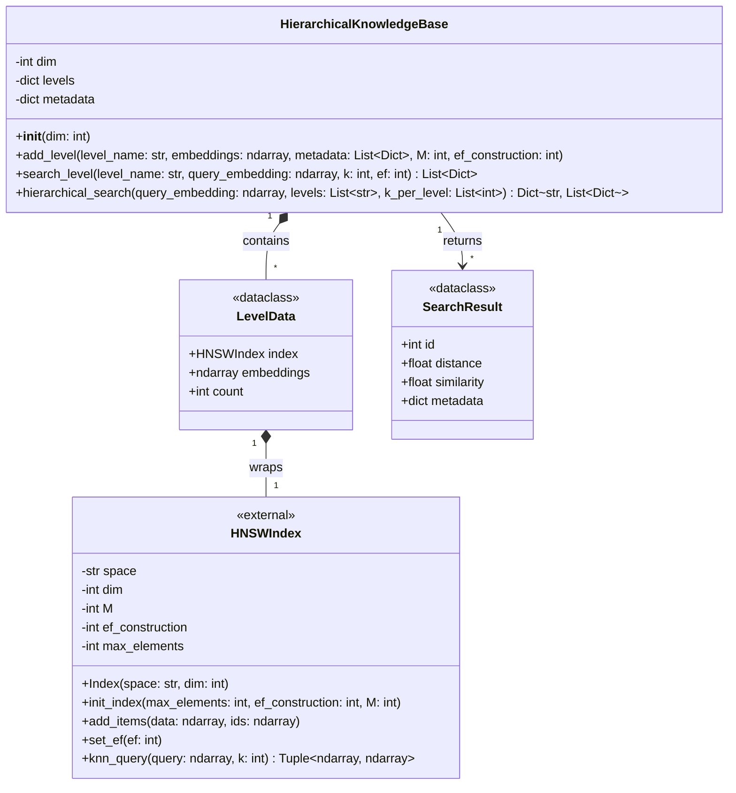
```mermaid
classDiagram
    class HierarchicalKnowledgeBase {
        -int dim
        -dict levels
        -dict metadata
        +__init__(dim: int)
        +add_level(level_name: str, embeddings: ndarray, metadata: List~Dict~, M: int, ef_construction: int)
        +search_level(level_name: str, query_embedding: ndarray, k: int, ef: int) List~Dict~
        +hierarchical_search(query_embedding: ndarray, levels: List~str~, k_per_level: List~int~) Dict~str, List~Dict~~
    }

    class HNSWIndex {
        <<external>>
        -str space
        -int dim
        -int M
        -int ef_construction
        -int max_elements
        +Index(space: str, dim: int)
        +init_index(max_elements: int, ef_construction: int, M: int)
        +add_items(data: ndarray, ids: ndarray)
        +set_ef(ef: int)
        +knn_query(query: ndarray, k: int) Tuple~ndarray, ndarray~
    }

    class LevelData {
        <<dataclass>>
        +HNSWIndex index
        +ndarray embeddings
        +int count
    }

    class SearchResult {
        <<dataclass>>
        +int id
        +float distance
        +float similarity
        +dict metadata
    }

    HierarchicalKnowledgeBase "1" *-- "*" LevelData : contains
    HierarchicalKnowledgeBase "1" --> "*" SearchResult : returns
    LevelData "1" *-- "1" HNSWIndex : wraps
```

### Document Hierarchy Structure

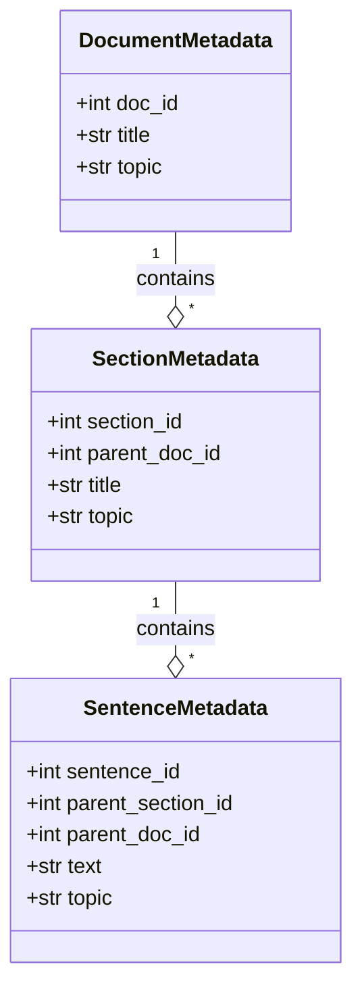
```mermaid
classDiagram
    class DocumentMetadata {
        +int doc_id
        +str title
        +str topic
    }

    class SectionMetadata {
        +int section_id
        +int parent_doc_id
        +str title
        +str topic
    }

    class SentenceMetadata {
        +int sentence_id
        +int parent_section_id
        +int parent_doc_id
        +str text
        +str topic
    }

    DocumentMetadata "1" --o "*" SectionMetadata : contains
    SectionMetadata "1" --o "*" SentenceMetadata : contains
```

### HNSW Layer Structure

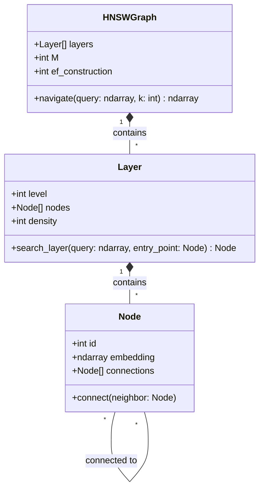
```mermaid
classDiagram
    class HNSWGraph {
        +Layer[] layers
        +int M
        +int ef_construction
        +navigate(query: ndarray, k: int) ndarray
    }

    class Layer {
        +int level
        +Node[] nodes
        +int density
        +search_layer(query: ndarray, entry_point: Node) Node
    }

    class Node {
        +int id
        +ndarray embedding
        +Node[] connections
        +connect(neighbor: Node)
    }

    HNSWGraph "1" *-- "*" Layer : contains
    Layer "1" *-- "*" Node : contains
    Node "*" -- "*" Node : connected to
```

---

## Sequence Diagrams

### Single Level Search

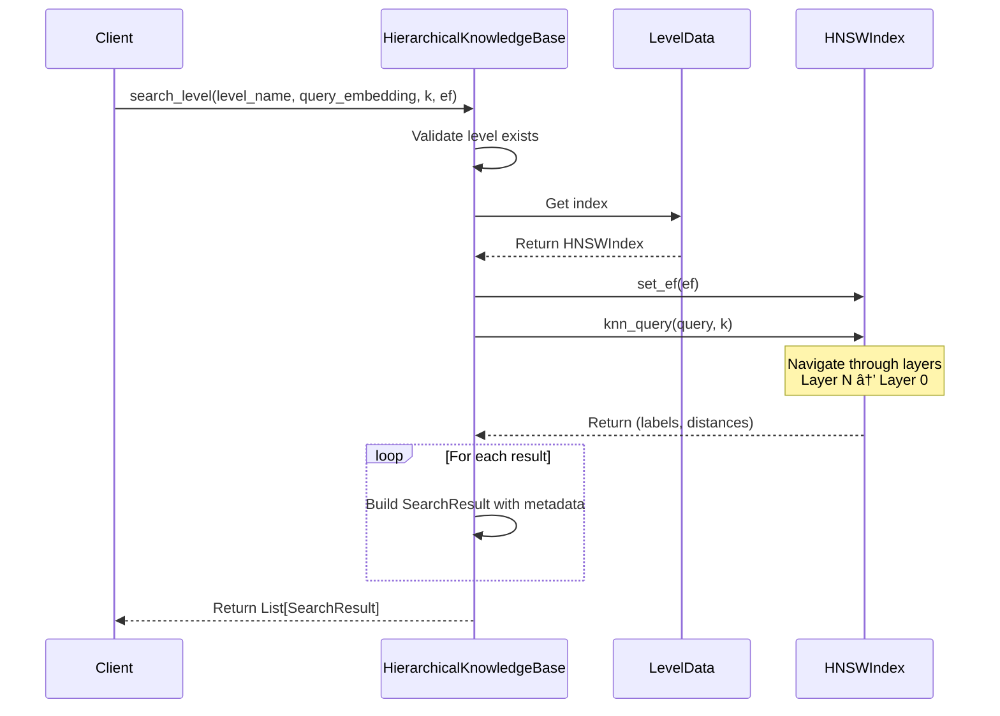
```mermaid
sequenceDiagram
    participant Client
    participant KB as HierarchicalKnowledgeBase
    participant Level as LevelData
    participant HNSW as HNSWIndex

    Client->>KB: search_level(level_name, query_embedding, k, ef)
    KB->>KB: Validate level exists
    KB->>Level: Get index
    Level-->>KB: Return HNSWIndex
    KB->>HNSW: set_ef(ef)
    KB->>HNSW: knn_query(query, k)
    
    Note over HNSW: Navigate through layers<br/>Layer N → Layer 0
    
    HNSW-->>KB: Return (labels, distances)
    
    loop For each result
        KB->>KB: Build SearchResult with metadata
    end
    
    KB-->>Client: Return List[SearchResult]
```

### Hierarchical Search (Multi-Level)

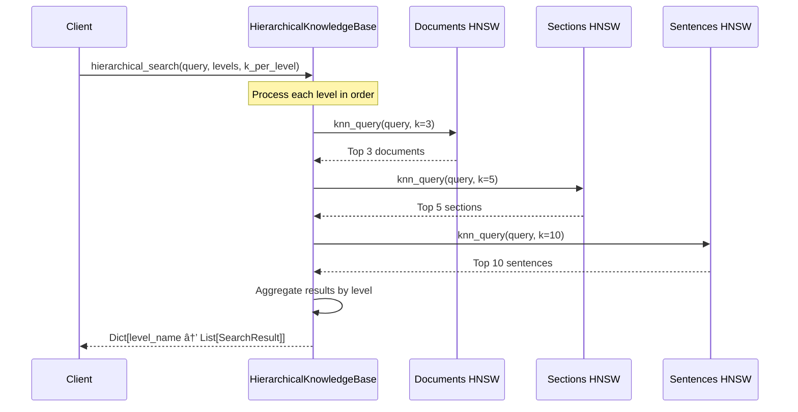
```mermaid
sequenceDiagram
    participant Client
    participant KB as HierarchicalKnowledgeBase
    participant DocIndex as Documents HNSW
    participant SecIndex as Sections HNSW
    participant SentIndex as Sentences HNSW

    Client->>KB: hierarchical_search(query, levels, k_per_level)
    
    Note over KB: Process each level in order
    
    KB->>DocIndex: knn_query(query, k=3)
    DocIndex-->>KB: Top 3 documents
    
    KB->>SecIndex: knn_query(query, k=5)
    SecIndex-->>KB: Top 5 sections
    
    KB->>SentIndex: knn_query(query, k=10)
    SentIndex-->>KB: Top 10 sentences
    
    KB->>KB: Aggregate results by level
    KB-->>Client: Dict[level_name → List[SearchResult]]
```

### HNSW Index Construction

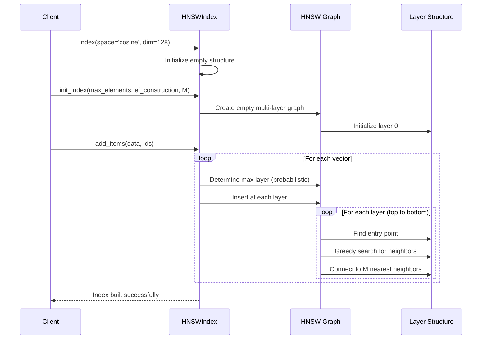
```mermaid
sequenceDiagram
    participant Client
    participant Index as HNSWIndex
    participant Graph as HNSW Graph
    participant Layers as Layer Structure

    Client->>Index: Index(space='cosine', dim=128)
    Index->>Index: Initialize empty structure
    
    Client->>Index: init_index(max_elements, ef_construction, M)
    Index->>Graph: Create empty multi-layer graph
    Graph->>Layers: Initialize layer 0
    
    Client->>Index: add_items(data, ids)
    
    loop For each vector
        Index->>Graph: Determine max layer (probabilistic)
        Index->>Graph: Insert at each layer
        
        loop For each layer (top to bottom)
            Graph->>Layers: Find entry point
            Graph->>Layers: Greedy search for neighbors
            Graph->>Layers: Connect to M nearest neighbors
        end
    end
    
    Index-->>Client: Index built successfully
```

### HNSW Search Navigation

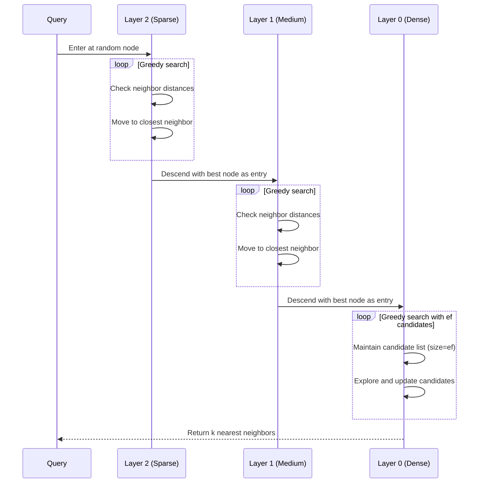
```mermaid
sequenceDiagram
    participant Query
    participant Layer2 as Layer 2 (Sparse)
    participant Layer1 as Layer 1 (Medium)
    participant Layer0 as Layer 0 (Dense)

    Query->>Layer2: Enter at random node
    
    loop Greedy search
        Layer2->>Layer2: Check neighbor distances
        Layer2->>Layer2: Move to closest neighbor
    end
    
    Layer2->>Layer1: Descend with best node as entry
    
    loop Greedy search
        Layer1->>Layer1: Check neighbor distances
        Layer1->>Layer1: Move to closest neighbor
    end
    
    Layer1->>Layer0: Descend with best node as entry
    
    loop Greedy search with ef candidates
        Layer0->>Layer0: Maintain candidate list (size=ef)
        Layer0->>Layer0: Explore and update candidates
    end
    
    Layer0-->>Query: Return k nearest neighbors
```

---

## Workflow Diagrams

### HNSW Index Building Workflow

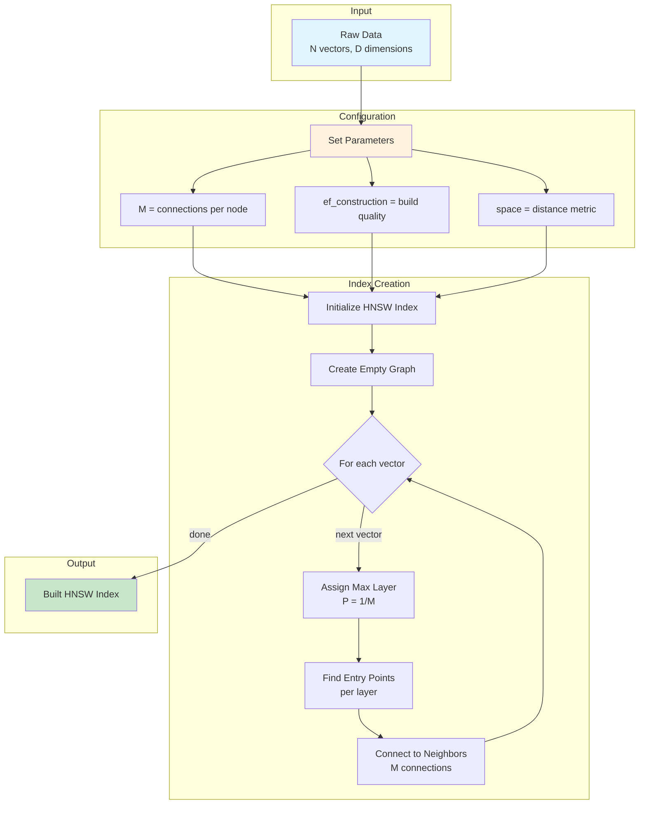
```mermaid
flowchart TB
    subgraph Input
        A[Raw Data<br/>N vectors, D dimensions]
    end

    subgraph Configuration
        B[Set Parameters]
        B1[M = connections per node]
        B2[ef_construction = build quality]
        B3[space = distance metric]
    end

    subgraph Index Creation
        C[Initialize HNSW Index]
        D[Create Empty Graph]
        E{For each vector}
        F[Assign Max Layer<br/>P = 1/M]
        G[Find Entry Points<br/>per layer]
        H[Connect to Neighbors<br/>M connections]
    end

    subgraph Output
        I[Built HNSW Index]
    end

    A --> B
    B --> B1 & B2 & B3
    B1 & B2 & B3 --> C
    C --> D
    D --> E
    E -->|next vector| F
    F --> G
    G --> H
    H --> E
    E -->|done| I

    style A fill:#e1f5fe
    style I fill:#c8e6c9
    style B fill:#fff3e0
```

### Hierarchical Search Workflow

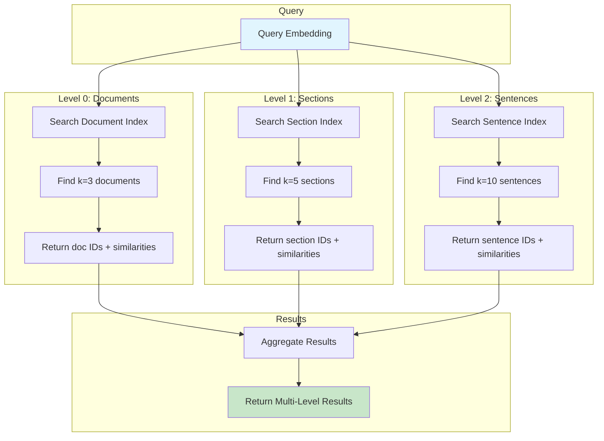
```mermaid
flowchart TB
    subgraph Query
        A[Query Embedding]
    end

    subgraph "Level 0: Documents"
        B[Search Document Index]
        B1[Find k=3 documents]
        B2[Return doc IDs + similarities]
    end

    subgraph "Level 1: Sections"
        C[Search Section Index]
        C1[Find k=5 sections]
        C2[Return section IDs + similarities]
    end

    subgraph "Level 2: Sentences"
        D[Search Sentence Index]
        D1[Find k=10 sentences]
        D2[Return sentence IDs + similarities]
    end

    subgraph Results
        E[Aggregate Results]
        F[Return Multi-Level Results]
    end

    A --> B
    B --> B1 --> B2
    A --> C
    C --> C1 --> C2
    A --> D
    D --> D1 --> D2
    B2 & C2 & D2 --> E
    E --> F

    style A fill:#e1f5fe
    style F fill:#c8e6c9
```

### HNSW Search Algorithm Workflow

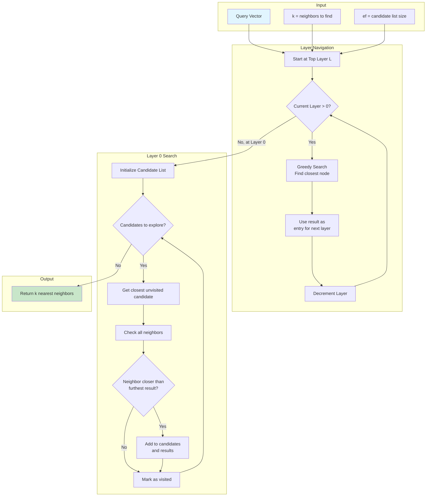
```mermaid
flowchart TB
    subgraph Input
        A[Query Vector]
        B[k = neighbors to find]
        C[ef = candidate list size]
    end

    subgraph "Layer Navigation"
        D[Start at Top Layer L]
        E{Current Layer > 0?}
        F[Greedy Search<br/>Find closest node]
        G[Use result as<br/>entry for next layer]
        H[Decrement Layer]
    end

    subgraph "Layer 0 Search"
        I[Initialize Candidate List]
        J{Candidates to explore?}
        K[Get closest unvisited candidate]
        L[Check all neighbors]
        M{Neighbor closer than<br/>furthest result?}
        N[Add to candidates<br/>and results]
        O[Mark as visited]
    end

    subgraph Output
        P[Return k nearest neighbors]
    end

    A & B & C --> D
    D --> E
    E -->|Yes| F
    F --> G
    G --> H
    H --> E
    E -->|No, at Layer 0| I
    I --> J
    J -->|Yes| K
    K --> L
    L --> M
    M -->|Yes| N
    M -->|No| O
    N --> O
    O --> J
    J -->|No| P

    style A fill:#e1f5fe
    style P fill:#c8e6c9
```

### Hierarchical Knowledge Base Construction Workflow

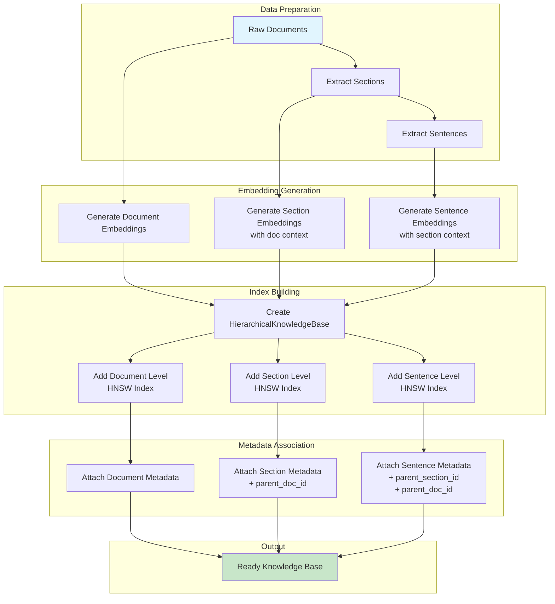
```mermaid
flowchart TB
    subgraph "Data Preparation"
        A[Raw Documents]
        B[Extract Sections]
        C[Extract Sentences]
    end

    subgraph "Embedding Generation"
        D[Generate Document Embeddings]
        E[Generate Section Embeddings<br/>with doc context]
        F[Generate Sentence Embeddings<br/>with section context]
    end

    subgraph "Index Building"
        G[Create HierarchicalKnowledgeBase]
        H[Add Document Level<br/>HNSW Index]
        I[Add Section Level<br/>HNSW Index]
        J[Add Sentence Level<br/>HNSW Index]
    end

    subgraph "Metadata Association"
        K[Attach Document Metadata]
        L[Attach Section Metadata<br/>+ parent_doc_id]
        M[Attach Sentence Metadata<br/>+ parent_section_id<br/>+ parent_doc_id]
    end

    subgraph Output
        N[Ready Knowledge Base]
    end

    A --> B --> C
    A --> D
    B --> E
    C --> F
    D & E & F --> G
    G --> H & I & J
    H --> K
    I --> L
    J --> M
    K & L & M --> N

    style A fill:#e1f5fe
    style N fill:#c8e6c9
```

### Search Strategy Decision Workflow

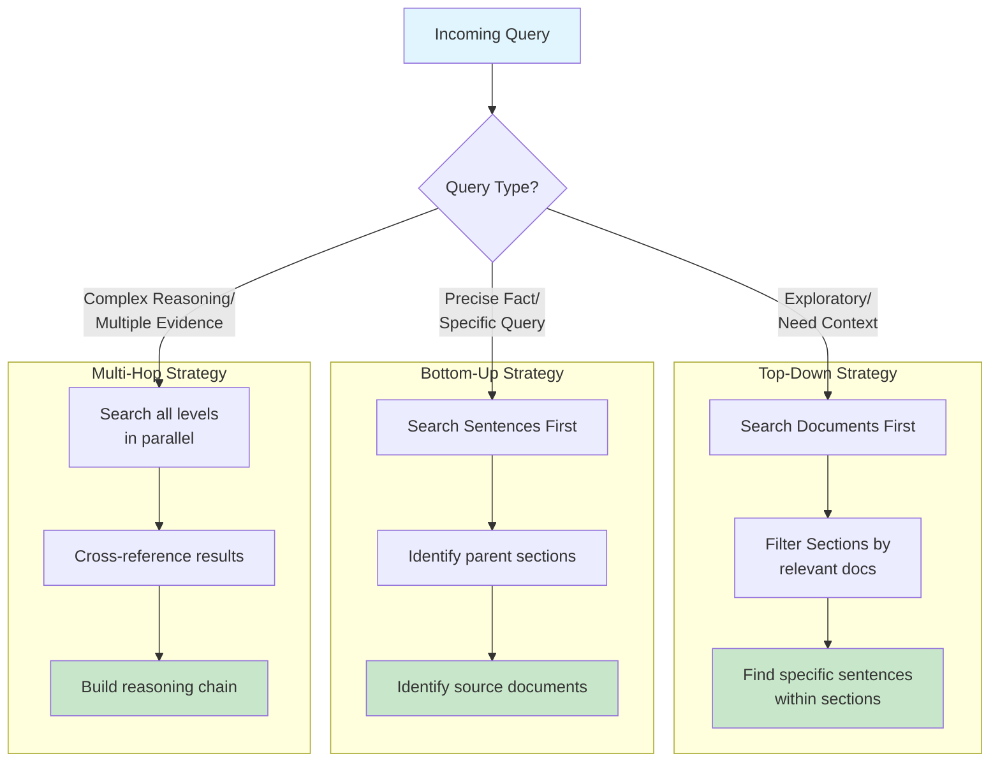
```mermaid
flowchart TB
    A[Incoming Query]
    B{Query Type?}
    
    subgraph "Top-Down Strategy"
        C1[Search Documents First]
        C2[Filter Sections by<br/>relevant docs]
        C3[Find specific sentences<br/>within sections]
    end
    
    subgraph "Bottom-Up Strategy"
        D1[Search Sentences First]
        D2[Identify parent sections]
        D3[Identify source documents]
    end
    
    subgraph "Multi-Hop Strategy"
        E1[Search all levels<br/>in parallel]
        E2[Cross-reference results]
        E3[Build reasoning chain]
    end

    A --> B
    B -->|Exploratory/<br/>Need Context| C1
    C1 --> C2 --> C3
    
    B -->|Precise Fact/<br/>Specific Query| D1
    D1 --> D2 --> D3
    
    B -->|Complex Reasoning/<br/>Multiple Evidence| E1
    E1 --> E2 --> E3

    style A fill:#e1f5fe
    style C3 fill:#c8e6c9
    style D3 fill:#c8e6c9
    style E3 fill:#c8e6c9
```

---

## Component Descriptions

### 1. HierarchicalKnowledgeBase

The central class that manages multi-level HNSW indices for hierarchical reasoning.

#### Attributes

| Attribute | Type | Description |
|-----------|------|-------------|
| `dim` | `int` | Dimensionality of embedding vectors (default: 384) |
| `levels` | `dict` | Dictionary mapping level names to LevelData objects |
| `metadata` | `dict` | Dictionary mapping level names to lists of metadata dictionaries |

#### Methods

| Method | Parameters | Returns | Description |
|--------|------------|---------|-------------|
| `__init__` | `dim: int` | `None` | Initialize the knowledge base with specified embedding dimension |
| `add_level` | `level_name: str, embeddings: ndarray, metadata: List[Dict], M: int, ef_construction: int` | `None` | Add a new hierarchical level with its HNSW index |
| `search_level` | `level_name: str, query_embedding: ndarray, k: int, ef: int` | `List[Dict]` | Search within a specific level and return ranked results |
| `hierarchical_search` | `query_embedding: ndarray, levels: List[str], k_per_level: List[int]` | `Dict[str, List[Dict]]` | Search across multiple levels simultaneously |

### 2. HNSW Index (hnswlib)

The underlying approximate nearest neighbor search structure.

#### Key Parameters

| Parameter | Typical Range | Effect |
|-----------|--------------|--------|
| `space` | `'cosine'`, `'l2'`, `'ip'` | Distance metric for similarity computation |
| `dim` | Application-specific | Vector dimensionality |
| `M` | 16-64 | Number of bidirectional connections per node. Higher = better quality, more memory |
| `ef_construction` | 100-500 | Construction-time neighbor search depth. Higher = better index quality, slower build |
| `ef` (search) | 50-200 | Query-time search depth. Higher = better recall, slower search |

### 3. Document Hierarchy

The three-level document structure used for hierarchical reasoning:

```
┌─────────────────────────────────────────────────────â”
│ Level 0: Documents (Coarse)                         │
│ - Full document embeddings                          │
│ - 50 documents across 5 topics                      │
│ - Metadata: doc_id, title, topic                    │
├─────────────────────────────────────────────────────┤
│ Level 1: Sections (Medium)                          │
│ - Paragraph/section embeddings                      │
│ - 5 sections per document = 250 total               │
│ - Metadata: section_id, parent_doc_id, title, topic │
├─────────────────────────────────────────────────────┤
│ Level 2: Sentences (Fine)                           │
│ - Sentence-level embeddings                         │
│ - 10 sentences per section = 2,500 total            │
│ - Metadata: sentence_id, parent_section_id,         │
│            parent_doc_id, text, topic               │
└─────────────────────────────────────────────────────┘
```

---

## Data Flow

### Complete System Data Flow

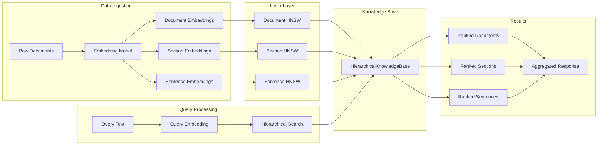
```mermaid
flowchart LR
    subgraph "Data Ingestion"
        A1[Raw Documents]
        A2[Embedding Model]
        A3[Document Embeddings]
        A4[Section Embeddings]
        A5[Sentence Embeddings]
    end

    subgraph "Index Layer"
        B1[Document HNSW]
        B2[Section HNSW]
        B3[Sentence HNSW]
    end

    subgraph "Knowledge Base"
        C[HierarchicalKnowledgeBase]
    end

    subgraph "Query Processing"
        D1[Query Text]
        D2[Query Embedding]
        D3[Hierarchical Search]
    end

    subgraph "Results"
        E1[Ranked Documents]
        E2[Ranked Sections]
        E3[Ranked Sentences]
        E4[Aggregated Response]
    end

    A1 --> A2
    A2 --> A3 & A4 & A5
    A3 --> B1
    A4 --> B2
    A5 --> B3
    B1 & B2 & B3 --> C
    
    D1 --> D2
    D2 --> D3
    D3 --> C
    
    C --> E1 & E2 & E3
    E1 & E2 & E3 --> E4
```

### Embedding Generation Flow

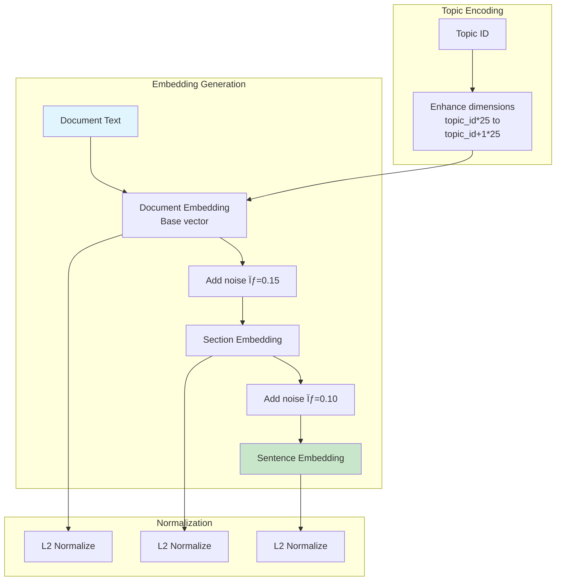
```mermaid
flowchart TB
    subgraph "Embedding Generation"
        A[Document Text] --> B[Document Embedding<br/>Base vector]
        B --> C[Add noise σ=0.15]
        C --> D[Section Embedding]
        D --> E[Add noise σ=0.10]
        E --> F[Sentence Embedding]
    end

    subgraph "Normalization"
        B --> G[L2 Normalize]
        D --> H[L2 Normalize]
        F --> I[L2 Normalize]
    end

    subgraph "Topic Encoding"
        J[Topic ID] --> K[Enhance dimensions<br/>topic_id*25 to<br/>topic_id+1*25]
        K --> B
    end

    style A fill:#e1f5fe
    style F fill:#c8e6c9
```

---

## Performance Characteristics

### Time Complexity Comparison

| Operation | Brute Force | HNSW |
|-----------|-------------|------|
| Index Build | O(N) | O(N log N) |
| Single Query | O(N) | O(log N) |
| k-NN Query | O(N log k) | O(log N) |

### Parameter Trade-offs

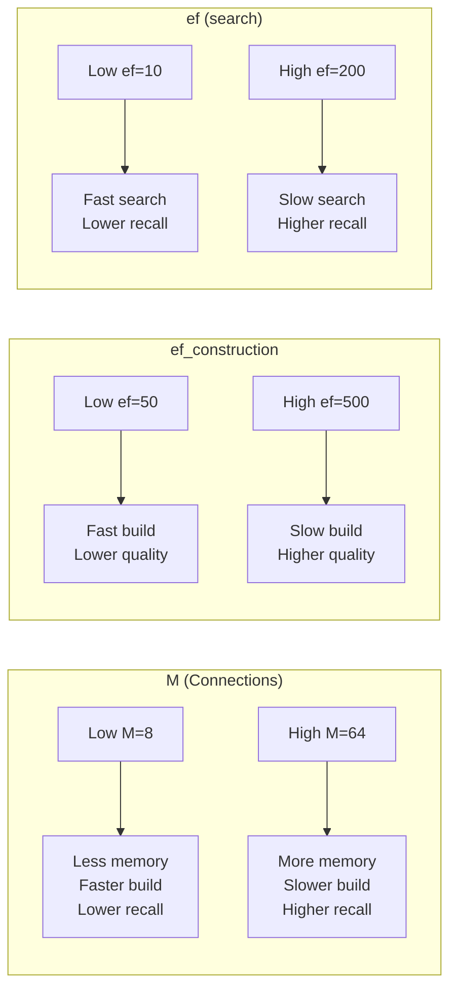
```mermaid
graph LR
    subgraph "M (Connections)"
        M1[Low M=8] --> M2[Less memory<br/>Faster build<br/>Lower recall]
        M3[High M=64] --> M4[More memory<br/>Slower build<br/>Higher recall]
    end

    subgraph "ef_construction"
        E1[Low ef=50] --> E2[Fast build<br/>Lower quality]
        E3[High ef=500] --> E4[Slow build<br/>Higher quality]
    end

    subgraph "ef (search)"
        S1[Low ef=10] --> S2[Fast search<br/>Lower recall]
        S3[High ef=200] --> S4[Slow search<br/>Higher recall]
    end
```

### Memory Usage

| Level | Items | Embedding Dim | M | Approximate Memory |
|-------|-------|---------------|---|-------------------|
| Documents | 50 | 128 | 16 | ~50 KB |
| Sections | 250 | 128 | 16 | ~250 KB |
| Sentences | 2,500 | 128 | 16 | ~2.5 MB |
| **Total** | **2,800** | - | - | **~2.8 MB** |

---

## Reasoning Strategies Summary

### Strategy Comparison

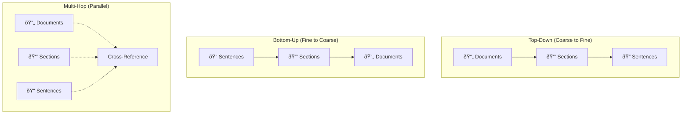
```mermaid
graph TB
    subgraph "Top-Down (Coarse to Fine)"
        TD1[📄 Documents] --> TD2[📑 Sections] --> TD3[📠Sentences]
    end

    subgraph "Bottom-Up (Fine to Coarse)"
        BU1[📠Sentences] --> BU2[📑 Sections] --> BU3[📄 Documents]
    end

    subgraph "Multi-Hop (Parallel)"
        MH1[📄 Documents]
        MH2[📑 Sections]
        MH3[📠Sentences]
        MH1 -.-> MH4[Cross-Reference]
        MH2 -.-> MH4
        MH3 -.-> MH4
    end
```

| Strategy | Best For | Example Query |
|----------|----------|---------------|
| **Top-Down** | Exploratory queries needing context | "Tell me about neural networks" |
| **Bottom-Up** | Precise fact retrieval | "What is the learning rate for ResNet?" |
| **Multi-Hop** | Complex reasoning with multiple evidence | "Compare CNN vs RNN architectures" |

---

## Usage Example

```python
# Initialize knowledge base
kb = HierarchicalKnowledgeBase(dim=128)

# Add hierarchical levels
kb.add_level('documents', doc_embeddings, doc_metadata, M=16, ef_construction=100)
kb.add_level('sections', section_embeddings, section_metadata, M=16, ef_construction=100)
kb.add_level('sentences', sentence_embeddings, sentence_metadata, M=16, ef_construction=100)

# Perform hierarchical search
results = kb.hierarchical_search(
    query_embedding,
    levels=['documents', 'sections', 'sentences'],
    k_per_level=[3, 5, 10]
)

# Access results by level
for doc in results['documents']:
    print(f"Document: {doc['metadata']['title']} (similarity: {doc['similarity']:.3f})")
```

---

## References

- [HNSW Paper: Efficient and robust approximate nearest neighbor search using Hierarchical Navigable Small World graphs](https://arxiv.org/abs/1603.09320)
- [hnswlib GitHub Repository](https://github.com/nmslib/hnswlib)
- [FAISS - Facebook AI Similarity Search](https://github.com/facebookresearch/faiss)

