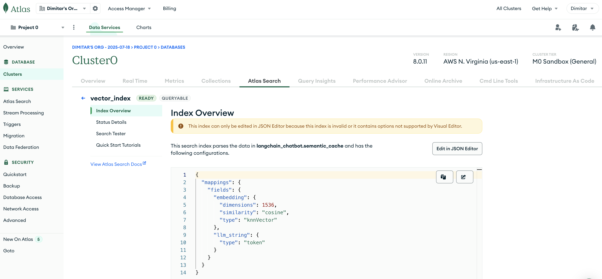

## MongoDB Atlas instance hosted on cloud.mongodb.com

### Note if running the main notebook on Google Colab

When running the main notebook [mongo_langchain_cache_memory.ipynb](https://github.com/dimitarpg13/rag_architectures_and_concepts/blob/main/src/examples/langchain/mongo_cache_memory/mongodb_langchain_cache_memory.ipynb)
on Google Colab

refer to the following article [Connecting MongoDB Atlas to Google Colab, 
Afzal Badshah, Medium, 2024](https://afzalbadshah.medium.com/connecting-mongodb-atlas-to-google-colab-da67e0b8f533)
