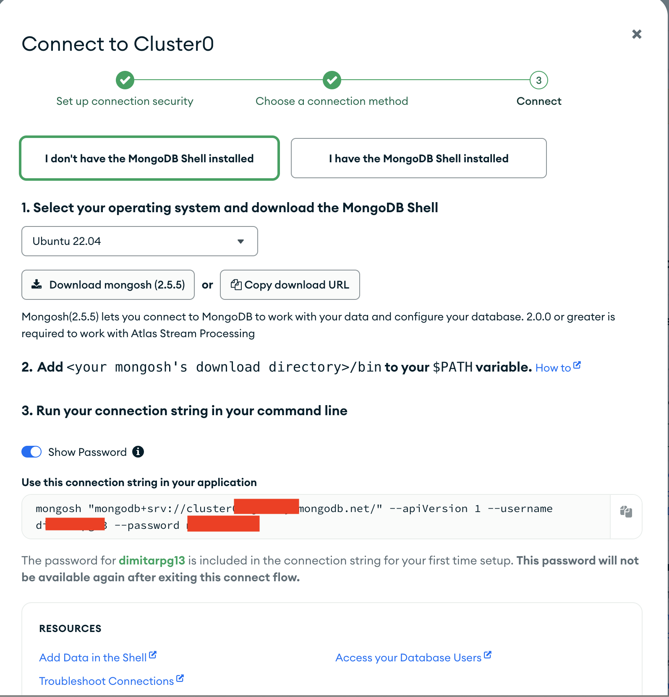
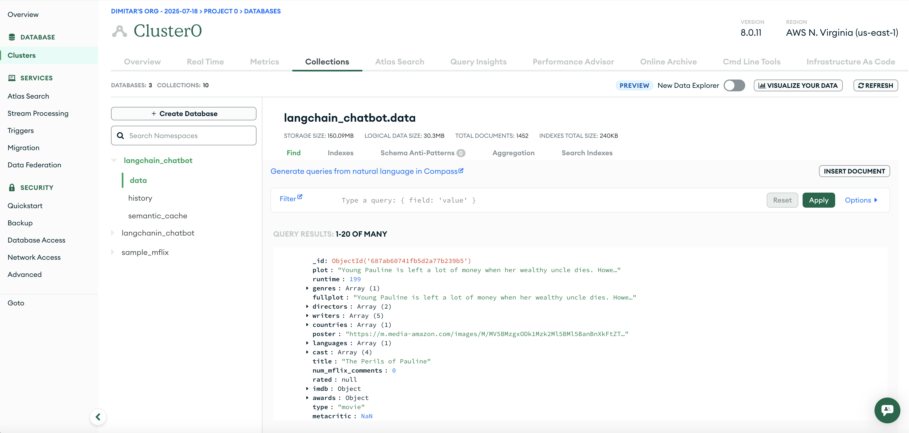
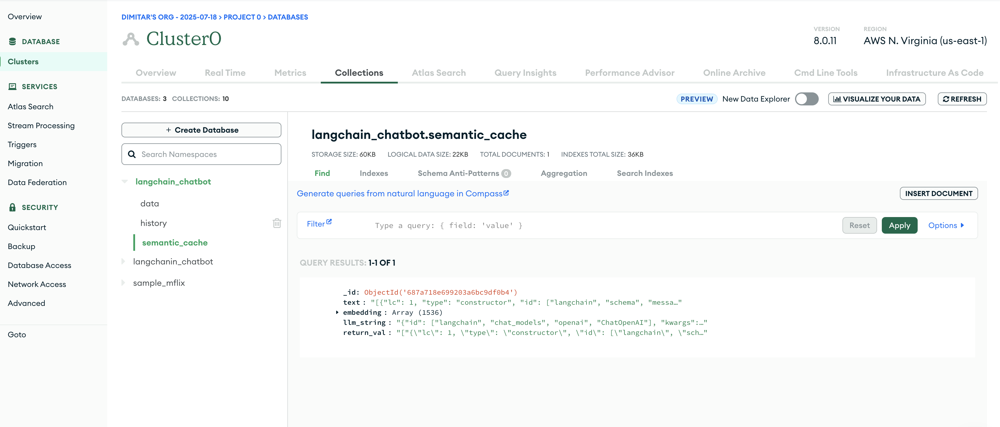

## MongoDB Atlas instance hosted on cloud.mongodb.com



Figure: Getting MongoDB Atlas Free Tier




Figure: The collection `data` of the newly created DB `langchain_chatbot`



Figure: The collection `semantic_cache` of the newly created DB `langchain_chatbot`


Figure: The Atlas Search Index `vector_index` created over the collection `semantic_cache`

This search index parses the data in langchain_chatbot.semantic_cache and has the following configurations.
```json

{
  "mappings": {
    "fields": {
      "embedding": {
        "dimensions": 1536,
        "similarity": "cosine",
        "type": "knnVector"
      },
      "llm_string": {
        "type": "token"
      }
    }
  }
}
```


### Note if running the main notebook on Google Colab

When running the main notebook [mongo_langchain_cache_memory.ipynb](https://github.com/dimitarpg13/rag_architectures_and_concepts/blob/main/src/examples/langchain/mongo_cache_memory/mongodb_langchain_cache_memory.ipynb)
on Google Colab

refer to the following article [Connecting MongoDB Atlas to Google Colab, 
Afzal Badshah, Medium, 2024](https://afzalbadshah.medium.com/connecting-mongodb-atlas-to-google-colab-da67e0b8f533)
