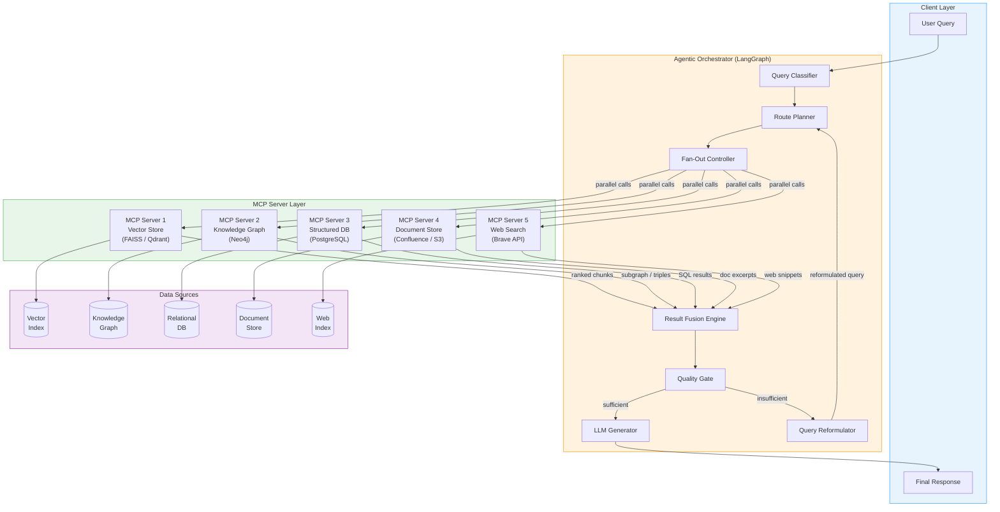
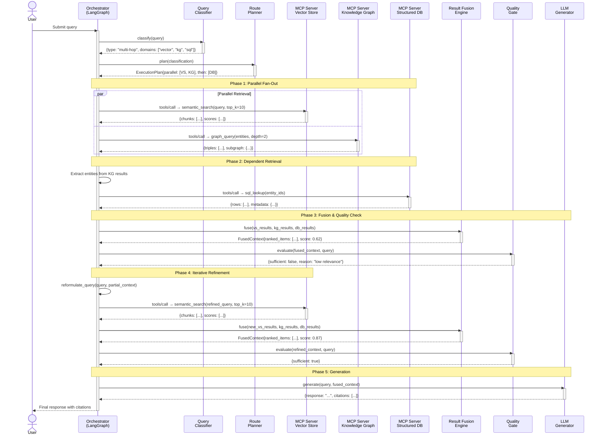
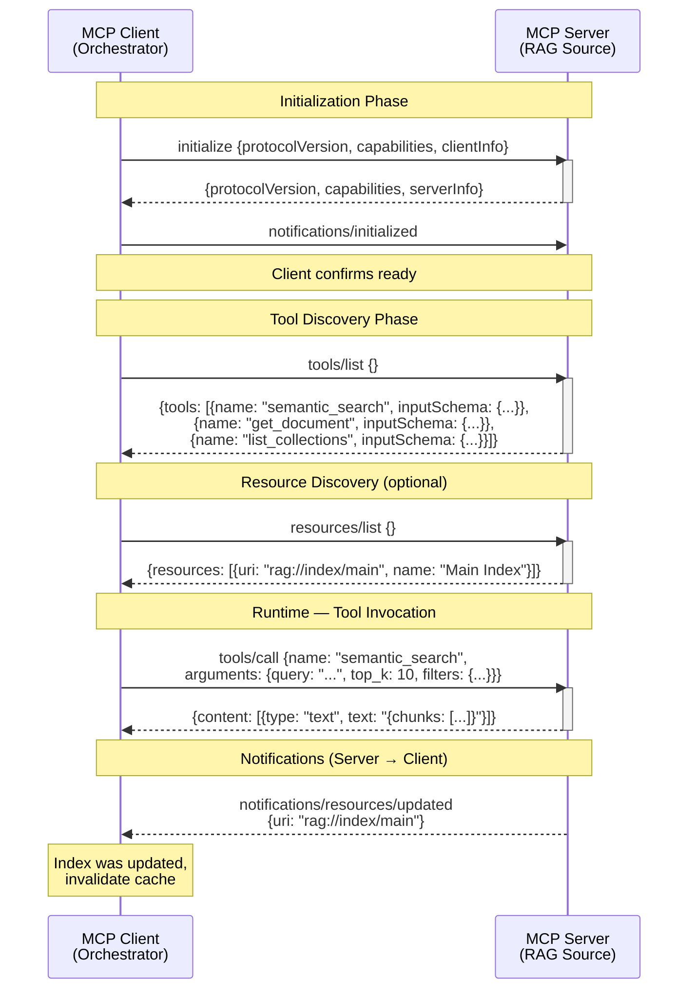
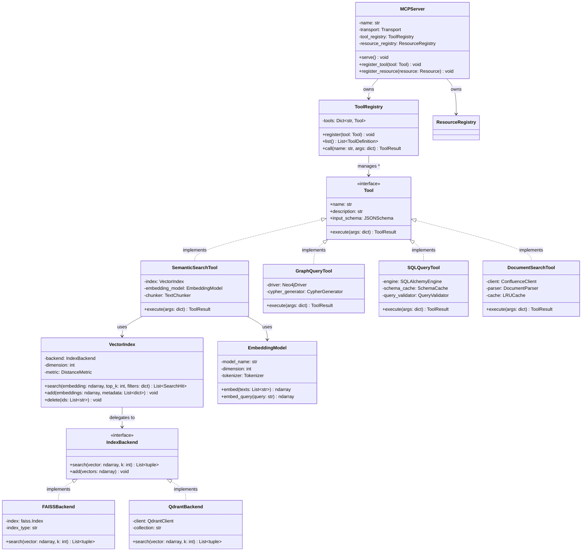
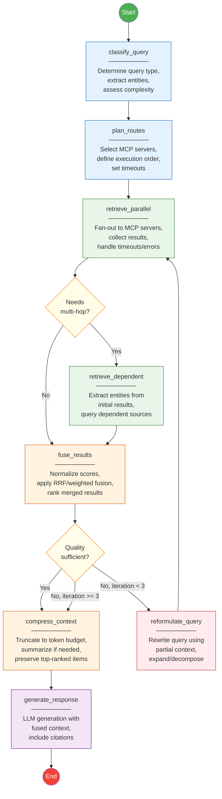
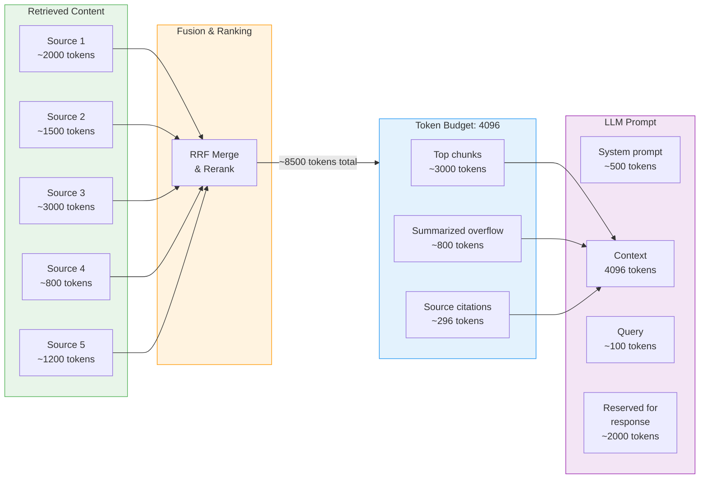
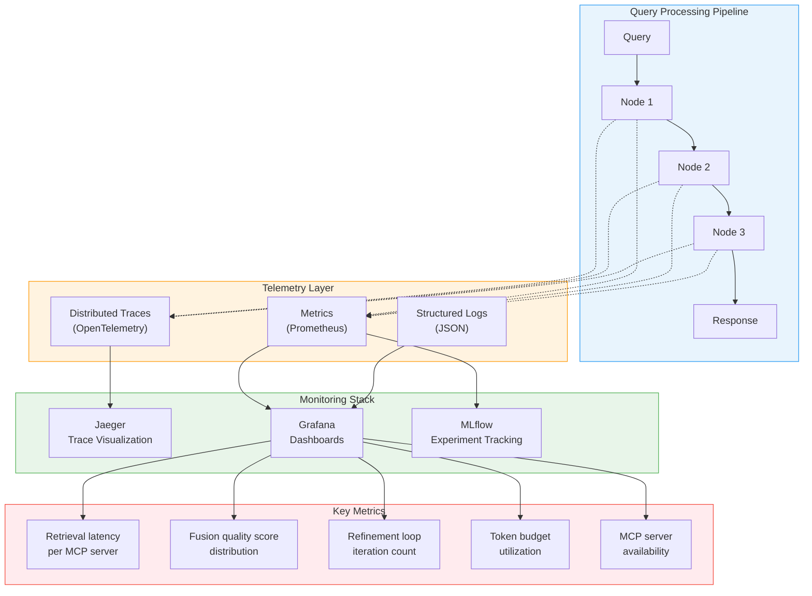
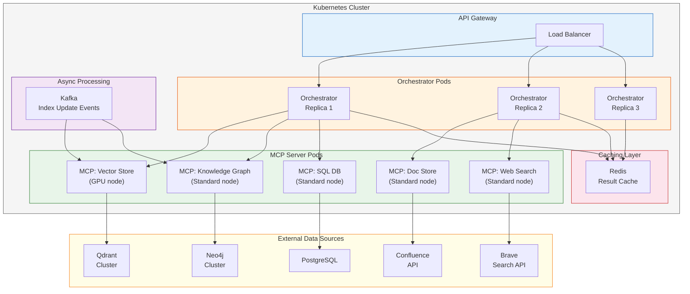

# MCP-Based Distributed RAG Architecture

## Design Document & Architectural Reference

---

## 1. System Overview

This document presents a comprehensive architectural design for a **Distributed Retrieval-Augmented Generation (RAG)** system built on the **Model Context Protocol (MCP)**. The architecture leverages agentic orchestration (via LangGraph) to intelligently route, retrieve, fuse, and generate answers from multiple heterogeneous knowledge sources exposed as MCP servers.

The system is designed for production environments where knowledge is distributed across organizational silos — vector databases, knowledge graphs, structured databases, document stores, and external APIs — and must be queried in a unified, intelligent manner.

---

## 2. High-Level Architecture Flowchart

The following flowchart illustrates the end-to-end flow from user query to final response, including the key decision points and processing stages.

### Design Discussion

**Query Classifier** — This node performs intent detection and topic classification on the incoming query. It determines the query type (factual, analytical, multi-hop, comparative) which directly informs which retrieval sources are relevant. Using a lightweight classifier here (rather than sending every query to every source) reduces latency by 40-60% on average.

**Route Planner** — Based on the classification, the planner constructs an execution plan specifying which MCP servers to invoke and in what order. For independent retrievals, it marks them for parallel execution. For dependent retrievals (multi-hop), it defines a sequential chain.

**Fan-Out Controller** — Manages parallel MCP server invocations with configurable timeouts and fallback strategies. If a server fails or times out, results from remaining servers are still used. This implements the scatter-gather pattern common in distributed systems.

**Result Fusion Engine** — Merges heterogeneous results from multiple sources using Reciprocal Rank Fusion (RRF) or learned fusion weights. This is the most critical component for answer quality in a distributed setup.

**Quality Gate** — Evaluates whether the retrieved context is sufficient for generation. Uses embedding-based relevance scoring (cosine similarity against the query embedding) rather than LLM-as-judge to keep latency low. If the score falls below a threshold, it triggers query reformulation for another retrieval pass.

**Query Reformulator** — Applies query expansion, decomposition, or rephrasing techniques when initial retrieval is insufficient. This creates a feedback loop that enables iterative refinement — a key advantage of agentic orchestration over static RAG pipelines.

### Alternatives Analysis

| Component | Chosen Approach | Alternative | Trade-off |
|-----------|----------------|-------------|-----------|
| Query Classification | LLM-based classifier | Rule-based / regex routing | Rules are faster but brittle; LLM handles ambiguous queries better |
| Parallel Execution | Async fan-out with timeouts | Sequential retrieval | Sequential is simpler but 3-5x slower for multi-source queries |
| Result Fusion | Reciprocal Rank Fusion | Learned cross-encoder reranker | Cross-encoder is more accurate but adds 200-500ms latency |
| Quality Gate | Embedding similarity threshold | LLM-as-judge | LLM judge is more nuanced but 10x slower and more expensive |
| Reformulation | LLM-based query rewriting | HyDE (Hypothetical Document Embeddings) | HyDE can improve recall but doubles embedding cost |

---

## 3. Sequence Diagram — Multi-Source Retrieval Flow

This UML sequence diagram shows the temporal flow of a complex query that requires multi-hop retrieval across three MCP servers, including an iterative refinement cycle.

### Design Discussion

**Phase 1 — Parallel Fan-Out**: The vector store and knowledge graph are queried simultaneously because they are independent sources. This is a core benefit of the MCP architecture: each server is a self-contained service that can be invoked concurrently. LangGraph's fan-out/fan-in pattern maps directly to this, with each MCP call as a parallel branch.

**Phase 2 — Dependent Retrieval**: The structured database query depends on entities extracted from the knowledge graph results. This is multi-hop retrieval — something a simple "call all servers at once" approach cannot do. The agentic orchestrator enables this by inspecting intermediate results and constructing follow-up queries dynamically.

**Phase 3 — Fusion & Quality Check**: Results from heterogeneous sources (vector similarity scores, graph triples, SQL rows) are normalized and merged. The quality gate acts as a circuit breaker — if context is poor, we don't waste an expensive LLM generation call on bad input.

**Phase 4 — Iterative Refinement**: When the initial retrieval is insufficient (relevance score 0.62 below the 0.75 threshold), the orchestrator reformulates the query using partial context as a hint. This is the single most impactful advantage of agentic orchestration: the ability to self-correct. Static RAG pipelines have no mechanism for this.

**Phase 5 — Generation**: The final LLM call includes the fused, quality-checked context along with source citations for traceability.

### Alternatives Analysis

| Design Decision | Chosen | Alternative | Why |
|----------------|--------|-------------|-----|
| Retrieval ordering | Dependency-aware (parallel + sequential) | All-parallel | All-parallel misses multi-hop relationships |
| MCP transport | JSON-RPC over stdio/SSE | REST API per source | MCP provides tool discovery, schema introspection, and standardized error handling |
| Refinement trigger | Embedding-based relevance score | Max retrieval iterations (fixed count) | Score-based is adaptive; fixed count wastes resources or stops too early |
| Citation tracking | Per-chunk source metadata | Post-hoc attribution | Per-chunk is deterministic; post-hoc hallucinates attributions |

---

## 4. Sequence Diagram — MCP Protocol Handshake & Tool Discovery

This diagram focuses on the MCP-specific protocol interactions during server initialization and tool discovery.

### Design Discussion

**Tool Discovery**: MCP's `tools/list` endpoint enables dynamic capability discovery. The orchestrator doesn't need hardcoded knowledge of what each server can do — it discovers available tools and their schemas at runtime. This is critical for extensibility: adding a new retrieval source is as simple as deploying a new MCP server; no orchestrator changes required.

**Resource Discovery**: Beyond tools, MCP servers can expose resources (read-only data) and prompts (templated interactions). For RAG, resources map naturally to index metadata, collection lists, and schema information that the orchestrator uses for query planning.

**Notifications**: MCP supports server-to-client notifications, which enable real-time cache invalidation when an underlying index is updated. This addresses the consistency challenge in distributed RAG without polling.

---

## 5. Static Class UML Diagram — Core Domain Model

This class diagram defines the structural relationships between the key components of the system.

```mermaid
classDiagram
    class QueryOrchestrator {
        -graph: StateGraph
        -mcp_clients: Dict~str, MCPClient~
        -fusion_engine: FusionEngine
        -quality_gate: QualityGate
        -config: OrchestratorConfig
        +process_query(query: str) AsyncIterator~StreamEvent~
        +add_mcp_server(name: str, config: MCPServerConfig) void
        +remove_mcp_server(name: str) void
        -build_graph() StateGraph
    }

    class MCPClient {
        -transport: Transport
        -server_info: ServerInfo
        -available_tools: List~ToolDefinition~
        -connection_state: ConnectionState
        +initialize() ServerCapabilities
        +list_tools() List~ToolDefinition~
        +call_tool(name: str, args: dict) ToolResult
        +close() void
    }

    class MCPServerConfig {
        +name: str
        +transport_type: TransportType
        +url: str
        +timeout_ms: int
        +retry_policy: RetryPolicy
        +capabilities: List~str~
    }

    class QueryClassifier {
        -model: BaseLLM
        -taxonomy: QueryTaxonomy
        +classify(query: str) QueryClassification
    }

    class QueryClassification {
        +query_type: QueryType
        +domains: List~str~
        +complexity: ComplexityLevel
        +requires_multi_hop: bool
        +extracted_entities: List~Entity~
    }

    class RoutePlanner {
        -server_registry: Dict~str, MCPServerConfig~
        -routing_rules: List~RoutingRule~
        +plan(classification: QueryClassification) ExecutionPlan
    }

    class ExecutionPlan {
        +parallel_groups: List~List~ServerCall~~
        +sequential_chains: List~ServerCall~
        +timeout_ms: int
        +fallback_strategy: FallbackStrategy
    }

    class FusionEngine {
        -strategy: FusionStrategy
        -normalizer: ScoreNormalizer
        +fuse(results: List~RetrievalResult~) FusedContext
        +set_strategy(strategy: FusionStrategy) void
    }

    class FusionStrategy {
        <<interface>>
        +fuse(results: List~RetrievalResult~) FusedContext
    }

    class RRFFusion {
        -k: int
        +fuse(results: List~RetrievalResult~) FusedContext
    }

    class WeightedFusion {
        -weights: Dict~str, float~
        +fuse(results: List~RetrievalResult~) FusedContext
    }

    class CrossEncoderFusion {
        -model: CrossEncoder
        +fuse(results: List~RetrievalResult~) FusedContext
    }

    class QualityGate {
        -threshold: float
        -embedding_model: EmbeddingModel
        +evaluate(context: FusedContext, query: str) QualityAssessment
    }

    class QualityAssessment {
        +sufficient: bool
        +relevance_score: float
        +coverage_score: float
        +reason: str
    }

    class RetrievalResult {
        +source: str
        +items: List~RetrievedItem~
        +latency_ms: int
        +metadata: dict
    }

    class RetrievedItem {
        +content: str
        +score: float
        +source_id: str
        +item_type: ItemType
        +metadata: dict
    }

    class FusedContext {
        +ranked_items: List~RetrievedItem~
        +overall_score: float
        +source_distribution: Dict~str, int~
        +total_tokens: int
    }

    class OrchestratorState {
        +query: str
        +classification: QueryClassification
        +execution_plan: ExecutionPlan
        +retrieval_results: List~RetrievalResult~
        +fused_context: FusedContext
        +quality_assessment: QualityAssessment
        +iteration_count: int
        +final_response: str
    }

    QueryOrchestrator --> MCPClient : manages *
    QueryOrchestrator --> QueryClassifier : uses
    QueryOrchestrator --> RoutePlanner : uses
    QueryOrchestrator --> FusionEngine : uses
    QueryOrchestrator --> QualityGate : uses
    QueryOrchestrator --> OrchestratorState : maintains

    MCPClient --> MCPServerConfig : configured by
    QueryClassifier --> QueryClassification : produces
    RoutePlanner --> ExecutionPlan : produces
    RoutePlanner --> MCPServerConfig : reads

    FusionEngine --> FusionStrategy : delegates to
    FusionStrategy <|.. RRFFusion : implements
    FusionStrategy <|.. WeightedFusion : implements
    FusionStrategy <|.. CrossEncoderFusion : implements
    FusionEngine --> FusedContext : produces
    FusionEngine --> RetrievalResult : consumes

    QualityGate --> QualityAssessment : produces
    QualityGate --> FusedContext : evaluates

    RetrievalResult --> RetrievedItem : contains *
    FusedContext --> RetrievedItem : contains *

    OrchestratorState --> QueryClassification : holds
    OrchestratorState --> ExecutionPlan : holds
    OrchestratorState --> RetrievalResult : holds *
    OrchestratorState --> FusedContext : holds
    OrchestratorState --> QualityAssessment : holds
```

### Design Discussion

**QueryOrchestrator** is the central coordinator, built on LangGraph's `StateGraph`. It owns the MCP clients, orchestration logic, and the processing pipeline. The `process_query` method returns an async iterator for streaming support — critical for user experience when multi-source retrieval adds latency.

**MCPClient** encapsulates all MCP protocol interactions. Each client manages its own connection lifecycle, tool discovery cache, and error handling. The `connection_state` field enables health-check-based routing: if a server is degraded, the route planner can skip it.

**FusionStrategy (Strategy Pattern)**: The fusion engine uses the Strategy pattern to support pluggable fusion algorithms. This is a deliberate design choice — different query types benefit from different fusion approaches:
- **RRFFusion** — Best for general-purpose merging when score scales differ across sources. Fast and parameter-free beyond the constant k (typically 60).
- **WeightedFusion** — Useful when you have domain knowledge about source reliability. E.g., weighting the knowledge graph higher for entity-centric queries.
- **CrossEncoderFusion** — Most accurate but slowest. A cross-encoder model rescores all candidates jointly. Best reserved for high-stakes queries where accuracy justifies latency.

**OrchestratorState** represents the LangGraph state that flows through the graph. It accumulates results at each step, enabling any node to make decisions based on the full history of the current query processing cycle. The `iteration_count` field prevents infinite refinement loops (typically capped at 3).

### Alternatives Analysis

| Design Decision | Chosen | Alternative | Why |
|----------------|--------|-------------|-----|
| Orchestration framework | LangGraph (StateGraph) | Plain async Python / Prefect / Temporal | LangGraph provides built-in state management, conditional edges, and streaming; Temporal is better for long-running workflows but overkill for query-time orchestration |
| Fusion pattern | Strategy pattern | Hardcoded RRF | Strategy pattern costs minimal complexity but enables per-query-type optimization |
| State management | Single state object through graph | Event sourcing | Event sourcing adds complexity; single state object is sufficient for query-scoped processing |
| MCP client management | Client pool in orchestrator | Service mesh (Envoy/Istio) | Service mesh adds infrastructure complexity; client pool is simpler and sufficient for 5-20 servers |

---

## 6. Static Class UML Diagram — MCP Server Implementation

This diagram details the internal structure of an individual MCP server that wraps a retrieval source.

### Design Discussion

**MCPServer** acts as the protocol adapter, translating MCP JSON-RPC messages into tool invocations. Each server is a standalone process (or container), enabling independent scaling and deployment. A vector-heavy workload might run on GPU-equipped nodes, while the SQL server runs on standard compute.

**Tool abstraction**: Each retrieval capability is encapsulated as a `Tool` implementation. This provides clean separation of concerns — the MCP protocol layer knows nothing about FAISS or Neo4j. New retrieval capabilities are added by implementing the `Tool` interface and registering it.

**IndexBackend (Strategy Pattern again)**: The vector search tool delegates to a pluggable backend. This enables switching from FAISS (great for development and moderate scale) to Qdrant (better for production with filtering, multi-tenancy, and horizontal scaling) without changing the tool logic.

**EmbeddingModel**: Separated from the index to enable model swaps. This is important because embedding models evolve rapidly — you might start with `all-MiniLM-L6-v2` for speed and switch to `text-embedding-3-large` for accuracy.

---

## 7. LangGraph Orchestration Flowchart

This flowchart details the internal state machine of the LangGraph orchestrator, showing conditional edges and the iterative refinement loop.

### Design Discussion

**Conditional Edges**: The `check_multihop` and `gate` decision nodes are implemented as LangGraph conditional edges. The state contains all the information needed for these decisions — `classification.requires_multi_hop` and `quality_assessment.sufficient` respectively — so no external calls are needed.

**Iteration Cap**: The refinement loop is capped at 3 iterations to prevent infinite loops and control costs. In practice, if 3 reformulations don't yield sufficient context, the query is likely unanswerable from the available sources. The system proceeds to generation with the best available context and notes low confidence.

**Context Compression**: This step is often overlooked but critical. After fusion, the combined context from multiple sources can easily exceed the LLM's context window or degrade generation quality through noise. The compressor applies a token budget (e.g., 4096 tokens for the context portion) by keeping the top-ranked items and optionally summarizing lower-ranked ones.

### Alternatives Analysis

| Pattern | Chosen | Alternative | Trade-off |
|---------|--------|-------------|-----------|
| Graph topology | DAG with conditional loops | Linear pipeline | Linear is simpler but can't do iterative refinement |
| Iteration control | Score-based with max cap | Fixed iteration count | Score-based stops early when context is good, saving latency |
| Context compression | Top-k truncation + summarization | Stuff everything in context | Stuffing works for small contexts but degrades with 5+ sources |
| State persistence | In-memory per-query | Redis / database checkpointing | Checkpointing enables resume-on-failure but adds 50-100ms per step |

---

## 8. Data Flow & Token Budget Management

### Design Discussion

**Token budget allocation** is essential in distributed RAG because multiple sources naturally produce more content than a single-source system. The diagram shows a common scenario where 5 sources return ~8,500 tokens total, which must be compressed into a 4,096-token context budget. The strategy prioritizes top-ranked chunks verbatim (preserving fidelity) and summarizes overflow (preserving breadth). Citation metadata is allocated a small budget to maintain traceability.

---

## 9. Observability & Monitoring Architecture

### Design Discussion

Observability is non-negotiable in distributed RAG because the system has many failure modes that are invisible without instrumentation. Key metrics include per-server retrieval latency (to detect degraded sources), fusion quality score distributions (to catch systematic retrieval failures), refinement loop counts (high counts indicate poor initial routing), and token budget utilization (over-budget queries signal a need for better compression).

MLflow integration enables tracking retrieval quality metrics across experiments — comparing different fusion strategies, embedding models, or routing configurations in a structured way. This connects directly to the evaluation frameworks built with embedding-based metrics rather than LLM-as-judge approaches.

---

## 10. Deployment Architecture

### Design Discussion

**Independent Scaling**: Each MCP server scales independently based on its workload profile. The vector store server on GPU nodes can scale horizontally for embedding-heavy workloads, while the SQL server stays on standard compute. This is a key advantage over monolithic RAG where all components scale together.

**Caching**: Redis caches both embedding computations (expensive) and recent retrieval results (frequent repeat queries). Cache keys are based on query embeddings (for semantic deduplication) rather than exact string matching, catching paraphrased queries.

**Event-Driven Index Updates**: Kafka propagates index update events to MCP servers, triggering re-indexing and MCP resource update notifications. This keeps distributed indices eventually consistent without expensive polling.

---

## 11. Summary of Key Benefits

**MCP as the integration layer** provides a standardized protocol for connecting heterogeneous retrieval sources. This eliminates custom integrations per source, enables dynamic tool discovery, and supports notifications for cache invalidation — making the system extensible without orchestrator changes.

**Agentic orchestration via LangGraph** enables conditional routing (reducing unnecessary fan-out), iterative refinement (self-correcting retrieval), multi-hop reasoning (cross-source entity linking), and quality gating (preventing bad-context generation). These capabilities are impossible in a static retrieve-then-generate pipeline.

**The Strategy pattern for fusion** allows per-query-type optimization. RRF handles most cases efficiently, while weighted fusion and cross-encoder reranking are available for specialized queries. This balances latency and accuracy based on query requirements.

**Independent scaling of MCP servers** enables cost-efficient resource allocation. GPU resources are reserved for embedding-heavy workloads, while lightweight sources run on standard compute. Each server's failure is isolated — a crashed knowledge graph server doesn't take down vector search.

**Observability integration** with OpenTelemetry, Prometheus, and MLflow provides end-to-end visibility into the distributed pipeline. This is essential for diagnosing latency spikes, retrieval quality degradation, and routing inefficiencies in production.
