# RAG Notebook — Component Diagrams

Detailed UML class and sequence diagrams for every LangChain / LangGraph component used in `rag.ipynb`.

---

## Table of Contents

1. [Overall Architecture](#1-overall-architecture)
2. [Environment & Configuration (Cell 5)](#2-environment--configuration-cell-5)
3. [ChatOpenAI — LLM (Cell 6)](#3-chatopenai--llm-cell-6)
4. [OpenAIEmbeddings (Cell 8)](#4-openaiembeddings-cell-8)
5. [InMemoryVectorStore (Cells 10, 19, 43)](#5-inmemoryvectorstore-cells-10-19-43)
6. [WebBaseLoader — Document Loading (Cell 14)](#6-webbaseloader--document-loading-cell-14)
7. [RecursiveCharacterTextSplitter (Cell 17)](#7-recursivecharactertextsplitter-cell-17)
8. [Prompt — Hub Pull & PromptTemplate (Cells 21, 39)](#8-prompt--hub-pull--prompttemplate-cells-21-39)
9. [LangGraph State & Node Functions (Cells 23, 25)](#9-langgraph-state--node-functions-cells-23-25)
10. [StateGraph — Compilation (Cell 27)](#10-stategraph--compilation-cell-27)
11. [Graph Invocation (Cell 32)](#11-graph-invocation-cell-32)
12. [Graph Streaming — Updates Mode (Cell 34)](#12-graph-streaming--updates-mode-cell-34)
13. [Graph Streaming — Messages Mode (Cell 36)](#13-graph-streaming--messages-mode-cell-36)
14. [Structured Output & Query Analysis Schema (Cells 45, 47)](#14-structured-output--query-analysis-schema-cells-45-47)
15. [Enhanced RAG Graph with Query Analysis (Cell 47)](#15-enhanced-rag-graph-with-query-analysis-cell-47)
16. [End-to-End Indexing Pipeline](#16-end-to-end-indexing-pipeline)
17. [End-to-End Retrieval & Generation Pipeline](#17-end-to-end-retrieval--generation-pipeline)

---

## 1. Overall Architecture

High-level class diagram showing every LangChain/LangGraph component and how they relate.

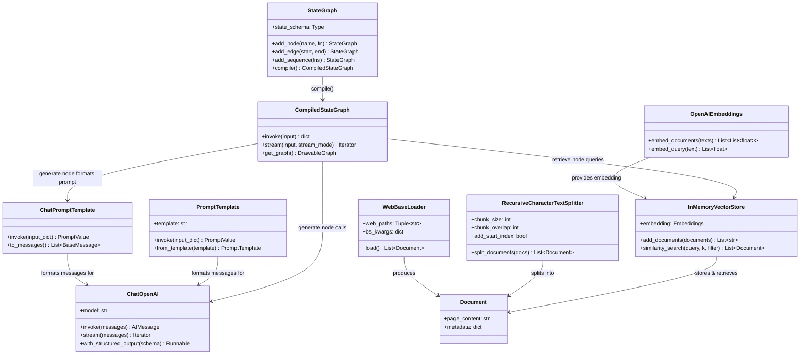
```mermaid
classDiagram
    direction TB

    class ChatOpenAI {
        +model: str
        +invoke(messages) AIMessage
        +stream(messages) Iterator
        +with_structured_output(schema) Runnable
    }

    class OpenAIEmbeddings {
        +embed_documents(texts) List~List~float~~
        +embed_query(text) List~float~
    }

    class InMemoryVectorStore {
        +embedding: Embeddings
        +add_documents(documents) List~str~
        +similarity_search(query, k, filter) List~Document~
    }

    class WebBaseLoader {
        +web_paths: Tuple~str~
        +bs_kwargs: dict
        +load() List~Document~
    }

    class RecursiveCharacterTextSplitter {
        +chunk_size: int
        +chunk_overlap: int
        +add_start_index: bool
        +split_documents(docs) List~Document~
    }

    class ChatPromptTemplate {
        +invoke(input_dict) PromptValue
        +to_messages() List~BaseMessage~
    }

    class PromptTemplate {
        +template: str
        +invoke(input_dict) PromptValue
        +from_template(template)$ PromptTemplate
    }

    class Document {
        +page_content: str
        +metadata: dict
    }

    class StateGraph {
        +state_schema: Type
        +add_node(name, fn) StateGraph
        +add_edge(start, end) StateGraph
        +add_sequence(fns) StateGraph
        +compile() CompiledStateGraph
    }

    class CompiledStateGraph {
        +invoke(input) dict
        +stream(input, stream_mode) Iterator
        +get_graph() DrawableGraph
    }

    OpenAIEmbeddings --> InMemoryVectorStore : provides embedding
    WebBaseLoader --> Document : produces
    RecursiveCharacterTextSplitter --> Document : splits into
    InMemoryVectorStore --> Document : stores & retrieves
    ChatPromptTemplate --> ChatOpenAI : formats messages for
    PromptTemplate --> ChatOpenAI : formats messages for
    StateGraph --> CompiledStateGraph : compile()
    CompiledStateGraph --> ChatOpenAI : generate node calls
    CompiledStateGraph --> InMemoryVectorStore : retrieve node queries
    CompiledStateGraph --> ChatPromptTemplate : generate node formats prompt
```

---

## 2. Environment & Configuration (Cell 5)

Sequence diagram for the environment setup using `python-dotenv` and `os.environ`.

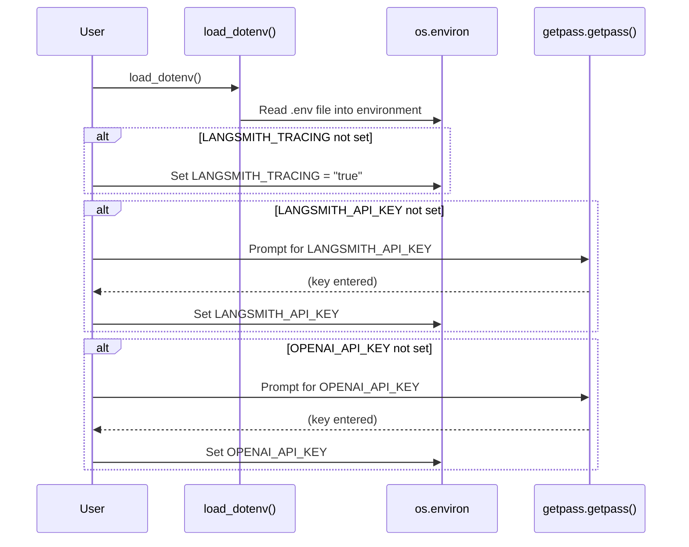
```mermaid
sequenceDiagram
    participant User
    participant dotenv as load_dotenv()
    participant env as os.environ
    participant getpass as getpass.getpass()

    User->>dotenv: load_dotenv()
    dotenv->>env: Read .env file into environment

    alt LANGSMITH_TRACING not set
        User->>env: Set LANGSMITH_TRACING = "true"
    end

    alt LANGSMITH_API_KEY not set
        User->>getpass: Prompt for LANGSMITH_API_KEY
        getpass-->>User: (key entered)
        User->>env: Set LANGSMITH_API_KEY
    end

    alt OPENAI_API_KEY not set
        User->>getpass: Prompt for OPENAI_API_KEY
        getpass-->>User: (key entered)
        User->>env: Set OPENAI_API_KEY
    end
```

---

## 3. ChatOpenAI — LLM (Cell 6)

### Class Diagram

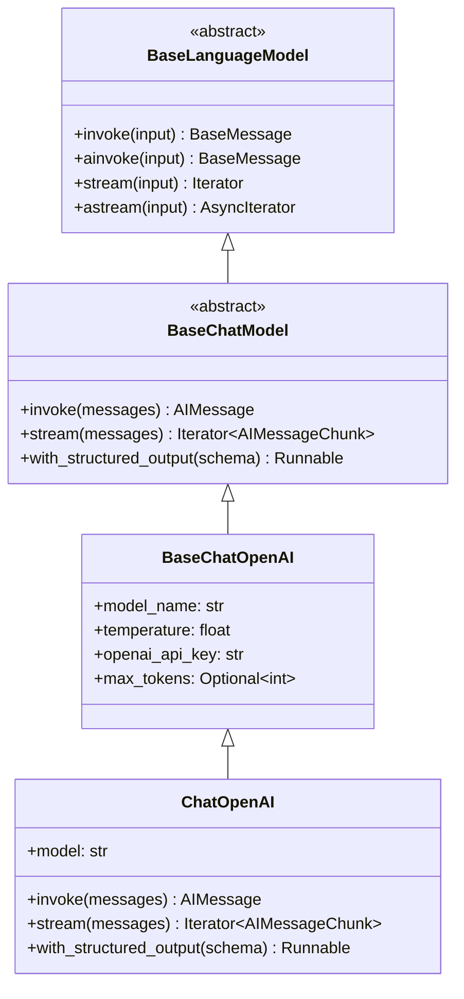
```mermaid
classDiagram
    direction TB

    class BaseLanguageModel {
        <<abstract>>
        +invoke(input) BaseMessage
        +ainvoke(input) BaseMessage
        +stream(input) Iterator
        +astream(input) AsyncIterator
    }

    class BaseChatModel {
        <<abstract>>
        +invoke(messages) AIMessage
        +stream(messages) Iterator~AIMessageChunk~
        +with_structured_output(schema) Runnable
    }

    class BaseChatOpenAI {
        +model_name: str
        +temperature: float
        +openai_api_key: str
        +max_tokens: Optional~int~
    }

    class ChatOpenAI {
        +model: str
        +invoke(messages) AIMessage
        +stream(messages) Iterator~AIMessageChunk~
        +with_structured_output(schema) Runnable
    }

    BaseLanguageModel <|-- BaseChatModel
    BaseChatModel <|-- BaseChatOpenAI
    BaseChatOpenAI <|-- ChatOpenAI
```

### Sequence Diagram — Instantiation

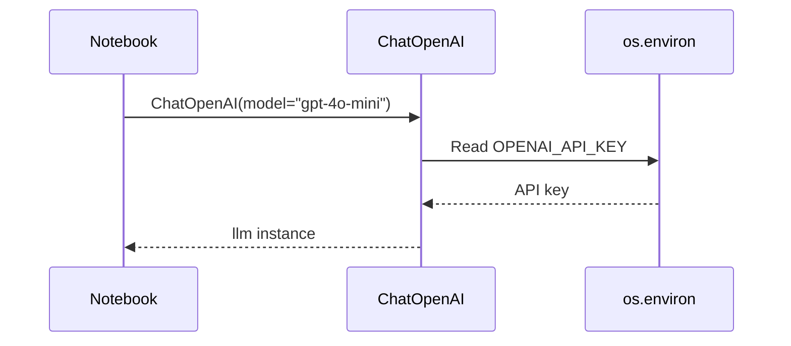
```mermaid
sequenceDiagram
    participant Notebook
    participant ChatOpenAI
    participant env as os.environ

    Notebook->>ChatOpenAI: ChatOpenAI(model="gpt-4o-mini")
    ChatOpenAI->>env: Read OPENAI_API_KEY
    env-->>ChatOpenAI: API key
    ChatOpenAI-->>Notebook: llm instance
```

---

## 4. OpenAIEmbeddings (Cell 8)

### Class Diagram

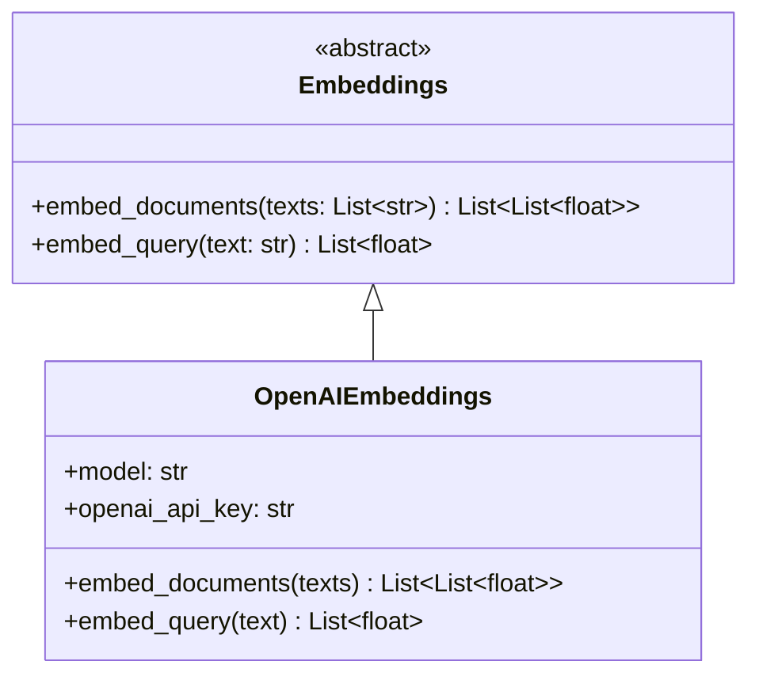
```mermaid
classDiagram
    direction TB

    class Embeddings {
        <<abstract>>
        +embed_documents(texts: List~str~) List~List~float~~
        +embed_query(text: str) List~float~
    }

    class OpenAIEmbeddings {
        +model: str
        +openai_api_key: str
        +embed_documents(texts) List~List~float~~
        +embed_query(text) List~float~
    }

    Embeddings <|-- OpenAIEmbeddings
```

### Sequence Diagram — Embedding a Query

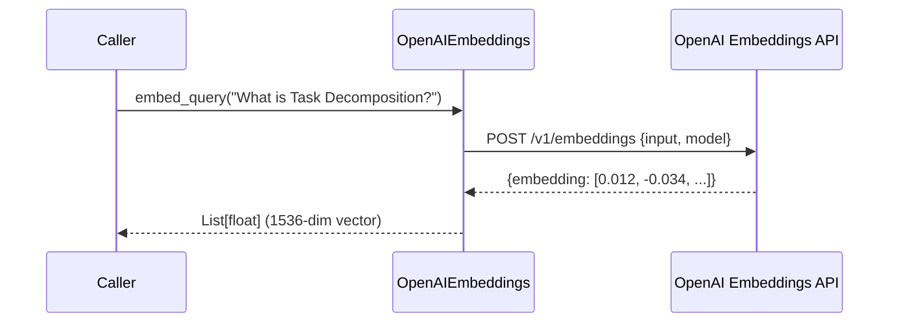
```mermaid
sequenceDiagram
    participant Caller
    participant OpenAIEmbeddings
    participant OpenAI_API as OpenAI Embeddings API

    Caller->>OpenAIEmbeddings: embed_query("What is Task Decomposition?")
    OpenAIEmbeddings->>OpenAI_API: POST /v1/embeddings {input, model}
    OpenAI_API-->>OpenAIEmbeddings: {embedding: [0.012, -0.034, ...]}
    OpenAIEmbeddings-->>Caller: List[float] (1536-dim vector)
```

---

## 5. InMemoryVectorStore (Cells 10, 19, 43)

### Class Diagram

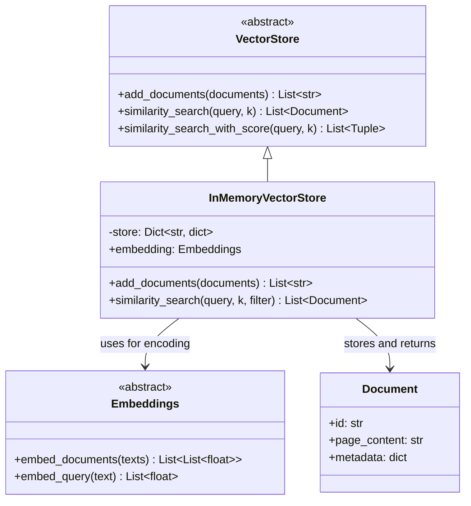
```mermaid
classDiagram
    direction TB

    class VectorStore {
        <<abstract>>
        +add_documents(documents) List~str~
        +similarity_search(query, k) List~Document~
        +similarity_search_with_score(query, k) List~Tuple~
    }

    class InMemoryVectorStore {
        -store: Dict~str, dict~
        +embedding: Embeddings
        +add_documents(documents) List~str~
        +similarity_search(query, k, filter) List~Document~
    }

    class Embeddings {
        <<abstract>>
        +embed_documents(texts) List~List~float~~
        +embed_query(text) List~float~
    }

    class Document {
        +id: str
        +page_content: str
        +metadata: dict
    }

    VectorStore <|-- InMemoryVectorStore
    InMemoryVectorStore --> Embeddings : uses for encoding
    InMemoryVectorStore --> Document : stores and returns
```

### Sequence Diagram — add_documents (Cell 19)

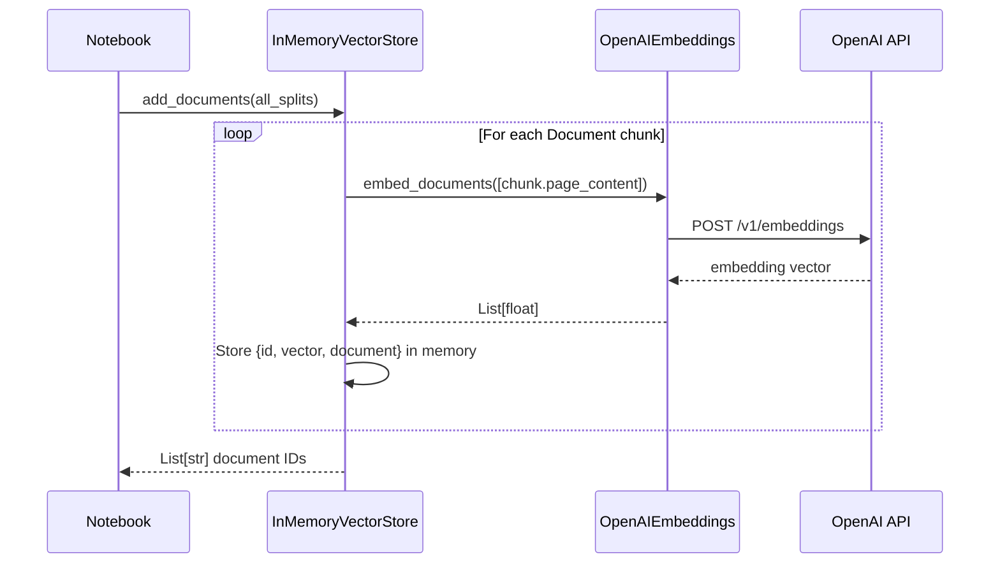
```mermaid
sequenceDiagram
    participant Notebook
    participant VectorStore as InMemoryVectorStore
    participant Embeddings as OpenAIEmbeddings
    participant OpenAI_API as OpenAI API

    Notebook->>VectorStore: add_documents(all_splits)

    loop For each Document chunk
        VectorStore->>Embeddings: embed_documents([chunk.page_content])
        Embeddings->>OpenAI_API: POST /v1/embeddings
        OpenAI_API-->>Embeddings: embedding vector
        Embeddings-->>VectorStore: List[float]
        VectorStore->>VectorStore: Store {id, vector, document} in memory
    end

    VectorStore-->>Notebook: List[str] document IDs
```

### Sequence Diagram — similarity_search

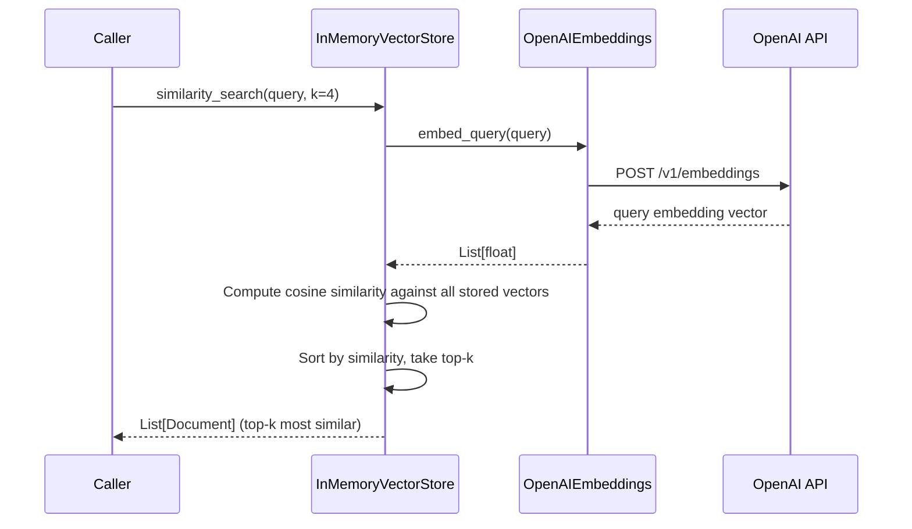
```mermaid
sequenceDiagram
    participant Caller
    participant VectorStore as InMemoryVectorStore
    participant Embeddings as OpenAIEmbeddings
    participant OpenAI_API as OpenAI API

    Caller->>VectorStore: similarity_search(query, k=4)
    VectorStore->>Embeddings: embed_query(query)
    Embeddings->>OpenAI_API: POST /v1/embeddings
    OpenAI_API-->>Embeddings: query embedding vector
    Embeddings-->>VectorStore: List[float]

    VectorStore->>VectorStore: Compute cosine similarity against all stored vectors
    VectorStore->>VectorStore: Sort by similarity, take top-k

    VectorStore-->>Caller: List[Document] (top-k most similar)
```

---

## 6. WebBaseLoader — Document Loading (Cell 14)

### Class Diagram

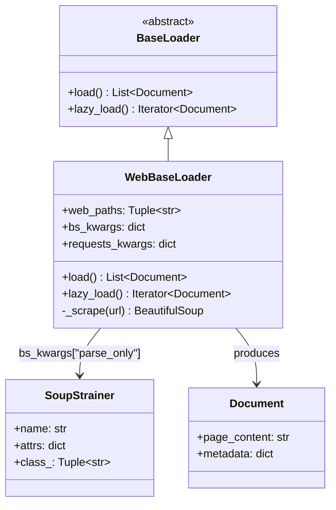
```mermaid
classDiagram
    direction TB

    class BaseLoader {
        <<abstract>>
        +load() List~Document~
        +lazy_load() Iterator~Document~
    }

    class WebBaseLoader {
        +web_paths: Tuple~str~
        +bs_kwargs: dict
        +requests_kwargs: dict
        +load() List~Document~
        +lazy_load() Iterator~Document~
        -_scrape(url) BeautifulSoup
    }

    class SoupStrainer {
        +name: str
        +attrs: dict
        +class_: Tuple~str~
    }

    class Document {
        +page_content: str
        +metadata: dict
    }

    BaseLoader <|-- WebBaseLoader
    WebBaseLoader --> SoupStrainer : bs_kwargs["parse_only"]
    WebBaseLoader --> Document : produces
```

### Sequence Diagram — Loading a Web Page

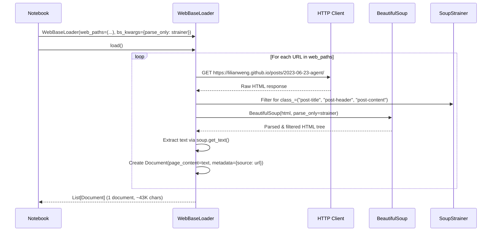
```mermaid
sequenceDiagram
    participant Notebook
    participant Loader as WebBaseLoader
    participant HTTP as HTTP Client
    participant BS4 as BeautifulSoup
    participant Strainer as SoupStrainer

    Notebook->>Loader: WebBaseLoader(web_paths=(...), bs_kwargs={parse_only: strainer})
    Notebook->>Loader: load()

    loop For each URL in web_paths
        Loader->>HTTP: GET https://lilianweng.github.io/posts/2023-06-23-agent/
        HTTP-->>Loader: Raw HTML response

        Loader->>Strainer: Filter for class_=("post-title", "post-header", "post-content")
        Loader->>BS4: BeautifulSoup(html, parse_only=strainer)
        BS4-->>Loader: Parsed & filtered HTML tree

        Loader->>Loader: Extract text via soup.get_text()
        Loader->>Loader: Create Document(page_content=text, metadata={source: url})
    end

    Loader-->>Notebook: List[Document] (1 document, ~43K chars)
```

---

## 7. RecursiveCharacterTextSplitter (Cell 17)

### Class Diagram

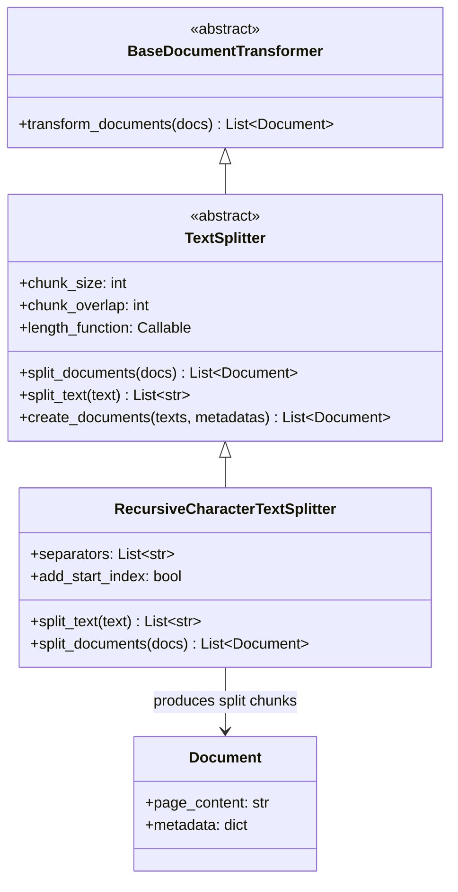
```mermaid
classDiagram
    direction TB

    class BaseDocumentTransformer {
        <<abstract>>
        +transform_documents(docs) List~Document~
    }

    class TextSplitter {
        <<abstract>>
        +chunk_size: int
        +chunk_overlap: int
        +length_function: Callable
        +split_documents(docs) List~Document~
        +split_text(text) List~str~
        +create_documents(texts, metadatas) List~Document~
    }

    class RecursiveCharacterTextSplitter {
        +separators: List~str~
        +add_start_index: bool
        +split_text(text) List~str~
        +split_documents(docs) List~Document~
    }

    class Document {
        +page_content: str
        +metadata: dict
    }

    BaseDocumentTransformer <|-- TextSplitter
    TextSplitter <|-- RecursiveCharacterTextSplitter
    RecursiveCharacterTextSplitter --> Document : produces split chunks
```

### Sequence Diagram — Splitting Documents

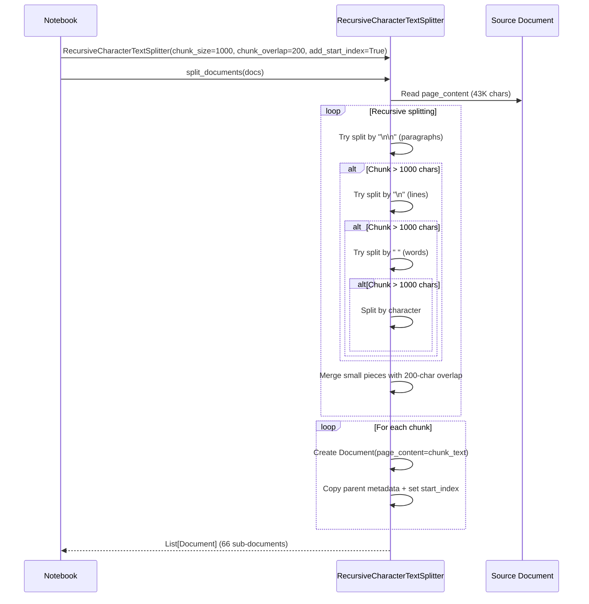
```mermaid
sequenceDiagram
    participant Notebook
    participant Splitter as RecursiveCharacterTextSplitter
    participant Doc as Source Document

    Notebook->>Splitter: RecursiveCharacterTextSplitter(chunk_size=1000, chunk_overlap=200, add_start_index=True)
    Notebook->>Splitter: split_documents(docs)

    Splitter->>Doc: Read page_content (43K chars)

    loop Recursive splitting
        Splitter->>Splitter: Try split by "\n\n" (paragraphs)
        alt Chunk > 1000 chars
            Splitter->>Splitter: Try split by "\n" (lines)
            alt Chunk > 1000 chars
                Splitter->>Splitter: Try split by " " (words)
                alt Chunk > 1000 chars
                    Splitter->>Splitter: Split by character
                end
            end
        end
        Splitter->>Splitter: Merge small pieces with 200-char overlap
    end

    loop For each chunk
        Splitter->>Splitter: Create Document(page_content=chunk_text)
        Splitter->>Splitter: Copy parent metadata + set start_index
    end

    Splitter-->>Notebook: List[Document] (66 sub-documents)
```

---

## 8. Prompt — Hub Pull & PromptTemplate (Cells 21, 39)

### Class Diagram

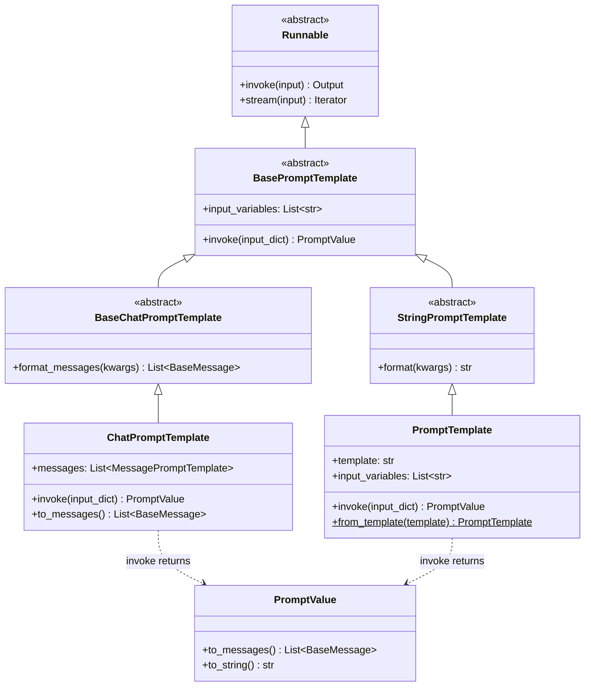
```mermaid
classDiagram
    direction TB

    class Runnable {
        <<abstract>>
        +invoke(input) Output
        +stream(input) Iterator
    }

    class BasePromptTemplate {
        <<abstract>>
        +input_variables: List~str~
        +invoke(input_dict) PromptValue
    }

    class BaseChatPromptTemplate {
        <<abstract>>
        +format_messages(kwargs) List~BaseMessage~
    }

    class ChatPromptTemplate {
        +messages: List~MessagePromptTemplate~
        +invoke(input_dict) PromptValue
        +to_messages() List~BaseMessage~
    }

    class StringPromptTemplate {
        <<abstract>>
        +format(kwargs) str
    }

    class PromptTemplate {
        +template: str
        +input_variables: List~str~
        +invoke(input_dict) PromptValue
        +from_template(template)$ PromptTemplate
    }

    class PromptValue {
        +to_messages() List~BaseMessage~
        +to_string() str
    }

    Runnable <|-- BasePromptTemplate
    BasePromptTemplate <|-- BaseChatPromptTemplate
    BaseChatPromptTemplate <|-- ChatPromptTemplate
    BasePromptTemplate <|-- StringPromptTemplate
    StringPromptTemplate <|-- PromptTemplate
    ChatPromptTemplate ..> PromptValue : invoke returns
    PromptTemplate ..> PromptValue : invoke returns
```

### Sequence Diagram — Hub Pull (Cell 21)

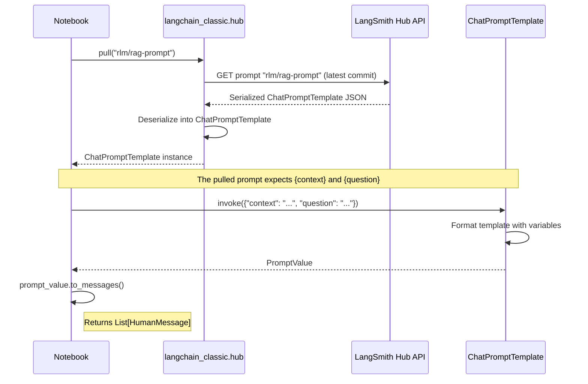
```mermaid
sequenceDiagram
    participant Notebook
    participant Hub as langchain_classic.hub
    participant LangSmith as LangSmith Hub API
    participant Prompt as ChatPromptTemplate

    Notebook->>Hub: pull("rlm/rag-prompt")
    Hub->>LangSmith: GET prompt "rlm/rag-prompt" (latest commit)
    LangSmith-->>Hub: Serialized ChatPromptTemplate JSON
    Hub->>Hub: Deserialize into ChatPromptTemplate
    Hub-->>Notebook: ChatPromptTemplate instance

    Note over Notebook,Prompt: The pulled prompt expects {context} and {question}

    Notebook->>Prompt: invoke({"context": "...", "question": "..."})
    Prompt->>Prompt: Format template with variables
    Prompt-->>Notebook: PromptValue

    Notebook->>Notebook: prompt_value.to_messages()
    Note right of Notebook: Returns List[HumanMessage]
```

### Sequence Diagram — PromptTemplate.from_template (Cell 39)

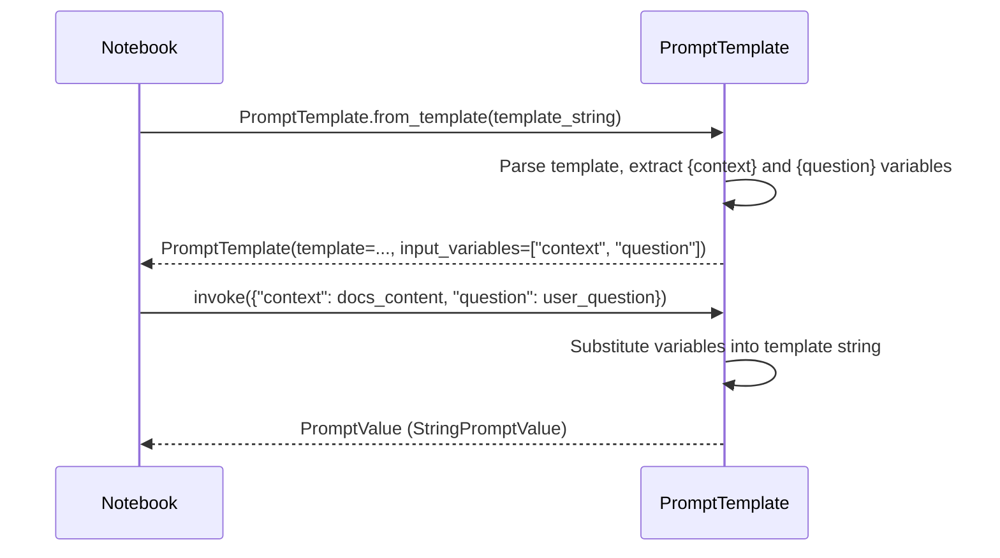
```mermaid
sequenceDiagram
    participant Notebook
    participant PT as PromptTemplate

    Notebook->>PT: PromptTemplate.from_template(template_string)
    PT->>PT: Parse template, extract {context} and {question} variables
    PT-->>Notebook: PromptTemplate(template=..., input_variables=["context", "question"])

    Notebook->>PT: invoke({"context": docs_content, "question": user_question})
    PT->>PT: Substitute variables into template string
    PT-->>Notebook: PromptValue (StringPromptValue)
```

---

## 9. LangGraph State & Node Functions (Cells 23, 25)

### Class Diagram — State Schema & Node Signatures

```mermaid
classDiagram
    direction TB

    class State {
        <<TypedDict>>
        +question: str
        +context: List~Document~
        +answer: str
    }

    class Document {
        +page_content: str
        +metadata: dict
    }

    class retrieve {
        <<function>>
        +__call__(state: State) dict
    }

    class generate {
        <<function>>
        +__call__(state: State) dict
    }

    class InMemoryVectorStore {
        +similarity_search(query) List~Document~
    }

    class ChatPromptTemplate {
        +invoke(input_dict) PromptValue
    }

    class ChatOpenAI {
        +invoke(messages) AIMessage
    }

    State --> Document : context contains

    retrieve --> State : reads question from
    retrieve --> InMemoryVectorStore : calls similarity_search
    retrieve ..> State : returns {context: docs}

    generate --> State : reads question, context from
    generate --> ChatPromptTemplate : formats prompt
    generate --> ChatOpenAI : invokes LLM
    generate ..> State : returns {answer: text}
```

### Sequence Diagram — retrieve() Node

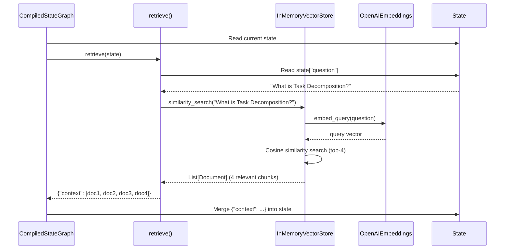
```mermaid
sequenceDiagram
    participant Graph as CompiledStateGraph
    participant retrieve as retrieve()
    participant VectorStore as InMemoryVectorStore
    participant Embeddings as OpenAIEmbeddings
    participant State

    Graph->>State: Read current state
    Graph->>retrieve: retrieve(state)
    retrieve->>State: Read state["question"]
    State-->>retrieve: "What is Task Decomposition?"

    retrieve->>VectorStore: similarity_search("What is Task Decomposition?")
    VectorStore->>Embeddings: embed_query(question)
    Embeddings-->>VectorStore: query vector
    VectorStore->>VectorStore: Cosine similarity search (top-4)
    VectorStore-->>retrieve: List[Document] (4 relevant chunks)

    retrieve-->>Graph: {"context": [doc1, doc2, doc3, doc4]}
    Graph->>State: Merge {"context": ...} into state
```

### Sequence Diagram — generate() Node

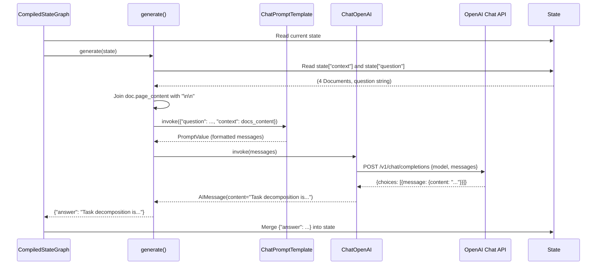
```mermaid
sequenceDiagram
    participant Graph as CompiledStateGraph
    participant generate as generate()
    participant Prompt as ChatPromptTemplate
    participant LLM as ChatOpenAI
    participant OpenAI_API as OpenAI Chat API
    participant State

    Graph->>State: Read current state
    Graph->>generate: generate(state)

    generate->>State: Read state["context"] and state["question"]
    State-->>generate: (4 Documents, question string)

    generate->>generate: Join doc.page_content with "\n\n"

    generate->>Prompt: invoke({"question": ..., "context": docs_content})
    Prompt-->>generate: PromptValue (formatted messages)

    generate->>LLM: invoke(messages)
    LLM->>OpenAI_API: POST /v1/chat/completions {model, messages}
    OpenAI_API-->>LLM: {choices: [{message: {content: "..."}}]}
    LLM-->>generate: AIMessage(content="Task decomposition is...")

    generate-->>Graph: {"answer": "Task decomposition is..."}
    Graph->>State: Merge {"answer": ...} into state
```

---

## 10. StateGraph — Compilation (Cell 27)

### Class Diagram

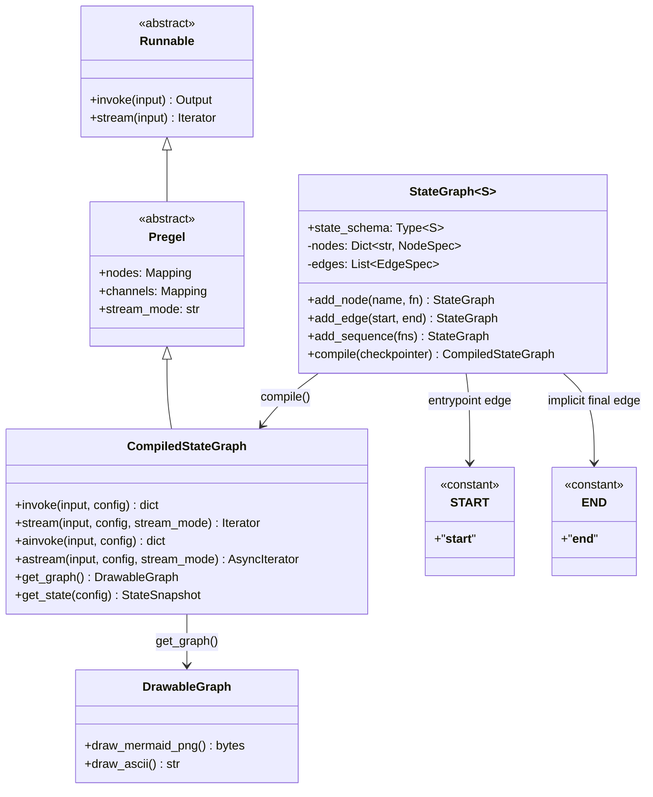
```mermaid
classDiagram
    direction TB

    class StateGraph~S~ {
        +state_schema: Type~S~
        -nodes: Dict~str, NodeSpec~
        -edges: List~EdgeSpec~
        +add_node(name, fn) StateGraph
        +add_edge(start, end) StateGraph
        +add_sequence(fns) StateGraph
        +compile(checkpointer) CompiledStateGraph
    }

    class CompiledStateGraph {
        +invoke(input, config) dict
        +stream(input, config, stream_mode) Iterator
        +ainvoke(input, config) dict
        +astream(input, config, stream_mode) AsyncIterator
        +get_graph() DrawableGraph
        +get_state(config) StateSnapshot
    }

    class Pregel {
        <<abstract>>
        +nodes: Mapping
        +channels: Mapping
        +stream_mode: str
    }

    class Runnable {
        <<abstract>>
        +invoke(input) Output
        +stream(input) Iterator
    }

    class DrawableGraph {
        +draw_mermaid_png() bytes
        +draw_ascii() str
    }

    class START {
        <<constant>>
        +"__start__"
    }

    class END {
        <<constant>>
        +"__end__"
    }

    Runnable <|-- Pregel
    Pregel <|-- CompiledStateGraph
    StateGraph --> CompiledStateGraph : compile()
    CompiledStateGraph --> DrawableGraph : get_graph()
    StateGraph --> START : entrypoint edge
    StateGraph --> END : implicit final edge
```

### Sequence Diagram — Building & Compiling the Graph

```mermaid
sequenceDiagram
    participant Notebook
    participant SG as StateGraph
    participant CSG as CompiledStateGraph

    Notebook->>SG: StateGraph(State)
    SG->>SG: Register state schema (question, context, answer)

    Notebook->>SG: add_sequence([retrieve, generate])
    SG->>SG: add_node("retrieve", retrieve)
    SG->>SG: add_node("generate", generate)
    SG->>SG: add_edge("retrieve", "generate")
    SG->>SG: add_edge("generate", END)

    Notebook->>SG: add_edge(START, "retrieve")
    SG->>SG: Set entrypoint → "retrieve"

    Notebook->>SG: compile()
    SG->>SG: Validate graph (entrypoint exists, no orphan nodes)
    SG->>SG: Build channel mapping from State schema
    SG->>SG: Build execution plan (topological order)
    SG->>CSG: Create CompiledStateGraph(nodes, channels, edges)
    SG-->>Notebook: CompiledStateGraph instance

    Note over CSG: Graph: START → retrieve → generate → END
```

---

## 11. Graph Invocation (Cell 32)

### Sequence Diagram — graph.invoke()

```mermaid
sequenceDiagram
    participant Notebook
    participant Graph as CompiledStateGraph
    participant State
    participant retrieve
    participant generate
    participant VectorStore as InMemoryVectorStore
    participant Prompt as ChatPromptTemplate
    participant LLM as ChatOpenAI
    participant OpenAI_API as OpenAI API

    Notebook->>Graph: invoke({"question": "What is Task Decomposition?"})
    Graph->>State: Initialize state {question: "What is Task Decomposition?"}

    rect rgb(230, 245, 255)
        Note over Graph,VectorStore: Step 1: retrieve node
        Graph->>retrieve: retrieve(state)
        retrieve->>VectorStore: similarity_search(question)
        VectorStore-->>retrieve: [doc1, doc2, doc3, doc4]
        retrieve-->>Graph: {"context": [doc1, doc2, doc3, doc4]}
        Graph->>State: Merge context into state
    end

    rect rgb(255, 245, 230)
        Note over Graph,OpenAI_API: Step 2: generate node
        Graph->>generate: generate(state)
        generate->>Prompt: invoke({question, context})
        Prompt-->>generate: formatted messages
        generate->>LLM: invoke(messages)
        LLM->>OpenAI_API: POST /v1/chat/completions
        OpenAI_API-->>LLM: AI response
        LLM-->>generate: AIMessage
        generate-->>Graph: {"answer": "Task decomposition is..."}
        Graph->>State: Merge answer into state
    end

    Graph-->>Notebook: {"question": "...", "context": [...], "answer": "..."}
```

---

## 12. Graph Streaming — Updates Mode (Cell 34)

### Sequence Diagram — stream(stream_mode="updates")

Each yielded step contains only the state keys that the most recently executed node returned.

```mermaid
sequenceDiagram
    participant Notebook
    participant Graph as CompiledStateGraph
    participant retrieve
    participant generate

    Notebook->>Graph: stream({"question": "..."}, stream_mode="updates")

    Graph->>retrieve: retrieve(state)
    retrieve-->>Graph: {"context": [doc1, doc2, doc3, doc4]}
    Graph-->>Notebook: yield {"retrieve": {"context": [doc1, ..., doc4]}}
    Note right of Notebook: First update: retrieve output

    Graph->>generate: generate(state)
    generate-->>Graph: {"answer": "Task decomposition is..."}
    Graph-->>Notebook: yield {"generate": {"answer": "Task decomposition is..."}}
    Note right of Notebook: Second update: generate output

    Note over Notebook: Iterator exhausted — graph reached END
```

---

## 13. Graph Streaming — Messages Mode (Cell 36)

### Sequence Diagram — stream(stream_mode="messages")

Yields `(message_chunk, metadata)` tuples as tokens are generated by the LLM.

```mermaid
sequenceDiagram
    participant Notebook
    participant Graph as CompiledStateGraph
    participant retrieve
    participant generate
    participant LLM as ChatOpenAI
    participant OpenAI_API as OpenAI API

    Notebook->>Graph: stream({"question": "..."}, stream_mode="messages")

    Graph->>retrieve: retrieve(state)
    retrieve-->>Graph: {"context": [...]}
    Note right of Graph: retrieve has no LLM calls, no message chunks yielded

    Graph->>generate: generate(state)
    generate->>LLM: invoke(messages)
    LLM->>OpenAI_API: POST /v1/chat/completions (stream=true)

    loop For each token chunk from SSE stream
        OpenAI_API-->>LLM: token chunk
        LLM-->>Graph: AIMessageChunk(content="Task")
        Graph-->>Notebook: yield (AIMessageChunk("Task"), metadata)
        Note right of Notebook: print("Task", end="|")
    end

    loop Continued
        OpenAI_API-->>LLM: token chunk
        LLM-->>Graph: AIMessageChunk(content=" decomposition")
        Graph-->>Notebook: yield (AIMessageChunk(" decomposition"), metadata)
    end

    Note over Notebook: "Task| decomposition| is| the| process|..."
```

---

## 14. Structured Output & Query Analysis Schema (Cells 45, 47)

### Class Diagram

```mermaid
classDiagram
    direction TB

    class Search {
        <<TypedDict>>
        +query: Annotated~str, "Search query to run."~
        +section: Annotated~Literal["beginning","middle","end"], "Section to query."~
    }

    class ChatOpenAI {
        +model: str
        +invoke(messages) AIMessage
        +with_structured_output(schema) Runnable
    }

    class StructuredLLM {
        <<Runnable>>
        +invoke(input) Search
    }

    class EnhancedState {
        <<TypedDict>>
        +question: str
        +query: Search
        +context: List~Document~
        +answer: str
    }

    ChatOpenAI --> StructuredLLM : with_structured_output(Search)
    StructuredLLM --> Search : invoke() returns
    EnhancedState --> Search : query field
```

### Sequence Diagram — with_structured_output

```mermaid
sequenceDiagram
    participant Node as analyze_query()
    participant LLM as ChatOpenAI
    participant StructuredLLM
    participant OpenAI_API as OpenAI API

    Node->>LLM: with_structured_output(Search)
    LLM->>LLM: Configure function calling / JSON schema for Search
    LLM-->>Node: StructuredLLM (Runnable wrapping ChatOpenAI)

    Node->>StructuredLLM: invoke("What does the end say about Task Decomposition?")
    StructuredLLM->>OpenAI_API: POST /v1/chat/completions {tools: [Search schema]}
    OpenAI_API-->>StructuredLLM: {tool_calls: [{function: {arguments: ...}}]}
    StructuredLLM->>StructuredLLM: Parse tool call arguments into Search TypedDict
    StructuredLLM-->>Node: {"query": "Task Decomposition", "section": "end"}
```

---

## 15. Enhanced RAG Graph with Query Analysis (Cell 47)

### Class Diagram — Enhanced State & Nodes

```mermaid
classDiagram
    direction TB

    class EnhancedState {
        <<TypedDict>>
        +question: str
        +query: Search
        +context: List~Document~
        +answer: str
    }

    class Search {
        <<TypedDict>>
        +query: str
        +section: Literal["beginning","middle","end"]
    }

    class analyze_query {
        <<function>>
        +__call__(state) dict
    }

    class retrieve {
        <<function>>
        +__call__(state) dict
    }

    class generate {
        <<function>>
        +__call__(state) dict
    }

    class ChatOpenAI {
        +with_structured_output(Search) Runnable
        +invoke(messages) AIMessage
    }

    class InMemoryVectorStore {
        +similarity_search(query, filter) List~Document~
    }

    class ChatPromptTemplate {
        +invoke(input_dict) PromptValue
    }

    EnhancedState --> Search : query field
    EnhancedState --> Document : context field

    analyze_query --> ChatOpenAI : with_structured_output
    analyze_query ..> EnhancedState : returns {query: Search}

    retrieve --> InMemoryVectorStore : similarity_search with filter
    retrieve ..> EnhancedState : returns {context: docs}

    generate --> ChatPromptTemplate : format prompt
    generate --> ChatOpenAI : invoke
    generate ..> EnhancedState : returns {answer: text}
```

### Sequence Diagram — Enhanced RAG Execution (Cell 51)

```mermaid
sequenceDiagram
    participant Notebook
    participant Graph as CompiledStateGraph
    participant State as EnhancedState
    participant analyze as analyze_query()
    participant LLM as ChatOpenAI
    participant StructLLM as StructuredLLM
    participant retrieve as retrieve()
    participant VS as InMemoryVectorStore
    participant generate as generate()
    participant Prompt as ChatPromptTemplate
    participant OpenAI_API as OpenAI API

    Notebook->>Graph: stream({"question": "What does the end say about Task Decomposition?"}, stream_mode="updates")
    Graph->>State: Initialize {question: "..."}

    rect rgb(240, 230, 255)
        Note over Graph,OpenAI_API: Step 1: analyze_query — structured output
        Graph->>analyze: analyze_query(state)
        analyze->>LLM: with_structured_output(Search)
        LLM-->>analyze: StructuredLLM

        analyze->>StructLLM: invoke(state["question"])
        StructLLM->>OpenAI_API: POST /v1/chat/completions {tools: [Search]}
        OpenAI_API-->>StructLLM: tool_call: {query: "Task Decomposition", section: "end"}
        StructLLM-->>analyze: Search dict

        analyze-->>Graph: {"query": {"query": "Task Decomposition", "section": "end"}}
        Graph->>State: Merge query into state
        Graph-->>Notebook: yield {"analyze_query": {"query": {...}}}
    end

    rect rgb(230, 245, 255)
        Note over Graph,VS: Step 2: retrieve — filtered similarity search
        Graph->>retrieve: retrieve(state)
        retrieve->>State: Read state["query"]
        State-->>retrieve: {"query": "Task Decomposition", "section": "end"}

        retrieve->>VS: similarity_search("Task Decomposition", filter=section=="end")
        VS->>VS: embed query → cosine similarity → filter by metadata["section"]=="end"
        VS-->>retrieve: List[Document] (matching "end" section only)

        retrieve-->>Graph: {"context": [filtered_doc1, ...]}
        Graph->>State: Merge context into state
        Graph-->>Notebook: yield {"retrieve": {"context": [...]}}
    end

    rect rgb(255, 245, 230)
        Note over Graph,OpenAI_API: Step 3: generate — LLM answer
        Graph->>generate: generate(state)
        generate->>Prompt: invoke({question, context})
        Prompt-->>generate: formatted messages
        generate->>LLM: invoke(messages)
        LLM->>OpenAI_API: POST /v1/chat/completions
        OpenAI_API-->>LLM: AI response
        LLM-->>generate: AIMessage

        generate-->>Graph: {"answer": "The end of the post discusses..."}
        Graph->>State: Merge answer into state
        Graph-->>Notebook: yield {"generate": {"answer": "..."}}
    end

    Note over Notebook: Graph: START → analyze_query → retrieve → generate → END
```

---

## 16. End-to-End Indexing Pipeline

Composite sequence diagram showing the full offline indexing flow (Cells 14–19).

```mermaid
sequenceDiagram
    participant Notebook
    participant Loader as WebBaseLoader
    participant BS4 as BeautifulSoup + SoupStrainer
    participant Splitter as RecursiveCharacterTextSplitter
    participant VS as InMemoryVectorStore
    participant Emb as OpenAIEmbeddings
    participant OpenAI_API as OpenAI API

    rect rgb(235, 255, 235)
        Note over Notebook,BS4: Phase 1: Load
        Notebook->>Loader: load()
        Loader->>Loader: HTTP GET blog post URL
        Loader->>BS4: Parse HTML (filter: post-title, post-header, post-content)
        BS4-->>Loader: Filtered text (~43K chars)
        Loader-->>Notebook: List[Document] (1 document)
    end

    rect rgb(255, 245, 235)
        Note over Notebook,Splitter: Phase 2: Split
        Notebook->>Splitter: split_documents(docs)
        Splitter->>Splitter: Recursively split by "\n\n", "\n", " ", ""
        Splitter->>Splitter: Enforce chunk_size=1000, overlap=200
        Splitter->>Splitter: Track start_index in metadata
        Splitter-->>Notebook: List[Document] (66 chunks)
    end

    rect rgb(235, 240, 255)
        Note over Notebook,OpenAI_API: Phase 3: Store
        Notebook->>VS: add_documents(all_splits)
        loop For each of 66 chunks
            VS->>Emb: embed_documents([chunk_text])
            Emb->>OpenAI_API: POST /v1/embeddings
            OpenAI_API-->>Emb: embedding vector
            Emb-->>VS: vector
            VS->>VS: Store (id, vector, document)
        end
        VS-->>Notebook: List[str] document IDs
    end
```

---

## 17. End-to-End Retrieval & Generation Pipeline

Composite sequence diagram showing the full online RAG flow (Cells 27–32).

```mermaid
sequenceDiagram
    participant User
    participant Graph as CompiledStateGraph
    participant State
    participant VS as InMemoryVectorStore
    participant Emb as OpenAIEmbeddings
    participant Prompt as ChatPromptTemplate
    participant LLM as ChatOpenAI
    participant OpenAI_API as OpenAI API

    User->>Graph: invoke({"question": "What is Task Decomposition?"})
    Graph->>State: {question: "What is Task Decomposition?", context: [], answer: ""}

    rect rgb(235, 255, 235)
        Note over Graph,Emb: START → retrieve
        Graph->>VS: similarity_search("What is Task Decomposition?")
        VS->>Emb: embed_query(question)
        Emb->>OpenAI_API: POST /v1/embeddings
        OpenAI_API-->>Emb: query vector (1536-d)
        Emb-->>VS: query vector
        VS->>VS: Cosine similarity → top-4 documents
        VS-->>Graph: [doc1, doc2, doc3, doc4]
        Graph->>State: state["context"] = [doc1, ..., doc4]
    end

    rect rgb(255, 245, 235)
        Note over Graph,OpenAI_API: retrieve → generate
        Graph->>Graph: docs_content = join(doc.page_content for doc in context)
        Graph->>Prompt: invoke({question: "...", context: docs_content})
        Prompt-->>Graph: PromptValue → messages

        Graph->>LLM: invoke(messages)
        LLM->>OpenAI_API: POST /v1/chat/completions {model: "gpt-4o-mini", messages: [...]}
        OpenAI_API-->>LLM: {content: "Task decomposition is the process of..."}
        LLM-->>Graph: AIMessage
        Graph->>State: state["answer"] = "Task decomposition is..."
    end

    Note over Graph: generate → END
    Graph-->>User: {question: "...", context: [...], answer: "Task decomposition is..."}
```
