# GraphRAG Architecture Comparison: In-Memory vs Graph Database Approaches

## Executive Summary

This document provides a comprehensive comparison between two GraphRAG (Graph-based Retrieval Augmented Generation) architectural patterns:
1. **In-Memory GraphRAG** using GraphRAG toolkit with LLM and embedding models
2. **Graph Database-based GraphRAG** using persistent graph storage systems

## Table of Contents
1. [Architecture Overview](#architecture-overview)
2. [In-Memory GraphRAG Design](#in-memory-graphrag-design)
3. [Graph Database-Based Design](#graph-database-based-design)
4. [Comparative Analysis](#comparative-analysis)
5. [Implementation Considerations](#implementation-considerations)
6. [Performance Characteristics](#performance-characteristics)
7. [Use Case Recommendations](#use-case-recommendations)

## Architecture Overview

### High-Level Comparison

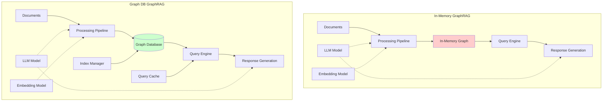

## In-Memory GraphRAG Design

### Architecture Details

The in-memory GraphRAG approach using the GraphRAG toolkit represents a lightweight, flexible solution that constructs and maintains graph structures entirely in application memory.

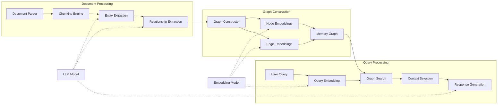

### Key Components

#### 1. Document Processing Pipeline
- **Chunking Strategy**: Documents are segmented into semantically coherent chunks
- **Entity Extraction**: LLM identifies entities, concepts, and key information
- **Relationship Mapping**: LLM extracts relationships between entities
- **Metadata Enrichment**: Additional context and attributes are attached to nodes and edges

#### 2. In-Memory Graph Structure
```python
class InMemoryGraph:
    def __init__(self):
        self.nodes = {}  # node_id -> {entity, embedding, metadata}
        self.edges = {}  # edge_id -> {source, target, relationship, weight}
        self.adjacency = defaultdict(list)  # node_id -> [connected_nodes]
        self.embeddings_index = None  # FAISS or similar for vector search
```

#### 3. Query Processing
- **Semantic Search**: Uses embedding similarity to find relevant subgraphs
- **Graph Traversal**: Explores connected nodes for context expansion
- **Context Aggregation**: Combines relevant information for LLM processing

### Advantages
- **Low Latency**: No network overhead for graph operations
- **Simplicity**: Minimal infrastructure requirements
- **Flexibility**: Easy to modify graph structure on-the-fly
- **Cost-Effective**: No database licensing or hosting costs

### Limitations
- **Scalability**: Limited by available RAM
- **Persistence**: Graph must be rebuilt on application restart
- **Concurrency**: Complex multi-user scenarios require careful synchronization
- **Durability**: No built-in crash recovery

## Graph Database-Based Design

### Architecture Details

The Graph DB-based approach leverages dedicated graph database systems (Neo4j, Amazon Neptune, ArangoDB, etc.) for persistent, scalable graph storage.

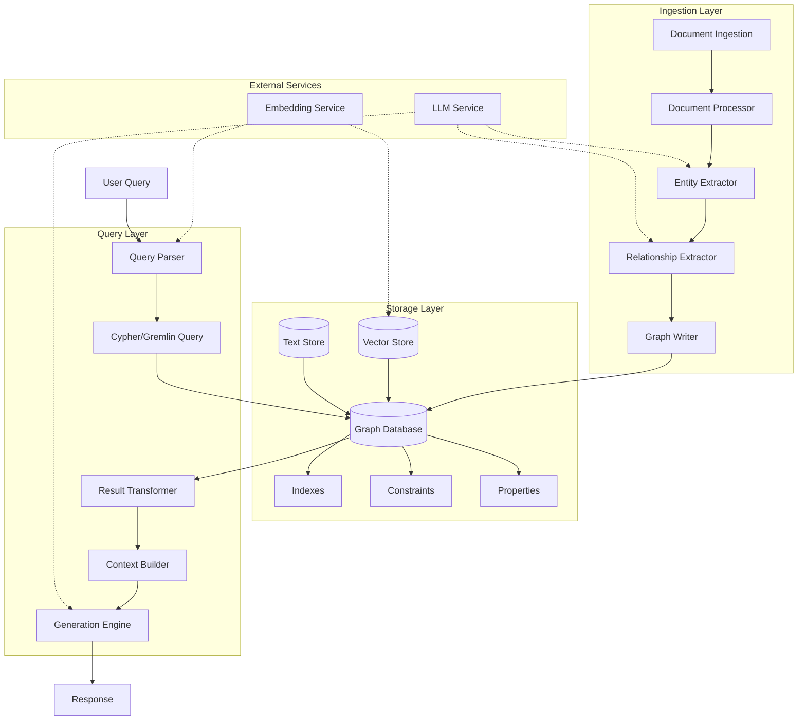

### Key Components

#### 1. Graph Database Engine
```cypher
// Example Neo4j Schema
CREATE CONSTRAINT entity_id ON (e:Entity) ASSERT e.id IS UNIQUE;
CREATE INDEX entity_embedding FOR (e:Entity) ON (e.embedding);
CREATE INDEX relationship_type FOR ()-[r:RELATES_TO]-() ON (r.type);

// Node Structure
(:Entity {
    id: "entity_123",
    name: "Machine Learning",
    type: "concept",
    embedding: [...],  // 768-dimensional vector
    metadata: {...},
    created_at: datetime(),
    source_doc: "doc_456"
})

// Edge Structure
(:Entity)-[:RELATES_TO {
    type: "implements",
    weight: 0.85,
    evidence: "text snippet",
    extracted_by: "gpt-4",
    timestamp: datetime()
}]->(:Entity)
```

#### 2. Query Processing Pipeline
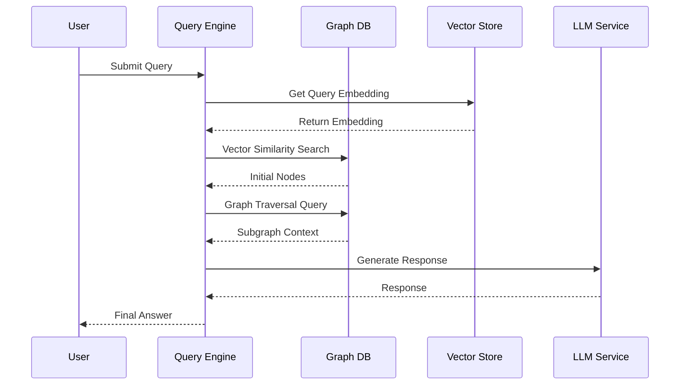

### Advantages
- **Scalability**: Can handle millions of nodes and relationships
- **Persistence**: Data survives application restarts
- **ACID Compliance**: Transactional consistency for concurrent operations
- **Rich Query Language**: Cypher/Gremlin for complex graph queries
- **Built-in Features**: Indexing, constraints, backup/recovery

### Limitations
- **Infrastructure Overhead**: Requires database setup and maintenance
- **Network Latency**: API calls add response time
- **Cost**: Licensing and hosting expenses
- **Complexity**: Steeper learning curve for graph query languages

## Comparative Analysis

### Performance Characteristics

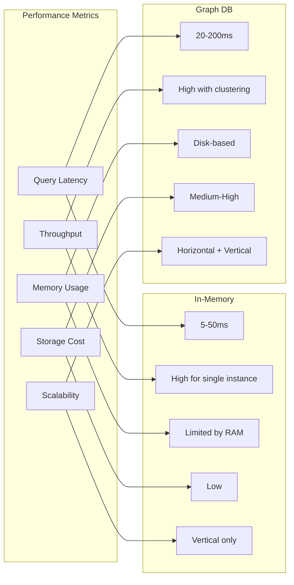

### Feature Comparison Matrix

| Feature | In-Memory GraphRAG | Graph DB GraphRAG |
|---------|-------------------|-------------------|
| **Setup Complexity** | Low - Python dependencies only | Medium-High - DB infrastructure |
| **Query Speed** | Very Fast (5-50ms) | Fast (20-200ms) |
| **Data Volume** | <100K nodes | Millions of nodes |
| **Persistence** | Session-based | Permanent |
| **Concurrent Users** | Limited | High |
| **Crash Recovery** | Manual rebuild | Automatic |
| **Query Flexibility** | Custom algorithms | SQL-like queries |
| **Memory Footprint** | High (all in RAM) | Low (disk-based) |
| **Development Speed** | Rapid prototyping | Production-ready |
| **Monitoring** | Custom implementation | Built-in tools |
| **Backup/Restore** | Manual serialization | Native support |
| **Cost Model** | Compute only | Compute + Storage + License |

## Implementation Considerations

### In-Memory GraphRAG Implementation

```python
from graphrag import GraphRAG
from sentence_transformers import SentenceTransformer
import numpy as np
from typing import Dict, List, Tuple

class InMemoryGraphRAG:
    def __init__(self, llm_model: str, embedding_model: str):
        self.llm = load_llm(llm_model)
        self.embedder = SentenceTransformer(embedding_model)
        self.graph = {
            'nodes': {},
            'edges': [],
            'embeddings': None
        }
    
    def build_graph(self, documents: List[str]):
        """Construct in-memory graph from documents"""
        for doc in documents:
            # Extract entities and relationships
            entities = self.llm.extract_entities(doc)
            relationships = self.llm.extract_relationships(doc)
            
            # Add to graph
            for entity in entities:
                node_id = hash(entity['text'])
                self.graph['nodes'][node_id] = {
                    'text': entity['text'],
                    'type': entity['type'],
                    'embedding': self.embedder.encode(entity['text'])
                }
            
            for rel in relationships:
                self.graph['edges'].append({
                    'source': hash(rel['source']),
                    'target': hash(rel['target']),
                    'type': rel['relation']
                })
        
        # Build embedding index
        self._build_embedding_index()
    
    def query(self, question: str, k: int = 5) -> str:
        """Query the graph and generate response"""
        # Find relevant subgraph
        query_embedding = self.embedder.encode(question)
        relevant_nodes = self._vector_search(query_embedding, k)
        
        # Expand context through edges
        context = self._expand_context(relevant_nodes)
        
        # Generate response
        return self.llm.generate(question, context)
```

### Graph Database Implementation

```python
from neo4j import GraphDatabase
import weaviate
from langchain.llms import OpenAI

class GraphDBGraphRAG:
    def __init__(self, 
                 neo4j_uri: str,
                 llm_model: str,
                 embedding_model: str):
        self.driver = GraphDatabase.driver(neo4j_uri)
        self.llm = OpenAI(model=llm_model)
        self.embedder = SentenceTransformer(embedding_model)
    
    def build_graph(self, documents: List[str]):
        """Populate graph database with document knowledge"""
        with self.driver.session() as session:
            for doc in documents:
                entities = self.llm.extract_entities(doc)
                relationships = self.llm.extract_relationships(doc)
                
                # Batch insert entities
                session.write_transaction(
                    self._create_entities, entities
                )
                
                # Batch insert relationships
                session.write_transaction(
                    self._create_relationships, relationships
                )
    
    def query(self, question: str) -> str:
        """Execute graph query and generate response"""
        with self.driver.session() as session:
            # Vector similarity search
            query_embedding = self.embedder.encode(question)
            
            # Cypher query for relevant subgraph
            result = session.read_transaction(
                self._similarity_search,
                query_embedding
            )
            
            # Build context from graph data
            context = self._format_context(result)
            
            # Generate response
            return self.llm.generate(question, context)
    
    @staticmethod
    def _similarity_search(tx, embedding, limit=10):
        query = """
        CALL db.index.vector.queryNodes(
            'entity-embeddings', 
            $limit, 
            $embedding
        ) YIELD node, score
        MATCH (node)-[r*1..2]-(connected)
        RETURN node, r, connected
        LIMIT 50
        """
        return tx.run(query, embedding=embedding, limit=limit)
```

## Performance Characteristics

### Latency Comparison

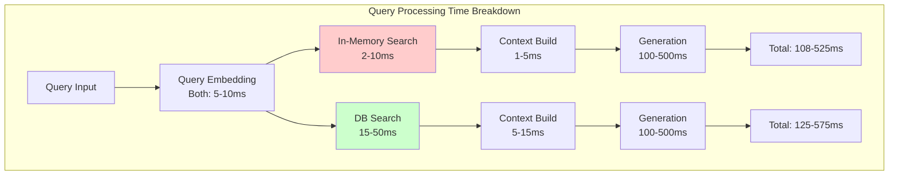

### Scalability Patterns

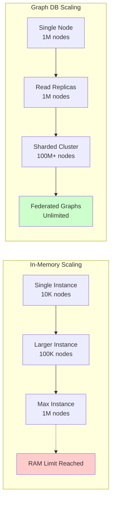

## Use Case Recommendations

### When to Use In-Memory GraphRAG

#### Ideal Scenarios
1. **Proof of Concept Development**
   - Rapid prototyping and experimentation
   - Testing different graph construction strategies
   - Evaluating GraphRAG effectiveness

2. **Small to Medium Knowledge Bases**
   - <100K entities
   - <1M relationships
   - Document collections <10GB

3. **Real-time Applications**
   - Ultra-low latency requirements (<50ms)
   - Predictable performance characteristics
   - Single-tenant applications

4. **Resource-Constrained Environments**
   - Edge computing scenarios
   - Offline-capable applications
   - Limited infrastructure budget

#### Example Use Cases
- Personal knowledge management systems
- Small team documentation search
- Interactive educational tools
- Specialized domain Q&A systems

### When to Use Graph Database GraphRAG

#### Ideal Scenarios
1. **Enterprise Production Systems**
   - Mission-critical applications
   - High availability requirements
   - Audit and compliance needs

2. **Large-Scale Knowledge Graphs**
   - Millions of entities
   - Complex relationship networks
   - Multi-source data integration

3. **Multi-User Environments**
   - Concurrent access patterns
   - User-specific access control
   - Collaborative knowledge building

4. **Dynamic Knowledge Evolution**
   - Continuous learning systems
   - Real-time updates from multiple sources
   - Version control and history tracking

#### Example Use Cases
- Enterprise knowledge management platforms
- Research paper recommendation systems
- Supply chain intelligence systems
- Healthcare knowledge graphs
- Legal document analysis platforms

## Hybrid Architecture Pattern

### Combining Both Approaches

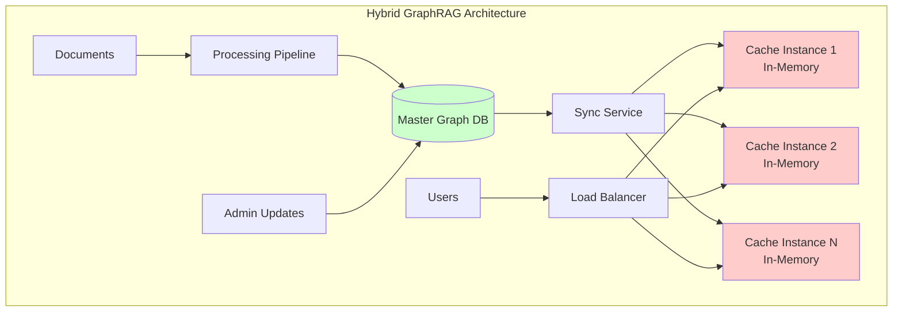

### Hybrid Implementation Strategy

```python
class HybridGraphRAG:
    """
    Combines Graph DB persistence with in-memory performance
    """
    def __init__(self, db_config, cache_config):
        self.graph_db = GraphDatabase(db_config)
        self.memory_cache = InMemoryGraph(cache_config)
        self.cache_ttl = cache_config.get('ttl', 3600)
        self.last_sync = None
    
    def initialize(self):
        """Load hot data into memory cache"""
        hot_subgraph = self.graph_db.get_frequently_accessed()
        self.memory_cache.load(hot_subgraph)
        self.last_sync = datetime.now()
    
    def query(self, question: str) -> str:
        """Try memory cache first, fallback to DB"""
        # Attempt fast in-memory query
        if self.memory_cache.has_relevant_data(question):
            return self.memory_cache.query(question)
        
        # Fallback to database for comprehensive search
        result = self.graph_db.query(question)
        
        # Update cache with new relevant data
        self.memory_cache.update(result.subgraph)
        
        return result.response
    
    def sync(self):
        """Periodic sync between DB and memory"""
        if self._should_sync():
            updates = self.graph_db.get_updates_since(self.last_sync)
            self.memory_cache.apply_updates(updates)
            self.last_sync = datetime.now()
```

## Monitoring and Observability

### Key Metrics to Track

#### In-Memory GraphRAG Metrics
```python
metrics = {
    'graph_size': len(graph.nodes),
    'memory_usage': sys.getsizeof(graph),
    'query_latency_p50': percentile(latencies, 50),
    'query_latency_p99': percentile(latencies, 99),
    'cache_hit_rate': hits / total_queries,
    'entity_extraction_time': avg(extraction_times),
    'embedding_generation_time': avg(embedding_times)
}
```

#### Graph DB GraphRAG Metrics
```cypher
// Neo4j monitoring queries
CALL dbms.queryJmx("org.neo4j:*") YIELD name, attributes
WHERE name CONTAINS "Store"
RETURN name, attributes.TotalStoreSize

// Query performance
CALL dbms.listQueries() YIELD query, elapsedTimeMillis
WHERE elapsedTimeMillis > 1000
RETURN query, elapsedTimeMillis
```

### Observability Architecture

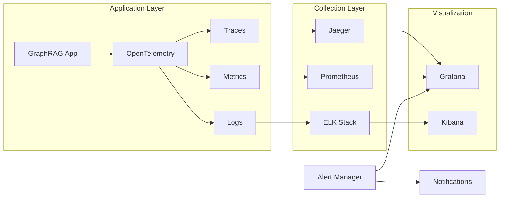

## Cost Analysis

### Total Cost of Ownership (TCO)

| Cost Component | In-Memory | Graph DB | Hybrid |
|----------------|-----------|----------|---------|
| **Infrastructure** | Low | High | Medium-High |
| **Development** | Low | Medium | High |
| **Maintenance** | Low | Medium | Medium |
| **Scaling** | High (vertical) | Medium (horizontal) | Medium |
| **Operations** | Low | Medium | High |
| **Data Recovery** | High | Low | Low |

### Cost Optimization Strategies

#### In-Memory Optimization
1. Implement efficient graph pruning algorithms
2. Use compression for node/edge attributes
3. Leverage shared memory for multi-process access
4. Implement selective loading based on query patterns

#### Graph DB Optimization
1. Proper indexing strategy
2. Query optimization and caching
3. Use read replicas for query distribution
4. Implement data archival for cold data

## Security Considerations

### In-Memory Security
```python
class SecureInMemoryGraph:
    def __init__(self):
        self.encrypted_nodes = {}
        self.access_control = AccessControlList()
    
    def add_node(self, node_data, user_context):
        if self.access_control.can_write(user_context):
            encrypted = self.encrypt(node_data)
            self.encrypted_nodes[node_id] = encrypted
    
    def query(self, query, user_context):
        if self.access_control.can_read(user_context):
            # Filter results based on user permissions
            return self.filtered_search(query, user_context)
```

### Graph DB Security
```cypher
// Role-based access control in Neo4j
CREATE ROLE reader;
GRANT MATCH {*} ON GRAPH knowledge TO reader;
DENY DELETE ON GRAPH knowledge TO reader;

// Property-level security
CREATE CONSTRAINT requires_classification
ON (n:Entity) ASSERT exists(n.classification);
```

## Conclusion and Recommendations

### Decision Framework

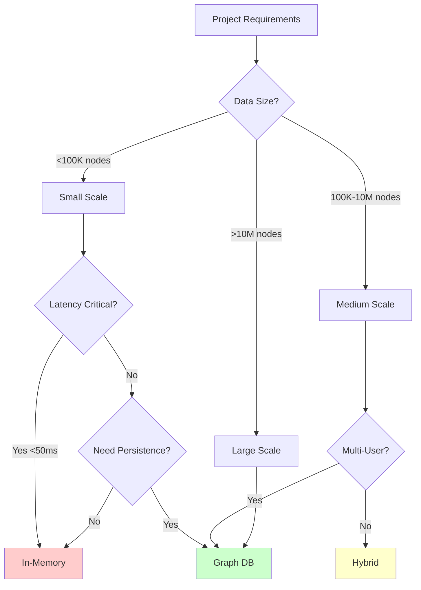

### Final Recommendations

1. **Start with In-Memory for:**
   - Rapid prototyping and POCs
   - Single-user or small team applications
   - Ultra-low latency requirements
   - Limited budget scenarios

2. **Choose Graph DB for:**
   - Production enterprise systems
   - Large-scale knowledge graphs
   - Multi-tenant applications
   - Compliance and audit requirements

3. **Implement Hybrid for:**
   - Best of both worlds requirements
   - Gradual migration paths
   - Performance-critical subset caching
   - Geographic distribution needs

### Migration Path

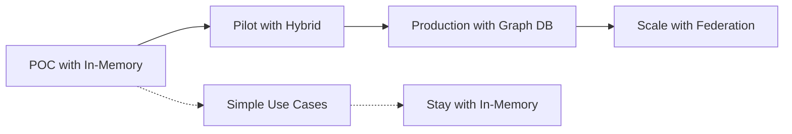

## Appendix: Implementation Checklist

### In-Memory GraphRAG Checklist
- [ ] Define memory limits and eviction policies
- [ ] Implement serialization for persistence
- [ ] Design graph construction pipeline
- [ ] Optimize embedding storage
- [ ] Implement query caching
- [ ] Add monitoring and metrics
- [ ] Plan for failure recovery
- [ ] Document memory requirements

### Graph DB GraphRAG Checklist
- [ ] Select appropriate graph database
- [ ] Design schema and constraints
- [ ] Implement connection pooling
- [ ] Create indexing strategy
- [ ] Set up backup and recovery
- [ ] Configure access control
- [ ] Implement query optimization
- [ ] Plan scaling strategy
- [ ] Set up monitoring dashboards
- [ ] Document operational procedures

### Performance Testing Checklist
- [ ] Define performance SLAs
- [ ] Create representative test dataset
- [ ] Implement load testing framework
- [ ] Measure query latency distribution
- [ ] Test concurrent user scenarios
- [ ] Evaluate memory consumption
- [ ] Test failure scenarios
- [ ] Benchmark against baselines
- [ ] Document performance characteristics

---

*This document provides a comprehensive comparison of GraphRAG architectures. The choice between in-memory and graph database approaches depends on specific requirements including scale, performance, persistence, and operational constraints.*
