# GraphRAG NetworkX Demo — Architecture, Evaluation & Extension Guide

This document provides a comprehensive architectural analysis of the GraphRAG workflow implemented in `graphrag_networkx_demo.ipynb`, including UML diagrams, sequence flows, extension strategies, and evaluation metrics.

---

## 1. High-Level Pipeline Overview

The workflow processes raw text documents through an extraction–indexing–retrieval–generation pipeline that combines **vector similarity search** with **knowledge-graph traversal** for context-aware response generation.

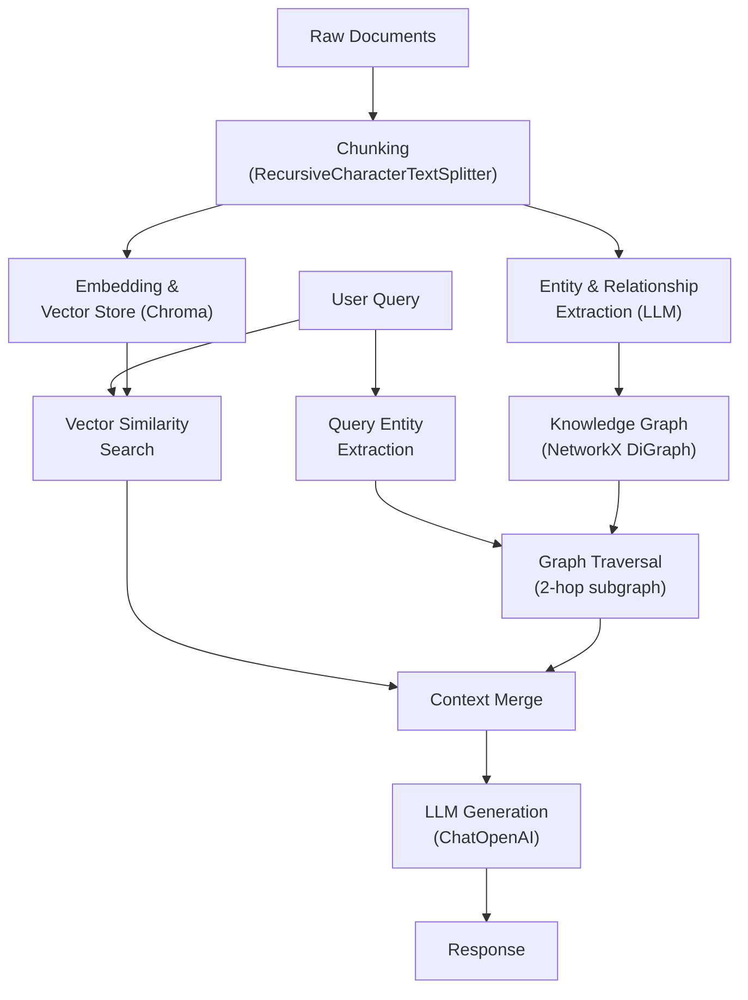

---

## 2. Static Class Diagram

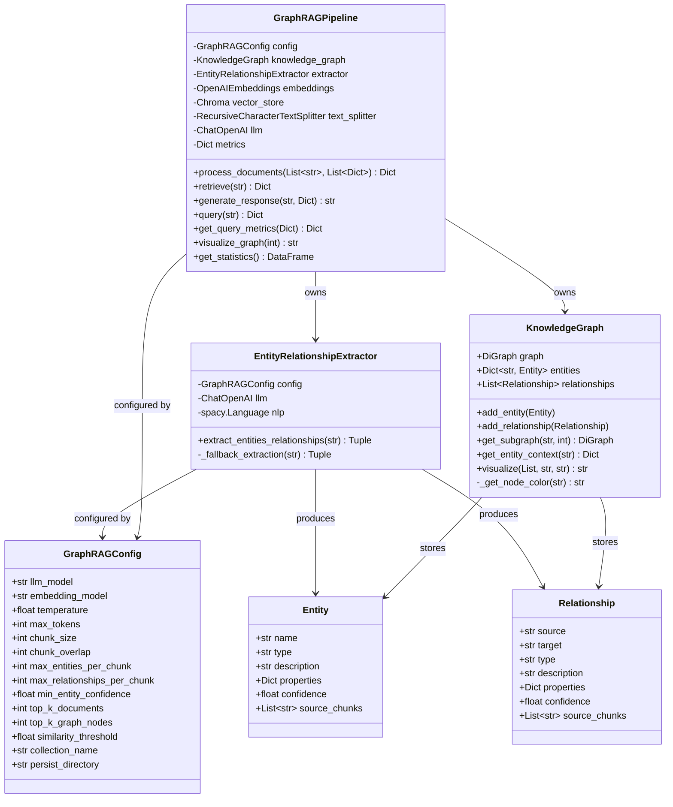

---

## 3. Document Ingestion Sequence

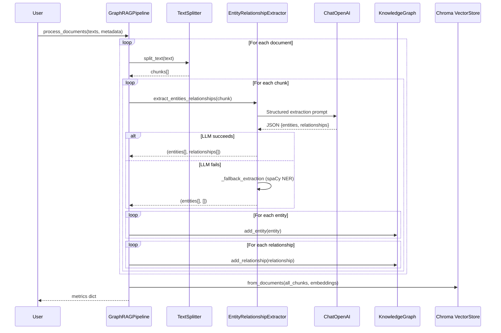

---

## 4. Query & Retrieval Sequence

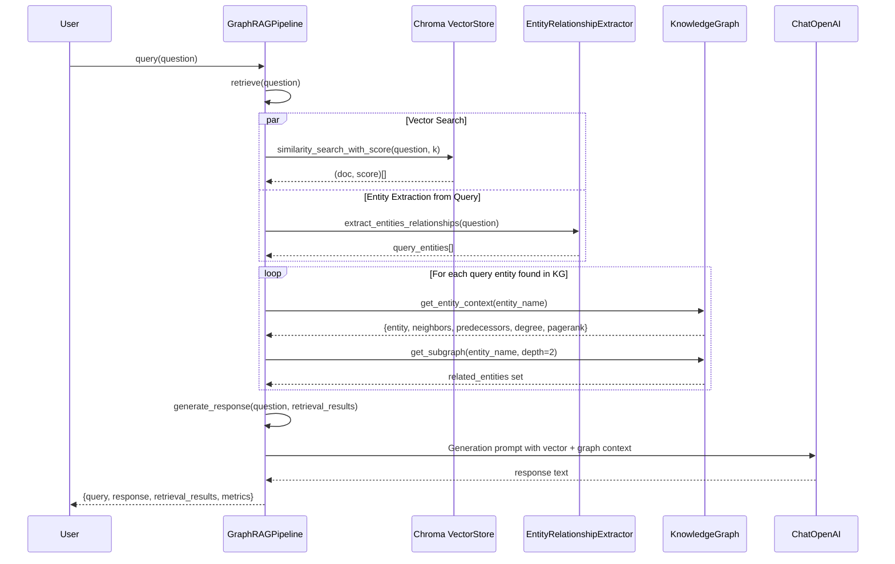

---

## 5. Entity Extraction — LLM with spaCy Fallback

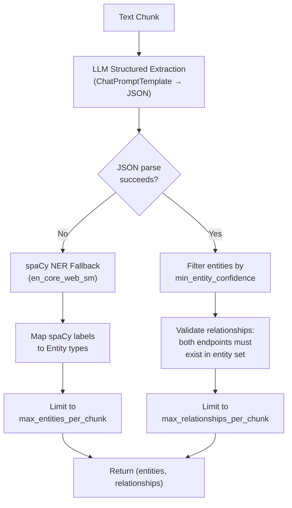

---

## 6. Hybrid Retrieval Strategy

The retrieval step combines two complementary signals:

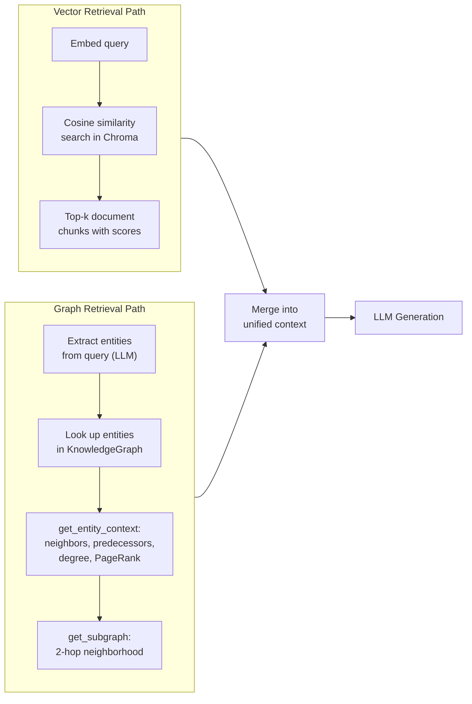

**Vector path** excels at surface-level semantic similarity.
**Graph path** adds structural context — how entities relate, their centrality (PageRank), and multi-hop connections the vector search would miss entirely.

---

## 7. Knowledge Graph Visualization Flow

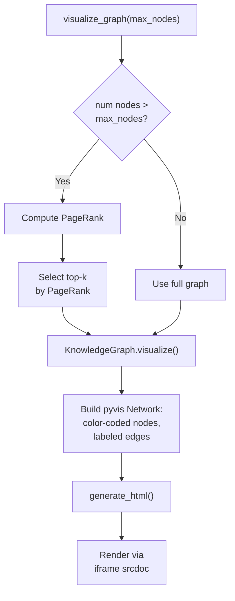

---

## 8. Extensions for Latency & Performance

### 8.1 Extraction Parallelism

The current implementation processes chunks sequentially. Since each LLM extraction call is independent, chunks can be processed concurrently.

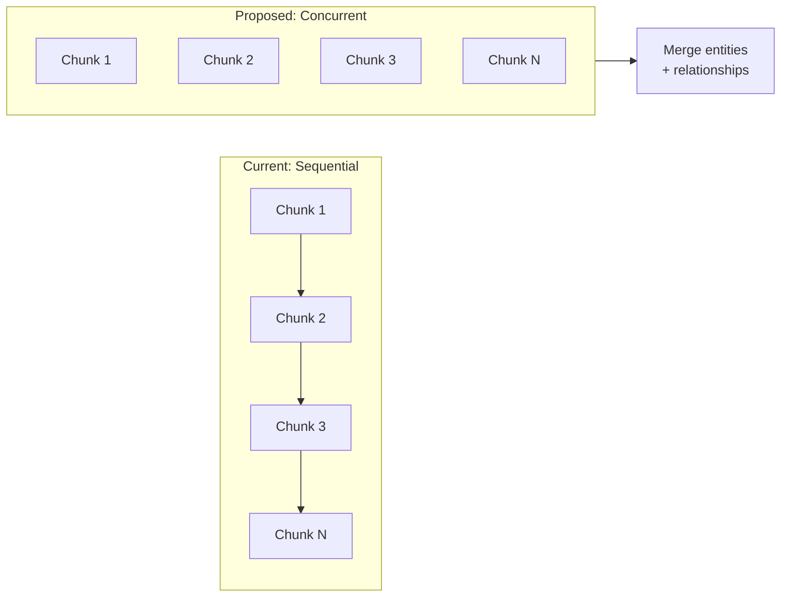

Implementation: use `asyncio.gather` with the async OpenAI client, or `concurrent.futures.ThreadPoolExecutor` with rate-limit-aware batching. Expected speedup: **3–8× on ingestion** for typical corpus sizes.

### 8.2 Caching & Incremental Updates

| Technique | Latency Impact | Implementation |
|-----------|---------------|----------------|
| **Extraction cache** (hash chunk → cached entities) | Eliminates redundant LLM calls on re-runs | Content-hash keyed dict or SQLite |
| **Incremental graph updates** | Only process new/changed documents | Track processed chunk IDs in metadata |
| **Embedding cache** | Skip re-embedding unchanged chunks | ChromaDB already handles this if collection persists |
| **LLM response cache** | Avoid identical extraction calls | `langchain` `SQLiteCache` or Redis |

### 8.3 Graph Backend Upgrade

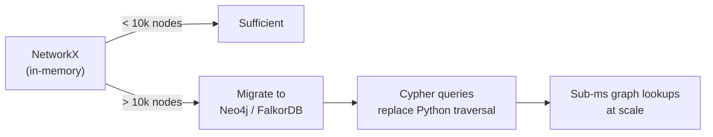

NetworkX is single-threaded and memory-bound. For production graphs (>10k nodes), a dedicated graph database delivers orders-of-magnitude faster traversals and supports concurrent access.

### 8.4 Embedding Model Optimization

- Replace OpenAI API embeddings with a local model (e.g. `all-MiniLM-L6-v2`) to eliminate network round-trips during retrieval.
- Use quantized ONNX models for ~3× faster inference on CPU.
- Batch embed all chunks in one call instead of per-document.

---

## 9. Extensions for Robustness & Repeatability

### 9.1 Deterministic Extraction

LLM outputs are inherently stochastic. To improve repeatability:

| Strategy | Effect |
|----------|--------|
| **temperature=0** | Greedy decoding — near-deterministic output |
| **Seed parameter** (OpenAI `seed` field) | Reproducible sampling for a given prompt |
| **Structured output** (`response_format={"type": "json_object"}`) | Guarantees valid JSON, eliminates parse failures |
| **Schema validation** (Pydantic model) | Reject malformed extractions before they enter the graph |

### 9.2 Entity Resolution & Deduplication

The current pipeline treats entity names as exact-match keys. "Apple Inc.", "Apple", and "AAPL" would create three separate nodes.

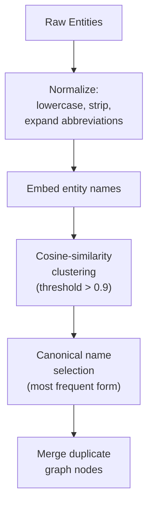

### 9.3 Confidence-Weighted Graph

Instead of binary edge presence, use the extraction confidence scores as edge weights. During retrieval, weight graph-context contributions by confidence. This down-ranks hallucinated edges and strengthens well-supported connections.

### 9.4 Multi-Pass Validation

Add a second LLM pass to validate extracted relationships:
1. Present the LLM with each `(source, relationship, target)` triple and the original text.
2. Ask: *"Is this relationship supported by the text? Yes/No + evidence."*
3. Remove triples that fail validation.

This trades ingestion latency for significantly higher graph quality.

---

## 10. Evaluation Metrics

### 10.1 Extraction Quality

| Metric | What It Measures | How to Compute |
|--------|-----------------|----------------|
| **Entity Precision** | Fraction of extracted entities that are correct | Manual annotation on sample chunks |
| **Entity Recall** | Fraction of true entities that were found | Compare against gold-standard annotations |
| **Relation Precision** | Fraction of extracted relations that are correct | Manual review of (src, rel, tgt) triples |
| **Relation Recall** | Fraction of true relations that were found | Gold-standard comparison |
| **Entity F1** | Harmonic mean of entity precision and recall | Standard F1 formula |
| **Relation F1** | Harmonic mean of relation precision and recall | Standard F1 formula |

### 10.2 Retrieval Quality

| Metric | What It Measures | How to Compute |
|--------|-----------------|----------------|
| **Recall@k** | Fraction of relevant chunks in top-k results | Requires relevance labels for queries |
| **MRR (Mean Reciprocal Rank)** | Position of first relevant result | 1/rank of first relevant hit, averaged |
| **Graph Hit Rate** | How often graph traversal finds query entities | Count of entity matches / total queries |
| **Context Coverage** | Are all facts needed to answer in the context? | Manual or LLM-as-judge annotation |

### 10.3 Generation Quality

| Metric | What It Measures | How to Compute |
|--------|-----------------|----------------|
| **Faithfulness** | Does the answer only use facts from context? | LLM-as-judge or RAGAS faithfulness score |
| **Answer Relevancy** | Does the answer address the question? | LLM-as-judge or RAGAS relevancy |
| **Groundedness** | Can every claim be traced to a source? | Claim-level attribution check |
| **BLEU / ROUGE** | N-gram overlap with reference answer | Automated, requires reference answers |
| **BERTScore** | Semantic similarity to reference answer | Embedding-based, more robust than n-gram |

### 10.4 Graph Quality

| Metric | What It Measures | Current Implementation |
|--------|-----------------|----------------------|
| **Graph Density** | Connectivity of the graph | `nx.density()` — already reported |
| **Weakly Connected Components** | Fragmentation | `nx.number_weakly_connected_components()` — already reported |
| **Average Degree** | Typical connectivity per node | Already reported |
| **PageRank Entropy** | How evenly distributed centrality is | `scipy.stats.entropy(pagerank_values)` |
| **Edge Confidence Distribution** | Quality of extracted relationships | Histogram of confidence scores |

### 10.5 End-to-End Evaluation Framework

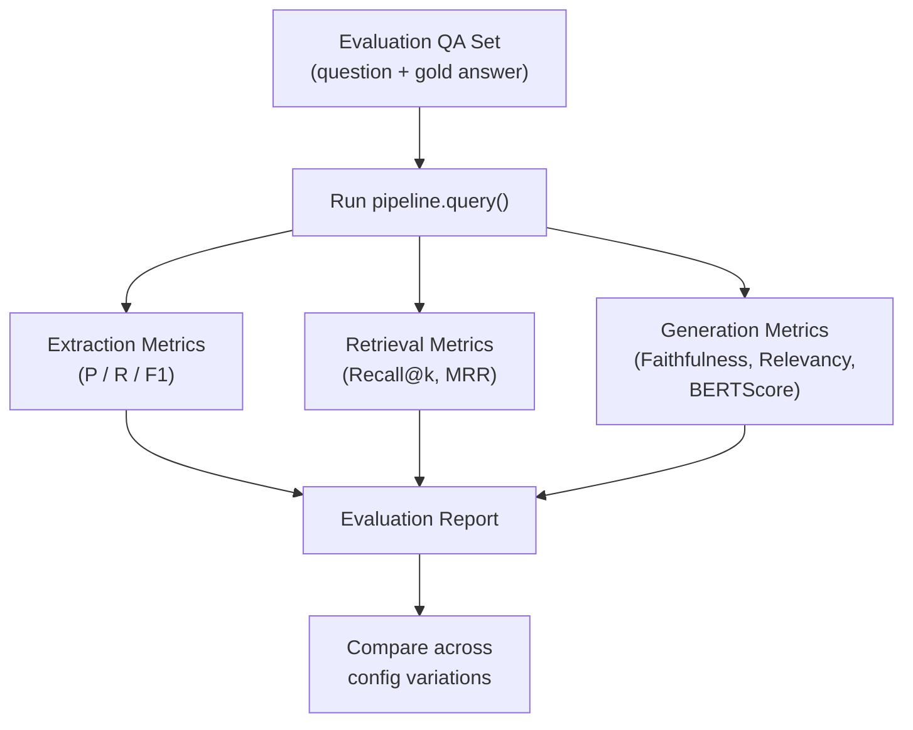

Use the [RAGAS](https://docs.ragas.io/) framework for automated RAG evaluation: it computes faithfulness, answer relevancy, and context precision/recall without requiring gold answers for every question.

---

## 11. Summary

The `graphrag_networkx_demo` notebook implements a functional GraphRAG system with four main components — document processing, LLM-based entity/relationship extraction, hybrid vector+graph retrieval, and context-aware generation. The architecture is clean and extensible but currently optimized for clarity over production readiness. The key levers for improvement are:

- **Latency**: parallelized extraction, local embeddings, caching, graph DB backend
- **Robustness**: deterministic LLM settings, entity deduplication, multi-pass validation, schema enforcement
- **Evaluation**: extraction F1, retrieval recall, generation faithfulness via RAGAS, graph quality metrics
